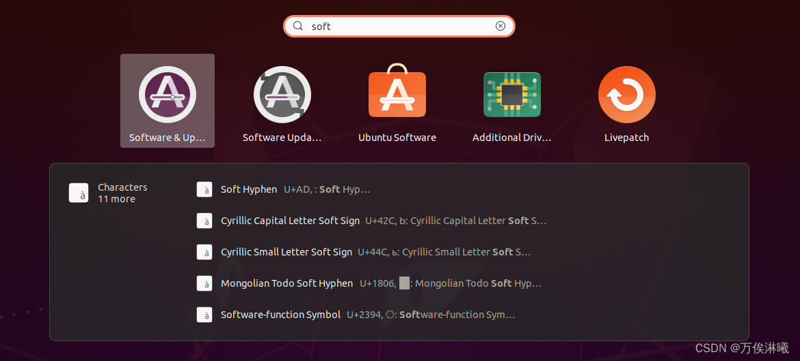
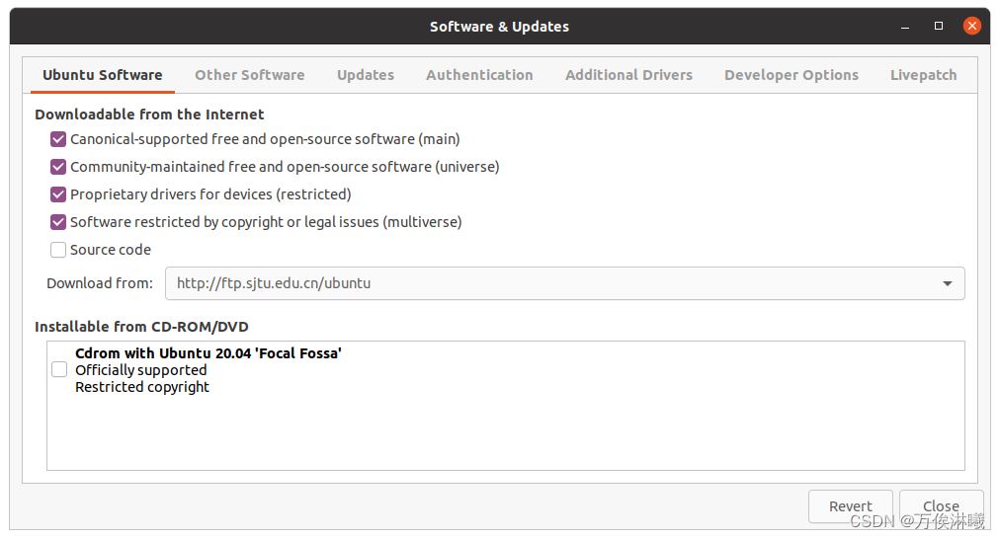
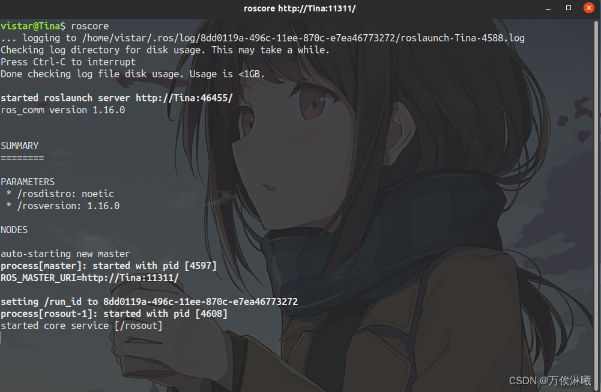
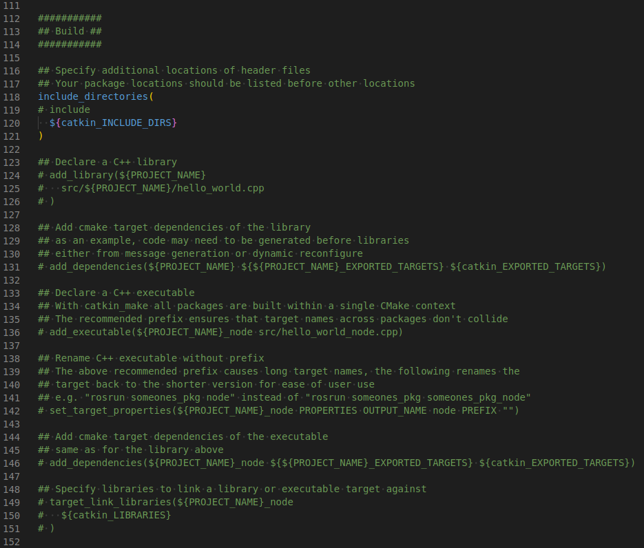
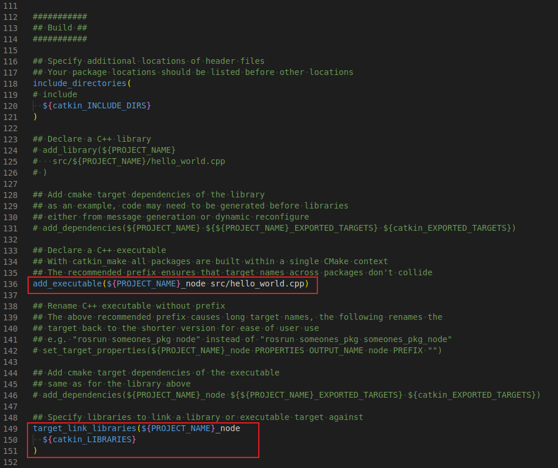
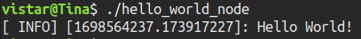
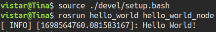
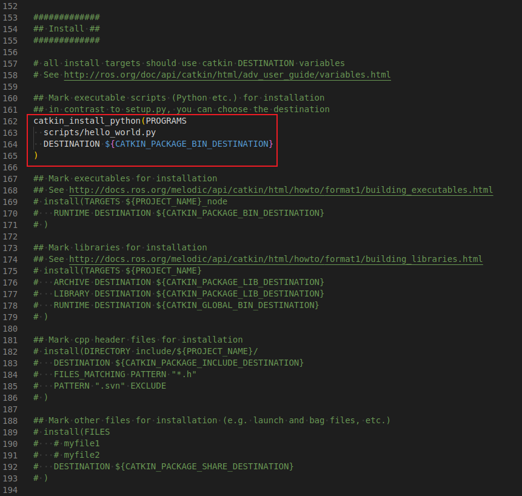
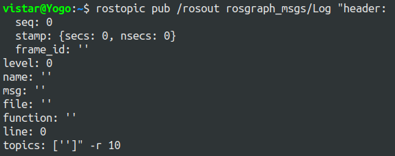

# ROSLearning

# 一、ROS概览与开发环境

## 1.1 ROS简介

### 1.1.1 为什么要诞生ROS

机器人是一种高度复杂的系统性实现，机器人设计包含了机械加工、机械结构设计、硬件设计、嵌入式软件设计、上层软件设计....是各种硬件与软件集成，甚至可以说机器人系统是当今工业体系的集大成者。

机器人体系是相当庞大的，其复杂度之高，以至于没有任何个人、组织甚至公司能够独立完成系统性的机器人研发工作。

一种更合适的策略是：让机器人研发者专注于自己擅长的领域，其他模块则直接复用相关领域更专业研发团队的实现，当然自身的研究也可以被他人继续复用。这种基于"复用"的分工协作，遵循了**不重复发明轮子**的原则，显然是可以大大提高机器人的研发效率的，尤其是随着机器人硬件越来越丰富，软件库越来越庞大，这种复用性和模块化开发需求也愈发强烈。

在此大背景下，于 **2007** 年，一家名为 **柳树车库（Willow Garage）**的机器人公司发布了 ***ROS***(机器人操作系统)，ROS是一套机器人通用软件框架，可以提升功能模块的复用性，并且随着该系统的不断迭代与完善，如今 ROS 已经成为机器人领域的事实标准。

### 1.1.2 什么是ROS

**ROS全称Robot Operating System(机器人操作系统)**

- ROS是适用于机器人的**开源**元操作系统
- ROS集成了大量的工具，库，协议，提供类似OS所提供的功能，简化对机器人的控制
- 还提供了用于在**多台计算机**上获取，构建，编写和运行代码的工具和库，ROS在某些方面类似于“机器人框架”
- ROS设计者将ROS表述为“ROS = Plumbing + Tools + Capabilities + Ecosystem”，即ROS是通讯机制、工具软件包、机器人高层技能以及机器人生态系统的集合体


### 1.1.3 ROS的目标

机器人开发的分工思想，实现了不同研发团队间的共享和协作，提升了机器人的研发效率，为了服务“ 分工”，ROS主要设计了如下目标：

- **代码复用:**ROS的目标不是成为具有最多功能的框架，ROS的主要目标是支持机器人技术研发中的代码*重用*。
- **分布式:**ROS是进程（也称为*Nodes*）的分布式框架,ROS中的进程可分布于不同主机，不同主机协同工作，从而分散计算压力
- **松耦合:**ROS中功能模块封装于独立的功能包或元功能包，便于分享，功能包内的模块以节点为单位运行，以ROS标准的IO作为接口，开发者不需要关注模块内部实现，只要了解接口规则就能实现复用,实现了模块间点对点的松耦合连接
- **精简：**ROS被设计为尽可能精简，以便为ROS编写的代码可以与其他机器人软件框架一起使用。ROS易于与其他机器人软件框架集成：ROS已与OpenRAVE，Orocos和Player集成。
- **语言独立性：**包括Java，C++，Python等。为了支持更多应用开发和移植，ROS设计为一种语言弱相关的框架结构，使用简洁，中立的定义语言描述模块间的消息接口，在编译中再产生所使用语言的目标文件，为消息交互提供支持，同时允许消息接口的嵌套使用
- **易于测试：**ROS具有称为[rostest](http://wiki.ros.org/rostest)的内置单元/集成测试框架，可轻松安装和拆卸测试工具。
- **大型应用：**ROS适用于大型运行时系统和大型开发流程。
- **丰富的组件化工具包：**ROS可采用组件化方式集成一些工具和软件到系统中并作为一个组件直接使用，如RVIZ（3D可视化工具），开发者根据ROS定义的接口在其中显示机器人模型等，组件还包括仿真环境和消息查看工具等
- **免费且开源：**开发者众多，功能包多

### 1.1.4 ROS发展历程

- ROS是一个由来已久、贡献者众多的大型软件项目。在ROS诞生之前，很多学者认为，机器人研究需要一个开放式的协作框架，并且已经有不少类似的项目致力于实现这样的框架。在这些工作中，斯坦福大学在2000年年中开展了一系列相关研究项目，如斯坦福人工智能机器人（STandford AI Robot, STAIR）项目、个人机器人（Personal Robots, PR）项目等，在上述项目中，在研究具有代表性、集成式人工智能系统的过程中，创立了用于室内场景的高灵活性、动态软件系统，其可以用于机器人学研究。

- 2007年，柳树车库（Willow Garage）提供了大量资源，用于将斯坦福大学机器人项目中的软件系统进行扩展与完善，同时，在无数研究人员的共同努力下，ROS的核心思想和基本软件包逐渐得到完善。

- ROS的发行版本（ROS distribution）指ROS软件包的版本，其与Linux的发行版本（如Ubuntu）的概念类似。推出ROS发行版本的目的在于使开发人员可以使用相对稳定的代码库，直到其准备好将所有内容进行版本升级为止。因此，每个发行版本推出后，ROS开发者通常仅对这一版本的bug进行修复，同时提供少量针对核心软件包的改进。

- 版本特点: 按照英文字母顺序命名，ROS 目前已经发布了ROS1 的最终版本: noetic，并建议后期过渡至 ROS2 版本。noetic 版本之前默认使用的是 Python2，noetic 支持 Python3。

    建议版本: noetic 或 melodic 或 kinetic

## 1.2 ROS安装

ROS不是真正的操作系统，它需要依赖于其他操作系统，我们以**noetic**为例，它依赖于**Ubuntu20.04**，所以安装ROS noetic之前需要先安装Ubuntu20.04，有以下两种方式：

- 物理机安装：可以保证性能，且不需要考虑硬件交互问题，但和windows系统交互不便；
- 虚拟机安装：可以方便的实现 windows 与 ubuntu 切换，不过性能稍差，且与硬件交互不便。

实际应用中，ROS常需要获取硬件数据，且对性能要求较高，所以原则上建议在物理机中安装，但初学只需要了解ROS原理与初级使用，虚拟机已足够，所以初学建议虚拟机安装ubuntu和ROS。

常用的虚拟机有VMware和virtualbox，前者收费后者免费，按需选择。

### 1.2.1 安装虚拟机

### 1.2.2 安装Ubuntu

### 1.2.3 安装ROS

#### 1.2.3.1 设置Ubuntu的软件和更新

在搜索框输入software，选择软件和更新一项，勾选 `main`、`universe`、`restricted` 和 `multiverse`，然后在`Downlosd from`选择一个中国的服务器，我选的上海交大的源，然后点 `Close` 关闭就行了。




#### 1.2.3.2 添加源

如果网速快，可以直接用官方源，打开terminal输入一下命令：

```bash
sudo sh -c 'echo "deb http://packages.ros.org/ros/ubuntu $(lsb_release -sc) main" > /etc/apt/sources.list.d/ros-latest.list'
```

网速慢的话，可以用国内源：
[国内源列表](http://wiki.ros.org/ROS/Installation/UbuntuMirrors)

上海交大源

```bash
sudo sh -c '. /etc/lsb-release && echo "deb http://mirrors.sjtug.sjtu.edu.cn/ros/ubuntu/ `lsb_release -cs` main" > /etc/apt/sources.list.d/ros-latest.list'
```

清华源

```bash
sudo sh -c '. /etc/lsb-release && echo "deb http://mirrors.tuna.tsinghua.edu.cn/ros/ubuntu/ `lsb_release -cs` main" > /etc/apt/sources.list.d/ros-latest.list'
```

#### 1.2.3.3 添加密钥

```bash
sudo apt-key adv --keyserver 'hkp://keyserver.ubuntu.com:80' --recv-key C1CF6E31E6BADE8868B172B4F42ED6FBAB17C654
```

#### 1.2.3.4 更新软件包索引

```bash
sudo apt update
```

#### 1.2.3.5 安装ROS

ROS有好几个安装模式，包含的功能有多有少，我选择的完全安装。

```bash
sudo apt install ros-noetic-desktop-full
```

#### 1.2.3.6 设置环境变量

为了每次启动新terminal，ROS仍能用，不用每次手动设置环境变量。

```bash
echo "source /opt/ros/noetic/setup.bash" >> ~/.bashrc
source ~/.bashrc
```

#### 1.2.3.7 安装其他工具和依赖关系

ROS的核心部分已经安装完了，但还有一些构建软件包的依赖关系和工具。

```bash
sudo apt install python3-rosdep python3-rosinstall python3-rosinstall-generator python3-wstool build-essential
```

#### 1.2.3.8 初始化rosdep

rosdep可以为要编译的源安装系统依赖性，并且是运行ROS中某些核心组件所必需的。

```bash
sudo rosdep init
rosdep update
```

这一步，由于软件服务器在国外，常常访问超时，解决办法见 [ERROR: cannot download default sources list from: 20-default.list. Website may be down.](https://blog.csdn.net/maizousidemao/article/details/109476275)

另外，也可以安装国内版的rosdep，如下：

##### 国内版rosdep

为了方便国内同学学习ROS，大佬 **鱼香ROS** 基于 `rosdep` 源码制作了 `rosdepc`，后缀 `c` 即 `China` 。

##### 1. 安装  `rosdepc`

```bash
sudo pip install rosdepc
```

如果显示没有 `pip` 可以使用 `pip3`：

```bash
sudo pip3 install rosdepc
```

如果 `pip3` 还没有，需要先安装 `pip3`：

```bash
sudo apt-get install python3-pip
```

##### 2. 使用  `rosdepc`

```bash
sudo rosdepc init
rosdepc update
```

#### 1.2.3.9 验证

这样ROS就安装好啦，输入

```bash
roscore
```

如果没有错误，就是安装成功了。




## 1.3 ROS Hello World

万物始于Hello World，为了体验ROS，使用Hello World介绍ROS的简单使用。

### 1.3.1 Hello World工程简介

首先需要创建工程，流程为：

1. 创建工作空间目录（即工程根目录，注意此时还不是ROS工作空间，只是一个目录）
2. 初始化工作空间（即把当前目录初始化为一个ROS工作空间）
3. 创建功能包（ROS基本单元，可以理解为一个功能模块，每个工程至少有一个功能包）
4. 编辑源文件（写代码实现需求）
5. 编辑编译配置文件（ROS1使用CMake编译系统，这里编辑CMakeList.txt文件）
6. 编译工程（使用CMake编译ROS工程，生成可执行文件，即ros节点，下文均称作节点）

不只是Hello World，所有ROS工程都是这样的流程。

另外，目前ROS开发主要使用C++和Python语言，这里会分别实现。

### 1.3.2 ROS Hello World C++ 版

注：其中`ros_learning`是工作空间的自定义名称。

#### 1.3.2.1 创建工作空间目录

```bash
# 递归创建工作空间目录
mkdir -p ros_learning/src
```

#### 1.3.2.2 初始化工作空间

这一步有两种方法都可以达到初始化工作空间的目的：

方法一：

```bash
# 1.进入src目录
cd ros_learning/src
# 2.初始化工作空间
catkin_init_workspace
```

方法二：

```bash
# 1.进入ros_learning目录
cd ros_learning/src
# 2.编译工作空间
catkin_make
```

#### 1.3.2.3 创建功能包

```bash
cd ros_learning/src
catkin_create_pkg hello_world std_msgs rospy roscpp
```

其中，hello_world：自定义功能包名称，

std_msgs rospy roscpp：功能包依赖，roscpp是C++实现的库，而rospy是python实现的库，std_msgs是ROS标准消息库

#### 1.3.2.4 编辑源文件

在`ros_learning/src/hello_world/src`目录下新增`hello_world.cpp`文件，文件内容如下：

```c++
#include "ros/ros.h"

int main(int argc, char **argv)
{
    // 初始化ros节点，"hello_world_cpp"为自定义节点名称
    ros::init(argc, argv, "hello_world_cpp");

    // 在控制台打印 hello world
    ROS_INFO("Hello World!");

    return 0;
}
```

#### 1.3.2.5 编辑编译配置文件CMakeList.txt

由于新增了源文件`hello_world.cpp`，所以要配置该文件的编译规则。

找到`ros_learning/src/hello_world/CMakeLists.txt`中的`Build`，如下：



修改其中的`add_executable`和`target_link_libraries`两项，如下：



修改说明如下：

```cmake
add_executable(${PROJECT_NAME}_node src/hello_world.cpp)
# 生成可执行文件，其中 ${PROJECT_NAME}_node 代表节点的名称（也可以自定义，比如hello_world）
# src/hello_world.cpp 是源文件，也可以有多个。

target_link_libraries(${PROJECT_NAME}_node
  ${catkin_LIBRARIES}
)
# 链接库文件，因为我们使用了ros的 ros::init 和 ROS_INFO，所以需要链接相应的库才可以编译成功。
# ${PROJECT_NAME}_node 代表要执行链接库的节点名称
# ${catkin_LIBRARIES} 搜索库的路径
```

#### 1.3.2.6 编译工程

进入到ros_learning目录，编译该工程

```bash
cd ros_learning
catkin_make
```

编译成功后，会在ros_learning目录下生成build 和devel。

#### 1.3.2.7 运行节点

生成的节点在 `devel/lib/hello_world` 中，我们可以直接执行：



不过这样需要知道节点的具体路径，实际中操作较麻烦。

ROS提供了 `rosrun` 命令，可以根据包名和节点名，在任何目录执行。

但需要具备以下两个条件：

- 启动 roscore
- 进入到工作空间目录中，执行 source ./devel/setup.bash（为了让系统找到节点）



但 `source ./devel/setup.bash` 只对当前终端有效，新打开终端仍需再执行该命令，为了避免每次执行，可以把该命令加到当前用户的 `.bashrc` 文件中，该文件在用户的 `home` 目录下。

方法一：直接打开 `~/.bashrc` 文件，在末尾添加 `source 你的工作空间目录/devel/setup.bash` ，保存。

方法二：使用命令 `echo "source 你的工作空间目录/devel/setup.bash" >> ~/.bashrc`

最后，使用命令 `source ~/.bashrc` 使修改生效。


### 1.3.3 ROS Hello World Python 版

1到3步骤上面已经做过，这里直接编辑源文件。

#### 1.3.3.1 编辑源文件

进入到 `ros_learning/src/hello_world` 目录，新建 `scripts` 目录，在该目录中新增 `hello_world.py`，内容如下：

```python
#! /usr/bin python

import rospy

if __name__ == "__main__":
    # 初始化ros节点，"hello_world_py"为自定义节点名称
    rospy.init_node("hello_world_py")

    # 在控制台打印 Hello World!
    rospy.loginfo("Hello World!")
```

#### 1.3.3.2 编辑编译配置文件CMakeList.txt

找到`ros_learning/src/hello_world/CMakeLists.txt`中的`Install`，修改`catkin_install_python`如下：



修改说明：

```cmake
catkin_install_python(PROGRAMS
  scripts/hello_world.py
  DESTINATION ${CATKIN_PACKAGE_BIN_DESTINATION}
)
# 将脚本scripts/hello_world.py安装到指定位置
# PROGRAMS 关键字指定脚本程序
# DESTINATION 关键字指定安装位置
# ${CATKIN_PACKAGE_BIN_DESTINATION} 系统环境变量，存储当前功能包可执行文件安装路径
```

#### 1.3.3.3 编译工程

进入到ros_learning目录，编译该工程

```bash
cd ros_learning
catkin_make
```

编译成功后，会在ros_learning目录下生成build 和devel。

#### 1.3.3.4 运行节点

生成的脚本在 `devel/lib/hello_world` 中，同样可以直接运行，也可以使用 `rosrun`命令。

这里注意，无论直接运行还是使用`rosrun`命令，都需要先启动`roscore`。


## 一、Topic

### 1.1 常用函数接口

#### ros::Publisher类

```c++
// 两个重载函数模板，用于发布topic消息
template <typename M>
void publish(const boost::shared_ptr<M>& message) const

template <typename M>
void publish(const M& message) const
```

```c++
// 关闭与此发布者关联的广播
void shutdown()

// 还不知道怎么用，mark一下，有知道的欢迎评论区留言
boost::function<void(const SubscriberLinkPtr &)> getLastMessageCallback()

// 获取与此发布者关联的订阅者的数量
uint32_t getNumSubscribers() const

// 获取此发布者发布的topic
std::string getTopic() const

// 此发布者是否为锁存模式
// 锁存模式：记录发布的最后一条消息，每有订阅者连接发布一次最后一条消息
// 通过advertise函数设置
bool isLatched() const
```


#### ros::Subscriber类

```c++
// 获取与此订阅者关联的发布者的数量
uint32_t getNumPublishers() const

// 获取此订阅者订阅的topic
std::string getTopic() const

// 关闭与此订阅者关联的广播
void shutdown ()
```


### 1.2 常用命令行工具

#### rostopic相关

```bash
rostopic bw    显示主题使用的带宽
rostopic delay 显示带header的topic的网络延迟
rostopic echo  将消息打印到屏幕
rostopic find  按类型查找主题
rostopic hz    显示主题的发布率
rostopic info  打印关于活动主题的信息
rostopic list  打印有关活动主题的信息
rostopic pub   将数据发布到主题
rostopic type  打印主题类型
```


##### 1.2.1 rostopic bw

```bash
rostopic bw <topic-name>
rostopic bw /rosout
```

显示topic使用的带宽，显示的带宽是subscriber端的带宽，由于rostopic是用python实现的，所以实际速度可能会低于c++实现的ros节点。

比如topic为`/rosout` ，发布默认消息



则subscribe端的带宽为


其中，

`average`：带宽。

`mean`：从开始通信到现在，每次通信的平均数据量。

`min`：从开始通信到现在，最小的一次通信数据量。

`max`：从开始通信到现在，最大的一次通信数据量。

`window`：应该是从开始通信到现在接收数据的次数，但到100就不再增加了。作者代码里使用队列存储时间戳记录通信，通过获取队列大小得到通信次数，为限制内存开销，作者将队列大小限制为100，将队首元素pop，并将新时间戳加入队列，但pop后作者没有对记录通信次数的变量加1，所以`window`到100就不再增加了。


##### 1.2.2 rostopic delay

```
rostopic delay <topic-name>
rostopic delay /rosout
```

显示带header的topic的网络延迟(因为header会记录msg发出时的时间戳)，即msg从advertiser发出到subscriber接收经过的时间。

自己写一个测试topic `/log` 代码如下，

```python
#!/usr/bin/python3
#-*- coding:utf-8 -*-

import rospy
from rosgraph_msgs.msg import Log

if __name__ == '__main__':

    rospy.init_node('log')

    log = rospy.Publisher('/log', Log, queue_size=10)

    rate = rospy.Rate(10)

    while not rospy.is_shutdown():
        log_msg = Log()
        log_msg.header.stamp = rospy.get_rostime()

        log.publish(log_msg)
        rospy.loginfo("Publish log message %s", log_msg)
 
        rate.sleep()
```


则该topic的网络延迟为


其中，

`average delay` ：从开始通信到现在，所有通信的平均延迟时间，单位：s

`min`：从开始通信到现在，所有通信中延迟时间最小的一次

`max`：从开始通信到现在，所有通信中延迟时间最大的一次

`std dev`：从开始通信到现在，所有通信延迟数据的标准差，表征延迟数据的波动大小，标准差越小表示延迟数据波动越小。

`window`：和 `rostopic bw` 的`window` 一样，不过它的队列大小限制为50000。


##### 1.2.3 rostopic echo

```bash
rostopic echo <topic-name>
rostopic echo /rosout
```

将消息内容打印到屏幕


`rostopic echo` 有自己的参数选项，如下，

```
rostopic echo --offset	
rostopic echo --filter
rostopic echo -c
rostopic echo -b
rostopic echo -p
rostopic echo -p --nostr
rostopic echo -p --noarr
rostopic echo -w
rostopic echo -n
```


###### rostopic echo --offset

在打印的消息中显示advertiser发布时间与subscriber接收时间的偏移量，和`delay`一样，topic要有header，否则打印中没有时间戳。

```bash
rostopic echo --offset /topic_name
```

测试程序如下：

自定义msg：

```xml
# HeaderString.msg
# 自定义msg
std_msgs/Header header
string data
```

offset节点源文件：

package名称为mbot_communication，自建包需相应修改

```c++
#include "ros/ros.h"
#include "mbot_communication/HeaderString.h"

int main(int argc, char **argv)
{
    ros::init(argc, argv, "offset");

    ros::NodeHandle n;
    ros::Publisher chatter_pub = n.advertise<mbot_communication::HeaderString>("/offset", 1000);

    ros::Rate loop_rate(5);

    int count = 0;

    while (ros::ok())
    {
        mbot_communication::HeaderString msg;
        msg.header.stamp = ros::Time::now();
        std::stringstream ss;
        ss << "hello world " << count;
        msg.data = ss.str();

        chatter_pub.publish(msg);

        ROS_INFO("sec: %d, nsec: %d, data: %s", msg.header.stamp.sec, msg.header.stamp.nsec, msg.data.c_str());

        ros::spinOnce();

        loop_rate.sleep();
        ++count;
    }

    return 0;
}
```

启动offset节点后，执行以下命令会有相应打印：


其中，

stamp是时间戳，这里是advertiser发布时间与subscriber接收时间的偏移量，stamp = advertiser发布时间戳 - subscriber接收时间戳，secs是秒，nsecs是纳秒，1秒= $1*10^{-9}$ 纳秒，上图第一个消息的偏移量就是 $-1+998923014*10^{-9} = -0.001076986(s)$ 。


###### rostopic echo --filter

显示与指定python语法的逻辑表达式匹配的消息

```
rostopic echo --filter "逻辑表达式"  /topic_name
rostopic echo --filter "m.data=='foo'"  /topic_name
```

可以对消息内容做逻辑匹配，比如上述自定义 `/offset` topic，只显示seq为偶数的消息，


默认消息变量为 `m`，使用`.`表示字段包含关系，只支持匹配数字和字符串，

支持python的所有内置运算符和内置函数，比如对于数字，支持 `+`、`-`、`*`、`**`、`/`、`//`、`%` 等数学运算，`&`、`|`、`~`、`^`、`<<`、`>>` 等位运算，`pow()`、`abs()`、`round()`、`max()` 等内置函数，对于字符串，支持 `split()`、`upper()`、`find()`、`len()` 等内置函数，就是那种使用时不需要另外`import`包的函数在这里都支持。

对于逻辑运算支持 `==`、`!=`、`>`、`<`、`>=`、`<=`、`and`、`or` 等。

另外，如果和字符或字符串进行比较，需要用 `''` 括起来。

再给两个例子，其他自己探索吧：


###### rostopic echo -c

打印每条消息前清除屏幕，不能与 `-p` 一起使用。

```bash
rostopic echo -c /topic_name
```


###### rostopic echo -b

显示bag文件中录制的topic

```bash
rostopic echo -b log_file.bag /topic_name
```

录制了一段/offset的消息，使用该命令打印如下：


`.bag`有特定的编码格式，不能直接打开，如果想直接查看bag记录的内容而不想每次播放bag，可以使用这个命令将bag内容重定向，offset.txt文件就可以随时打开查看了。


和 `rostopic echo -b` 一起用的还有一个 `-a` 参数选项，用来显示 `bag` 文件中记录的所有消息，也就是 `rostopic echo -b log_file.bag` 后面如果接 `topic` 名字，就显示对应 `topic` 的消息内容，如果接 `-a` 就显示所有消息。


显示所有消息时，是按照记录时的时间顺序打印每条消息的。


###### rostopic echo -p

以 matlab/octave 友好的格式显示消息。不能与 `-c` 一起使用。

```
rostopic echo -p /topic_name
```


其中，以`%`开头的第一行是标题，按顺序对应每行以 `,` 隔开的变量名。

`rostopic echo -p` 还有两个参数选项，`--nostr ` 和 `--noarr` ，分别代表 `忽略字符串` 和 `忽略数组` 


使用 `--nostr` 参数选项后，忽略掉了字符串类型的 `frame_id` 和 `data` 。


###### rostopic echo -w

以固定宽度 `NUM_WIDTH` 打印所有数值，如果 `NUM_WIDTH` 小于实际宽度，则以实际宽度打印。

```bash
rostopic echo -w NUM_WIDTH /topic_name
```


每个数字的宽度为13，实际宽度不足13的，在数字前面补空格。

符合python的 `%` 占位符规则，具体可查询 `python % 占位符` 。


###### rostopic echo -n

打印接收到的 `COUNT` 条消息并退出。

```bash
rostopic echo -n COUNT /topic_name
```


##### 1.2.4 rostopic find

```bash
rostopic find <msg-type>
rostopic find rosgraph_msgs/Log
```

按照 `topic` 的消息类型查找运行的 `topic`。


##### 1.2.5 rostopic hz

```
rostopic hz <topic-name>
rostopic hz /rosout
```

显示主题的发布率。默认情况下，报告的速率是 rostopic 运行期间的平均速率。


和 `rostopic delay` 的打印类似，其中，

`average rate` ：从开始通信到现在，所有通信的平均发布率，单位：Hz

`min`：从开始通信到现在，所有通信中发布周期最小的一次

`max`：从开始通信到现在，所有通信中发布周期最大的一次

`std dev`：从开始通信到现在，所有通信发布周期的标准差，表征发布周期的波动大小，标准差越小表示波动越小。

`window`：从开始通信到现在接收数据的次数，队列限制大小50000。


`rostopic hz` 的参数选项如下：

```bash
rostopic hz -w 
rostopic hz --filter
```


###### rostopic hz -w

使用窗口大小（样本数）报告速率，以对速率进行时间局部估计。

如不使用 `-w` 选项，报告的平均速率时从开始通信以来所有通信的平均速率，如使用 `-w` 则为最近 `WINDOW_SIZE` 次通信的平均速率。

```bash
 rostopic hz -w WINDOW_SIZE /topic_name
```


###### rostopic hz --filter

仅报告指定python语法的逻辑表达式匹配的消息的速率。

逻辑表达式的使用规则同 `rostopic echo --filter`

此选项对性能有很大影响，不应用于高速率主题。

```
rostopic hz --filter FILTER_EXPR /topic_name
```


##### 1.2.6 rostopic info

```bash
rostopic info <topic-name>
rostopic info /rosout
```

打印 `topic` 的信息


其中，

Type：是 `topic` 的消息类型

Publishers：是该 `topic` 的发布者节点名，如果是通过 `rostopic` 指令发布，则节点名称就是 `/rostopic_7739_1651069588197` 的命名形式，其中 `7739` 是节点的 `PID`（线程ID），

`1651069588197` 是什么不知道（如果你知道欢迎评论区留言）

Subscribers：是该 `topic` 的订阅者节点名。

`http://Yogo:40683/` 是该节点的网络地址，


##### 1.2.7 rostopic list

列出当前运行的topic


rostopic的参数选项如下：

```bash
rostopic list <namespace>    # 列出指定命名空间中的topic
rostopic list -b <bag_file>  # 列出bag文件中的topic
rostopic list -p  # 只列出发布者
rostopic list -s  # 只列出订阅者
rostopic list -v  # 详细模式
rostopic list --host  # 按主机名分组列表
```


###### rostopic list \<namespace\>

列出指定命名空间中的topic，关于ROS的命名空间，见 [ROS WiKi/Names/Graph Resource Names](http://wiki.ros.org/ROS/Concepts#Names.Names)

```bash
rostopic list /up
```


###### rostopic list -b <bag_file>

列出bag文件中的topic

```bash
rostopic list -b all.bag
```


###### rostopic list -p

只列出有发布者的topic

```bash
rostopic list -p
```

###### rostopic list -s

只列出有订阅者的topic

```bash
rostopic list -s
```


###### rostopic list -v

列出所有topic的详细信息

```
rostopic list -v
```


其中包括topic的属性(发布者/订阅者)、topic名、topic消息类型(方括号里的)、该topic发布者/订阅者的数量。


###### rostopic list --host

按主机名分组列表

```bash
rostopic list --host
```


其中，方括号里是主机名。


##### 1.2.8 rostopic pub

将数据发布到主题

```bash
rostopic pub <topic-name> <topic-type> [data...]
rostopic pub /topic_name std_msgs/String "hello"
```

关于topic发布的三种模式：

-   latching mode
    -   记录发布的最后一条消息，每有订阅者连接，发布一次最后一条消息
    -   默认为这个模式
-   once mode
    -   保持latching模式3秒，然后退出。
-   rate mode
    -   可以自定义消息的发布频率


关于topic发布消息的数据源：

-   命令行参数（最常用的方法）

    ```bash
    rostopic pub /topic_name std_msgs/String "hello"
    ```

-   管道输入

    ```bash
    rostopic echo /chatter | rostopic pub /bar std_msgs/String
    ```

    这个没发现有什么好用的场景，就是把`/chatter`的消息内容转发给`/bar`了。

-   通过YAML文件输入

    首先要有一个存有msg的文件，可以重定向topic内容：

    ```bash
    rostopic echo /chatter > chatter.bagy
    ```

    然后使用`-f`参数选项将文件内容输入到topic

    ```bash
    rostopic pub -f chatter.bagy /bar std_msgs/String
    ```

​		关于YAML格式在ROS中的使用，见 [YAML on the ROS command line](http://wiki.ros.org/ROS/YAMLCommandLine)


参数选项：

```bash
rostopic pub -l <topic-name> <topic-type> [data...]
rostopic pub --latch <topic-name> <topic-type> [data...]
rostopic pub -r RATE <topic-name> <topic-type> [data...]
rostopic pub -1 <topic-name> <topic-type> [data...]
rostopic pub --once <topic-name> <topic-type> [data...]
rostopic pub -f FILE <topic-name> <topic-type> [data...]
```

###### rostopic pub -l/--latch

`-l`和`--latch`是一样的，代表`latching mode`


发布者发布一次消息，并将最后一条消息保存等待，直到有新的订阅者连接，把保存的消息发给新的订阅者（每个新订阅者收到的都是这条保存的消息）


###### rostopic pub -r RATE

`rate mode`，`RATE`的单位是`Hz`。


发布者按`10Hz`的频率不停发布消息，订阅者一直接收消息。


###### rostopic pub -1/--once

`-1`(注意是数字1) 和 `--once` 是一样的，代表`once mode`


###### rostopic pub -f FILE

通过YAML文件输入


##### 1.2.9 rostopic type

显示topic的消息类型

```bash
rostopic type <topic-name>
rostopic type /topic_name
```


#### rosmsg 相关

```bash
rosmsg show 显示消息格式内容
rosmsg list 显示消息列表
rosmsg package 显示指定包中的所有消息列表
rosmsg packages 显示所有带有消息的包的列表
rosmsg md5 显示指定消息类型的 md5 总和
```


##### 1.2.10 rosmsg show

```bash
rosmsg show <message type>
rosmsg show std_msgs/String
```

显示 ROS 消息类型中的字段。


如果不知道包名称，也可以只写消息类型，该命令会在所有包中匹配：


**-r 选项**

显示消息原始文件中的所有内容，包括注释。

```bash
rosmsg show -r <message-type>
```


##### 1.2.11 rosmsg list

显示所有消息列表

```
rosmsg list
```


##### 1.2.12 rosmsg package

显示指定包中的所有消息列表

```bash
rosmsg package <package-name> 
rosmsg package mbot_communication
```


-r选项

将消息列表显示在一行

```bash
rosmsg package mbot_communication -s
```


##### 1.2.13 rosmsg packages

显示所有带有消息的包的列表。

```bash
rosmsg packages
```


-r选项

将包列表显示在一行

```bash
rosmsg packages -s
```


##### 1.2.14 rosmsg md5

显示指定消息类型的 md5 总和。如果编译的版本不匹配，会发出警告。

```bash
rosmsg md5 <message-type>
rosmsg md5 String
```


## 二、Service

### 2.1 常用函数接口

#### ros::ServiceClient类

```c++
// 四个重载函数模板，用于调用服务
// 使用指定的服务类型调用服务
template<class Service>
bool call(Service &service)

// 使用指定的请求/响应消息类型调用服务
template<class MReq, class MRes>
bool call(MReq &req, MRes &res)

// 多用于内部调用，以上两个函数最终均调用到该函数
template<typename MReq , typename MRes>
bool call(const MReq &req, MRes &resp, const std::string &service_md5sum)
 
bool call(const SerializedMessage &req, SerializedMessage &resp, const std::string &service_md5sum)

// 返回此句柄是否有效。对于持续性服务，当连接断开时，这将变为false。非持续性服务句柄始终有效。
bool isValid() const;

// 返回此句柄是否是持续性服务
bool isPersistent() const;

// 等待此服务发布并可用。
bool waitForExistence(ros::Duration timeout = ros::Duration(-1));

// 检查该服务是否已发布并可用。
bool exists();
    
// 返回此ServiceClient连接到的服务的名称。
std::string getService();

// 关闭与此ServiceClient关联的连接
void shutdown();
```


#### ros::ServiceServer类

```c++
// 返回此ServiceServer发布的服务的名称。
std::string getService();

// 取消发布与此ServiceServer关联的服务
void shutdown();
```


### 2.2 常用命令行工具

#### rosservice

```bash
rosservice call   使用提供的参数调用服务
rosservice find   通过服务消息类型查找服务
rosservice list   列出活跃的服务
rosservice node   打印服务的node名称
rosservice uri    打印服务的ROSRPC uri
rosservice type   打印指定服务的消息类型
rosservice args   打印服务的参数列表
rosservice info   打印服务相关信息
```


##### 2.2.1 rosservice call

```bash
rosservice call <service-name> [service-args]
rosservice call /service_name service-args
```

使用提供的参数调用服务


可以在服务名后直接跟参数列表，也可以使用字典的格式（键入服务名后，按tab自动补全，默认是这种格式）。


```bash
参数选项：--wait
```

等待服务发布才调用


如果服务没有发布，直接调用，会返回错误，使用 `--wait` 选项后，会一直等待服务发布才调用。


##### 2.2.2 rosservice find

```bash
rosservice find <service-type>
rosservice find rospy_tutorials/AddTwoInts
```

按照特定的消息类型查找已发布的 `service`。


##### 2.2.3 rosservice list

```bash
rosservice list
```

列出当前所有活跃的service


```bash
rosservice list <namespace>
```

列出指定名空间下当前所有活跃的service


```bash
-n选项：同时打印服务所在节点的名称
rosservice list -n
rosservice list <namespace> -n
```


前面是服务名，后面是节点名。


##### 2.2.4 rosservice node

```bash
rosservice node <service-name>
rosservice node /add_two_ints 
```


##### 2.2.5 rosservice uri

```bash
rosservice uri <service-name>
rosservice uri /add_two_ints 
```

打印服务的ROSRPC uri


##### 2.2.6 rosservice type

```bash
rosservice type <service-name>
rosservice type /add_two_ints 
```

打印指定service的消息类型


##### 2.2.7 rosservice args

```bash
rosservice args <service-name>
rosservice args /service_name
```

打印服务的参数列表，没有参数则没有打印


##### 2.2.8 rosservice info

```bash
rosservice info <service-name>
rosservice info /rosout
```

打印指定service的信息，相当于 `rosservice node`、`rosservice uri`、`rosservice type`、`rosservice args` 的集合。


其中，

Node：是service所在节点的名称。

URI：是service的ROSRPC地址。

Type：是service的消息类型。

Args：是service的参数列表。


#### rossrv 相关

rossrv和rosmsg的用法完全相同，具体对照rosmsg

```bash
rossrv show 显示服务格式内容
rossrv list 显示服务列表
rossrv package 显示指定包中的所有服务列表
rossrv packages 显示所有带有服务的包的列表
rossrv md5 显示指定服务类型的 md5 总和
```


 
