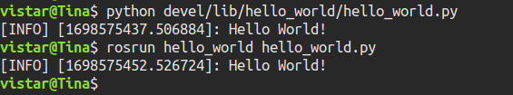
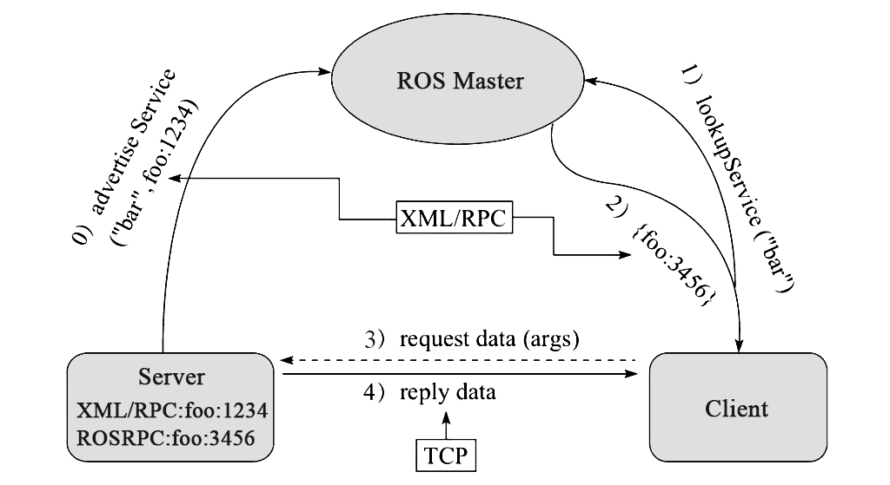
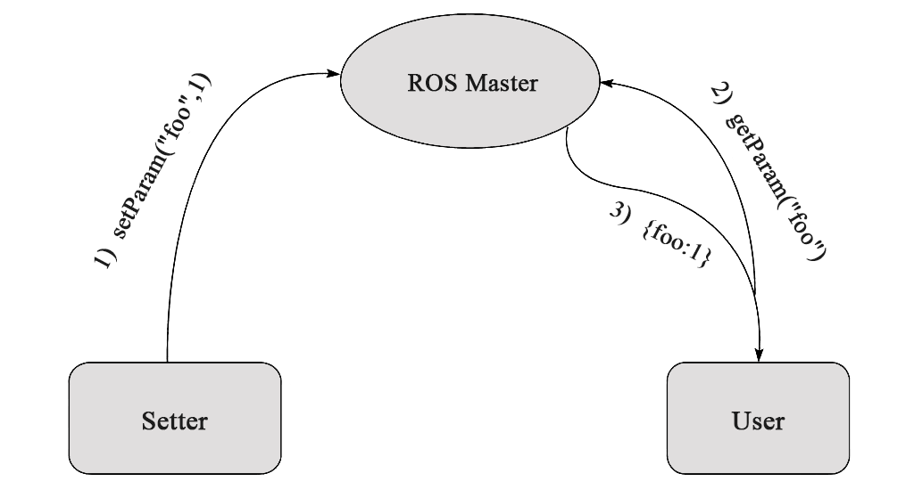
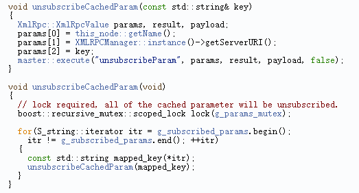
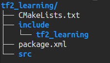
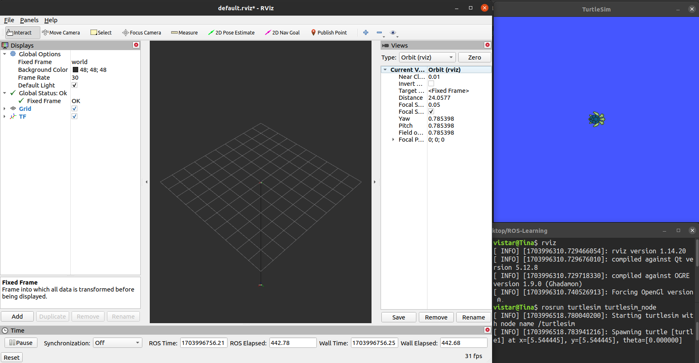

# ROSLearning

# 一、ROS概览

## 1.1 ROS简介

### 1.1.1 为什么要诞生ROS

机器人是一种高度复杂的系统性实现，机器人设计包含了机械加工、机械结构设计、硬件设计、嵌入式软件设计、上层软件设计....是各种硬件与软件集成，甚至可以说机器人系统是当今工业体系的集大成者。

机器人体系是相当庞大的，其复杂度之高，以至于没有任何个人、组织甚至公司能够独立完成系统性的机器人研发工作。

一种更合适的策略是：让机器人研发者专注于自己擅长的领域，其他模块则直接复用相关领域更专业研发团队的实现，当然自身的研究也可以被他人继续复用。这种基于"复用"的分工协作，遵循了**不重复发明轮子**的原则，显然是可以大大提高机器人的研发效率的，尤其是随着机器人硬件越来越丰富，软件库越来越庞大，这种复用性和模块化开发需求也愈发强烈。

在此大背景下，于 **2007** 年，一家名为 **柳树车库（Willow Garage）**的机器人公司发布了 ***ROS***(机器人操作系统)，ROS是一套机器人通用软件框架，可以提升功能模块的复用性，并且随着该系统的不断迭代与完善，如今 ROS 已经成为机器人领域的事实标准。

### 1.1.2 什么是ROS

**ROS全称Robot Operating System(机器人操作系统)**

- ROS是适用于机器人的**开源**元操作系统
- ROS集成了大量的工具，库，协议，提供类似OS所提供的功能，简化对机器人的控制
- 还提供了用于在**多台计算机**上获取，构建，编写和运行代码的工具和库，ROS在某些方面类似于“机器人框架”
- ROS设计者将ROS表述为“ROS = Plumbing + Tools + Capabilities + Ecosystem”，即ROS是通讯机制、工具软件包、机器人高层技能以及机器人生态系统的集合体


### 1.1.3 ROS的目标

机器人开发的分工思想，实现了不同研发团队间的共享和协作，提升了机器人的研发效率，为了服务“ 分工”，ROS主要设计了如下目标：

- **代码复用:**ROS的目标不是成为具有最多功能的框架，ROS的主要目标是支持机器人技术研发中的代码*重用*。
- **分布式:**ROS是进程（也称为*Nodes*）的分布式框架,ROS中的进程可分布于不同主机，不同主机协同工作，从而分散计算压力
- **松耦合:**ROS中功能模块封装于独立的功能包或元功能包，便于分享，功能包内的模块以节点为单位运行，以ROS标准的IO作为接口，开发者不需要关注模块内部实现，只要了解接口规则就能实现复用,实现了模块间点对点的松耦合连接
- **精简：**ROS被设计为尽可能精简，以便为ROS编写的代码可以与其他机器人软件框架一起使用。ROS易于与其他机器人软件框架集成：ROS已与OpenRAVE，Orocos和Player集成。
- **语言独立性：**包括Java，C++，Python等。为了支持更多应用开发和移植，ROS设计为一种语言弱相关的框架结构，使用简洁，中立的定义语言描述模块间的消息接口，在编译中再产生所使用语言的目标文件，为消息交互提供支持，同时允许消息接口的嵌套使用
- **易于测试：**ROS具有称为[rostest](http://wiki.ros.org/rostest)的内置单元/集成测试框架，可轻松安装和拆卸测试工具。
- **大型应用：**ROS适用于大型运行时系统和大型开发流程。
- **丰富的组件化工具包：**ROS可采用组件化方式集成一些工具和软件到系统中并作为一个组件直接使用，如RVIZ（3D可视化工具），开发者根据ROS定义的接口在其中显示机器人模型等，组件还包括仿真环境和消息查看工具等
- **免费且开源：**开发者众多，功能包多

### 1.1.4 ROS发展历程

- ROS是一个由来已久、贡献者众多的大型软件项目。在ROS诞生之前，很多学者认为，机器人研究需要一个开放式的协作框架，并且已经有不少类似的项目致力于实现这样的框架。在这些工作中，斯坦福大学在2000年年中开展了一系列相关研究项目，如斯坦福人工智能机器人（STandford AI Robot, STAIR）项目、个人机器人（Personal Robots, PR）项目等，在上述项目中，在研究具有代表性、集成式人工智能系统的过程中，创立了用于室内场景的高灵活性、动态软件系统，其可以用于机器人学研究。

- 2007年，柳树车库（Willow Garage）提供了大量资源，用于将斯坦福大学机器人项目中的软件系统进行扩展与完善，同时，在无数研究人员的共同努力下，ROS的核心思想和基本软件包逐渐得到完善。

- ROS的发行版本（ROS distribution）指ROS软件包的版本，其与Linux的发行版本（如Ubuntu）的概念类似。推出ROS发行版本的目的在于使开发人员可以使用相对稳定的代码库，直到其准备好将所有内容进行版本升级为止。因此，每个发行版本推出后，ROS开发者通常仅对这一版本的bug进行修复，同时提供少量针对核心软件包的改进。

- 版本特点: 按照英文字母顺序命名，ROS 目前已经发布了ROS1 的最终版本: noetic，并建议后期过渡至 ROS2 版本。noetic 版本之前默认使用的是 Python2，noetic 支持 Python3。

    建议版本: noetic 或 melodic 或 kinetic

## 1.2 ROS安装

ROS不是真正的操作系统，它需要依赖于其他操作系统，我们以**noetic**为例，它依赖于**Ubuntu20.04**，所以安装ROS noetic之前需要先安装Ubuntu20.04，有以下两种方式：

- 物理机安装：可以保证性能，且不需要考虑硬件交互问题，但和windows系统交互不便；
- 虚拟机安装：可以方便的实现 windows 与 ubuntu 切换，不过性能稍差，且与硬件交互不便。

实际应用中，ROS常需要获取硬件数据，且对性能要求较高，所以原则上建议在物理机中安装，但初学只需要了解ROS原理与初级使用，虚拟机已足够，所以初学建议虚拟机安装ubuntu和ROS。

常用的虚拟机有VMware和virtualbox，前者收费后者免费，按需选择。

### 1.2.1 安装虚拟机

### 1.2.2 安装Ubuntu

### 1.2.3 安装ROS

#### 1.2.3.1 设置Ubuntu的软件和更新

在搜索框输入software，选择软件和更新一项，勾选 `main`、`universe`、`restricted` 和 `multiverse`，然后在`Downlosd from`选择一个中国的服务器，我选的上海交大的源，然后点 `Close` 关闭就行了。


#### 1.2.3.2 添加源

如果网速快，可以直接用官方源，打开terminal输入一下命令：

```bash
sudo sh -c 'echo "deb http://packages.ros.org/ros/ubuntu $(lsb_release -sc) main" > /etc/apt/sources.list.d/ros-latest.list'
```

网速慢的话，可以用国内源：
[国内源列表](http://wiki.ros.org/ROS/Installation/UbuntuMirrors)

上海交大源

```bash
sudo sh -c '. /etc/lsb-release && echo "deb http://mirrors.sjtug.sjtu.edu.cn/ros/ubuntu/ `lsb_release -cs` main" > /etc/apt/sources.list.d/ros-latest.list'
```

清华源

```bash
sudo sh -c '. /etc/lsb-release && echo "deb http://mirrors.tuna.tsinghua.edu.cn/ros/ubuntu/ `lsb_release -cs` main" > /etc/apt/sources.list.d/ros-latest.list'
```

#### 1.2.3.3 添加密钥

```bash
sudo apt-key adv --keyserver 'hkp://keyserver.ubuntu.com:80' --recv-key C1CF6E31E6BADE8868B172B4F42ED6FBAB17C654
```

#### 1.2.3.4 更新软件包索引

```bash
sudo apt update
```

#### 1.2.3.5 安装ROS

ROS有好几个安装模式，包含的功能有多有少，我选择的完全安装。

```bash
sudo apt install ros-noetic-desktop-full
```

#### 1.2.3.6 设置环境变量

为了每次启动新terminal，ROS仍能用，不用每次手动设置环境变量。

```bash
echo "source /opt/ros/noetic/setup.bash" >> ~/.bashrc
source ~/.bashrc
```

#### 1.2.3.7 安装其他工具和依赖关系

ROS的核心部分已经安装完了，但还有一些构建软件包的依赖关系和工具。

```bash
sudo apt install python3-rosdep python3-rosinstall python3-rosinstall-generator python3-wstool build-essential
```

#### 1.2.3.8 初始化rosdep

rosdep可以为要编译的源安装系统依赖性，并且是运行ROS中某些核心组件所必需的。

```bash
sudo rosdep init
rosdep update
```

这一步，由于软件服务器在国外，常常访问超时，解决办法见 [ERROR: cannot download default sources list from: 20-default.list. Website may be down.](https://blog.csdn.net/maizousidemao/article/details/109476275)

另外，也可以安装国内版的rosdep，如下：

##### 国内版rosdep

为了方便国内同学学习ROS，大佬 **鱼香ROS** 基于 `rosdep` 源码制作了 `rosdepc`，后缀 `c` 即 `China` 。

##### 1. 安装  `rosdepc`

```bash
sudo pip install rosdepc
```

如果显示没有 `pip` 可以使用 `pip3`：

```bash
sudo pip3 install rosdepc
```

如果 `pip3` 还没有，需要先安装 `pip3`：

```bash
sudo apt-get install python3-pip
```

##### 2. 使用  `rosdepc`

```bash
sudo rosdepc init
rosdepc update
```

#### 1.2.3.9 验证

这样ROS就安装好啦，输入

```bash
roscore
```

如果没有错误，就是安装成功了。


## 1.3 ROS Hello World

万物始于Hello World，为了体验ROS，使用Hello World介绍ROS的简单使用。

### 1.3.1 Hello World工程简介

首先需要创建工程，流程为：

1. 创建工作空间目录（即工程根目录，注意此时还不是ROS工作空间，只是一个目录）
2. 初始化工作空间（即把当前目录初始化为一个ROS工作空间）
3. 创建功能包（ROS基本单元，可以理解为一个功能模块，每个工程至少有一个功能包）
4. 编辑源文件（写代码实现需求）
5. 编辑编译配置文件（ROS1使用CMake编译系统，这里编辑CMakeList.txt文件）
6. 编译工程（使用CMake编译ROS工程，生成可执行文件，即ros节点，下文均称作节点）

不只是Hello World，所有ROS工程都是这样的流程。

另外，目前ROS开发主要使用C++和Python语言，这里会分别实现。

### 1.3.2 ROS Hello World C++ 版

注：其中`ros_learning`是工作空间的自定义名称。

#### 1.3.2.1 创建工作空间目录

```bash
# 递归创建工作空间目录
mkdir -p ros_learning/src
```

#### 1.3.2.2 初始化工作空间

这一步有两种方法都可以达到初始化工作空间的目的：

方法一：

```bash
# 1.进入src目录
cd ros_learning/src
# 2.初始化工作空间
catkin_init_workspace
```

方法二：

```bash
# 1.进入ros_learning目录
cd ros_learning/src
# 2.编译工作空间
catkin_make
```

#### 1.3.2.3 创建功能包

```bash
cd ros_learning/src
catkin_create_pkg hello_world std_msgs rospy roscpp
```

其中，hello_world：自定义功能包名称，

std_msgs rospy roscpp：功能包依赖，roscpp是C++实现的库，而rospy是python实现的库，std_msgs是ROS标准消息库

#### 1.3.2.4 编辑源文件

在`ros_learning/src/hello_world/src`目录下新增`hello_world.cpp`文件，文件内容如下：

```c++
#include "ros/ros.h"

int main(int argc, char **argv)
{
    // 初始化ros节点，"hello_world_cpp"为自定义节点名称
    ros::init(argc, argv, "hello_world_cpp");

    // 在控制台打印 hello world
    ROS_INFO("Hello World!");

    return 0;
}
```

#### 1.3.2.5 编辑编译配置文件CMakeList.txt

由于新增了源文件`hello_world.cpp`，所以要配置该文件的编译规则。

找到`ros_learning/src/hello_world/CMakeLists.txt`中的`Build`，如下：


修改其中的`add_executable`和`target_link_libraries`两项，如下：


修改说明如下：

```cmake
add_executable(${PROJECT_NAME}_node src/hello_world.cpp)
# 生成可执行文件，其中 ${PROJECT_NAME}_node 代表节点的名称（也可以自定义，比如hello_world）
# src/hello_world.cpp 是源文件，也可以有多个。

target_link_libraries(${PROJECT_NAME}_node
  ${catkin_LIBRARIES}
)
# 链接库文件，因为我们使用了ros的 ros::init 和 ROS_INFO，所以需要链接相应的库才可以编译成功。
# ${PROJECT_NAME}_node 代表要执行链接库的节点名称
# ${catkin_LIBRARIES} 搜索库的路径
```

#### 1.3.2.6 编译工程

进入到ros_learning目录，编译该工程

```bash
cd ros_learning
catkin_make
```

编译成功后，会在ros_learning目录下生成build 和devel。

#### 1.3.2.7 运行节点

生成的节点在 `devel/lib/hello_world` 中，我们可以直接执行：


不过这样需要知道节点的具体路径，实际中操作较麻烦。

ROS提供了 `rosrun` 命令，可以根据包名和节点名，在任何目录执行。

但需要具备以下两个条件：

- 启动 roscore
- 进入到工作空间目录中，执行 source ./devel/setup.bash（为了让系统找到节点）


但 `source ./devel/setup.bash` 只对当前终端有效，新打开终端仍需再执行该命令，为了避免每次执行，可以把该命令加到当前用户的 `.bashrc` 文件中，该文件在用户的 `home` 目录下。

方法一：直接打开 `~/.bashrc` 文件，在末尾添加 `source 你的工作空间目录/devel/setup.bash` ，保存。

方法二：使用命令 `echo "source 你的工作空间目录/devel/setup.bash" >> ~/.bashrc`

最后，使用命令 `source ~/.bashrc` 使修改生效。


### 1.3.3 ROS Hello World Python 版

1到3步骤上面已经做过，这里直接编辑源文件。

#### 1.3.3.1 编辑源文件

进入到 `ros_learning/src/hello_world` 目录，新建 `scripts` 目录，在该目录中新增 `hello_world.py`，内容如下：

```python
#! /usr/bin python

import rospy

if __name__ == "__main__":
    # 初始化ros节点，"hello_world_py"为自定义节点名称
    rospy.init_node("hello_world_py")

    # 在控制台打印 Hello World!
    rospy.loginfo("Hello World!")
```

#### 1.3.3.2 编辑编译配置文件CMakeList.txt

找到`ros_learning/src/hello_world/CMakeLists.txt`中的`Install`，修改`catkin_install_python`如下：


修改说明：

```cmake
catkin_install_python(PROGRAMS
  scripts/hello_world.py
  DESTINATION ${CATKIN_PACKAGE_BIN_DESTINATION}
)
# 将脚本scripts/hello_world.py安装到指定位置
# PROGRAMS 关键字指定脚本程序
# DESTINATION 关键字指定安装位置
# ${CATKIN_PACKAGE_BIN_DESTINATION} 系统环境变量，存储当前功能包可执行文件安装路径
```

#### 1.3.3.3 编译工程

进入到ros_learning目录，编译该工程

```bash
cd ros_learning
catkin_make
```

编译成功后，会在ros_learning目录下生成build 和devel。

#### 1.3.3.4 运行节点

生成的脚本在 `devel/lib/hello_world` 中，同样可以直接运行，也可以使用 `rosrun`命令。

这里注意，无论直接运行还是使用`rosrun`命令，都需要先启动`roscore`。




## 1.4 ROS架构

### 1.4.1 ROS架构简介

立足不同的角度，对ROS架构的描述也是不同的，一般我们可以从设计者、维护者、系统结构与自身结构4个角度来描述ROS结构:

#### 1. 设计者

ROS设计者将ROS表述为 `ROS = Plumbing + Tools + Capabilities + Ecosystem`

- Plumbing：**通讯机制(实现ROS不同节点之间的交互)**
- Tools：**工具软件包(ROS中的开发和调试工具)**
- Capabilities：机器人高层技能(ROS中某些功能的集合，比如：导航)
- Ecosystem：机器人生态系统(跨地域、跨软件与硬件的ROS联盟)

#### 2. 维护者

立足**维护者**的角度: ROS 架构可划分为两大部分

- main：核心部分，主要由Willow Garage 和一些开发者设计、提供以及维护。它提供了一些分布式计算的基本工具，以及整个ROS的核心部分的程序编写。
- universe：全球范围的代码，有不同国家的ROS社区组织开发和维护。一种是库的代码，如OpenCV、PCL等；库的上一层是从功能角度提供的代码，如人脸识别，他们调用下层的库；最上层的代码是应用级的代码，让机器人完成某一确定的功能。

#### 3. 系统架构

立足系统架构: ROS 可以划分为三层

- OS 层，也即经典意义的操作系统

    ROS 只是元操作系统，需要依托真正意义的操作系统，目前兼容性最好的是 Linux 的 Ubuntu，Mac、Windows 也支持 ROS 的较新版本

- 中间层

    是 ROS 封装的关于机器人开发的中间件，比如:

    - 基于 TCP/UDP 继续封装的 TCPROS/UDPROS 通信系统
    - 用于进程间通信 Nodelet，为数据的实时性传输提供支持
    - 另外，还提供了大量的机器人开发实现库，如：数据类型定义、坐标变换、运动控制....

- 应用层

    功能包，以及功能包内的节点，比如: master、turtlesim的控制与运动节点...

#### 4. 自身结构

就 ROS 自身实现而言，也可以划分为三层：

- 文件系统

    ROS文件系统级指的是在硬盘上面查看的ROS源代码的组织形式

- 计算图

    ROS 分布式系统中不同进程需要进行数据交互，计算图可以以点对点的网络形式表现数据交互过程，计算图中的重要概念: 节点(Node)、消息(message)、通信机制主题(topic)、通信机制服务(service)

- 开源社区

    ROS的社区级概念是ROS网络上进行代码发布的一种表现形式

    - 发行版（Distribution）　ROS发行版是可以独立安装、带有版本号的一系列综合功能包。ROS发行版像Linux发行版一样发挥类似的作用。这使得ROS软件安装更加容易，而且能够通过一个软件集合维持一致的版本。
    - 软件库（Repository）　ROS依赖于共享开源代码与软件库的网站或主机服务，在这里不同的机构能够发布和分享各自的机器人软件与程序。
    - ROS维基（ROS Wiki）　ROS Wiki是用于记录有关ROS系统信息的主要论坛。任何人都可以注册账户、贡献自己的文件、提供更正或更新、编写教程以及其他行为。网址是http://wiki.ros.org/。
    - Bug提交系统（Bug Ticket System）如果你发现问题或者想提出一个新功能，ROS提供这个资源去做这些。
    - 邮件列表（Mailing list）　ROS用户邮件列表是关于ROS的主要交流渠道，能够像论坛一样交流从ROS软件更新到ROS软件使用中的各种疑问或信息。网址是http://lists.ros.org/。
    - ROS问答（ROS Answer）用户可以使用这个资源去提问题。网址是https://answers.ros.org/questions/。
    - 博客（Blog）你可以看到定期更新、照片和新闻。网址是https://www.ros.org/news/，不过博客系统已经退休，ROS社区取而代之，网址是https://discourse.ros.org/。


### 1.4.2 ROS文件系统

ROS文件系统级指的是ROS源代码在硬盘上的组织形式，其结构大致可以如下图所示：


其中：

```bash
catkin workspace 工作空间
├── build：编译空间，用于存放CMake和catkin的缓存信息、配置信息和其他中间文件。
├── devel：开发空间，用于存放编译后生成的目标文件，包括头文件、动态&静态链接库、可执行文件等。
└── src：源码
    ├── CMakeList.txt：编译的基本配置
    ├── package1：功能包(ROS基本单元)包含多个节点、库与配置文件
    └── package2
        ├── CMakeList.txt：配置编译规则，比如源文件、依赖项、目标文件
        ├── package.xml：包信息，如:包名、版本、作者、依赖项等(ROS旧版本是manifest.xml)
        ├── scripts：脚本文件
        ├── msg：消息通信格式文件
        ├── srv：服务通信格式文件
        ├── include：头文件
        ├── src：C++源文件
        ├── launch：启动文件
        ├── action：动作格式文件
        └── config：参数配置文件
```


#### 1.4.1.1 package.xml 内容说明

该文件基于XML语言，XML指可扩展标记语言（e**X**tensible **M**arkup **L**anguage），被设计用来传输和存储数据。

该文件定义有关软件包的属性信息，如：软件包名称、版本号、作者、维护者以及对其他catkin软件包的依赖性。请注意，该概念类似于旧版ROS的 `rosbuild` 构建系统中使用的 `manifest.xml` 文件。

```xml
<!-- xml声明：文档符合xml1.0规范 -->
<?xml version="1.0"?>
<!-- 格式: 以前是 1，推荐使用格式 2 -->
<package format="2">
    <!-- 包名 -->
    <name>hello_world</name>
    <!-- 包版本 -->
    <version>0.0.0</version>
    <!-- 描述信息 -->
    <description>The hello_world package</description>
  
    <!-- One maintainer tag required, multiple allowed, one person per tag -->
    <!-- Example:  -->
    <!-- <maintainer email="jane.doe@example.com">Jane Doe</maintainer> -->
    <!-- 维护人员 -->
    <maintainer email="vistar@todo.todo">vistar</maintainer>
  
  
    <!-- One license tag required, multiple allowed, one license per tag -->
    <!-- Commonly used license strings: -->
    <!--   BSD, MIT, Boost Software License, GPLv2, GPLv3, LGPLv2.1, LGPLv3 -->
    <!-- 许可证信息，ROS核心组件默认 BSD -->
    <license>TODO</license>
  
  
    <!-- Url tags are optional, but multiple are allowed, one per tag -->
    <!-- Optional attribute type can be: website, bugtracker, or repository -->
    <!-- Example: -->
    <!-- <url type="website">http://wiki.ros.org/hello_world</url> -->
  
  
    <!-- Author tags are optional, multiple are allowed, one per tag -->
    <!-- Authors do not have to be maintainers, but could be -->
    <!-- Example: -->
    <!-- <author email="jane.doe@example.com">Jane Doe</author> -->
  
  
    <!-- The *depend tags are used to specify dependencies -->
    <!-- Dependencies can be catkin packages or system dependencies -->
    <!-- Examples: -->
    <!-- Use depend as a shortcut for packages that are both build and exec dependencies -->
    <!--   <depend>roscpp</depend> -->
    <!--   Note that this is equivalent to the following: -->
    <!--   <build_depend>roscpp</build_depend> -->
    <!--   <exec_depend>roscpp</exec_depend> -->
    <!-- Use build_depend for packages you need at compile time: -->
    <!--   <build_depend>message_generation</build_depend> -->
    <!-- Use build_export_depend for packages you need in order to build against this package: -->
    <!--   <build_export_depend>message_generation</build_export_depend> -->
    <!-- Use buildtool_depend for build tool packages: -->
    <!--   <buildtool_depend>catkin</buildtool_depend> -->
    <!-- Use exec_depend for packages you need at runtime: -->
    <!--   <exec_depend>message_runtime</exec_depend> -->
    <!-- Use test_depend for packages you need only for testing: -->
    <!--   <test_depend>gtest</test_depend> -->
    <!-- Use doc_depend for packages you need only for building documentation: -->
    <!--   <doc_depend>doxygen</doc_depend> -->
    <!-- 构建工具，这是必须的 -->
    <buildtool_depend>catkin</buildtool_depend>
    
    <!-- 指定此软件包依赖的其他软件包 -->
    <build_depend>roscpp</build_depend>
    <build_depend>rospy</build_depend>
    <build_depend>std_msgs</build_depend>
    
    <!-- 指定根据这个包构建成库所依赖的其他包 -->
    <build_export_depend>roscpp</build_export_depend>
    <build_export_depend>rospy</build_export_depend>
    <build_export_depend>std_msgs</build_export_depend>
    
    <!-- 指定运行该软件包所依赖的其他包 -->  
    <exec_depend>roscpp</exec_depend>
    <exec_depend>rospy</exec_depend>
    <exec_depend>std_msgs</exec_depend>
  
  
    <!-- The export tag contains other, unspecified, tags -->
    <export>
      <!-- Other tools can request additional information be placed here -->
  
    </export>
</package>

```

#### 1.4.1.2 CMakelists.txt 内容说明

该文件基于CMake语言，CMake是一个跨平台的编译工具，可以用简单的语句来描述所有平台的编译过程。

```cmake
# 所需 cmake 的最小版本
cmake_minimum_required(VERSION 3.0.2)
# 工程名称，隐式定义 ${PROJECT_NAME} 
project(hello_world)

## Compile as C++11, supported in ROS Kinetic and newer
# add_compile_options(-std=c++11)

## Find catkin macros and libraries
## if COMPONENTS list like find_package(catkin REQUIRED COMPONENTS xyz)
## is used, also find other catkin packages
# 设置构建所需要的软件包
find_package(catkin REQUIRED COMPONENTS
  roscpp
  rospy
  std_msgs
)

## System dependencies are found with CMake's conventions
# find_package(Boost REQUIRED COMPONENTS system)


## Uncomment this if the package has a setup.py. This macro ensures
## modules and global scripts declared therein get installed
## See http://ros.org/doc/api/catkin/html/user_guide/setup_dot_py.html
# 启动 python 模块支持
# catkin_python_setup()

################################################
## Declare ROS messages, services and actions ##
## 设置 ROS 消息、服务、动作等
################################################

## To declare and build messages, services or actions from within this
## package, follow these steps:
## * Let MSG_DEP_SET be the set of packages whose message types you use in
##   your messages/services/actions (e.g. std_msgs, actionlib_msgs, ...).
## * In the file package.xml:
##   * add a build_depend tag for "message_generation"
##   * add a build_depend and a exec_depend tag for each package in MSG_DEP_SET
##   * If MSG_DEP_SET isn't empty the following dependency has been pulled in
##     but can be declared for certainty nonetheless:
##     * add a exec_depend tag for "message_runtime"
## * In this file (CMakeLists.txt):
##   * add "message_generation" and every package in MSG_DEP_SET to
##     find_package(catkin REQUIRED COMPONENTS ...)
##   * add "message_runtime" and every package in MSG_DEP_SET to
##     catkin_package(CATKIN_DEPENDS ...)
##   * uncomment the add_*_files sections below as needed
##     and list every .msg/.srv/.action file to be processed
##   * uncomment the generate_messages entry below
##   * add every package in MSG_DEP_SET to generate_messages(DEPENDENCIES ...)

## Generate messages in the 'msg' folder
# add_message_files(
#   FILES
#   Message1.msg
#   Message2.msg
# )

## Generate services in the 'srv' folder
# add_service_files(
#   FILES
#   Service1.srv
#   Service2.srv
# )

## Generate actions in the 'action' folder
# add_action_files(
#   FILES
#   Action1.action
#   Action2.action
# )

## Generate added messages and services with any dependencies listed here
# 生成消息、服务的依赖包
# generate_messages(
#   DEPENDENCIES
#   std_msgs
# )

################################################
## Declare ROS dynamic reconfigure parameters ##
## 声明 ROS 动态参数配置
################################################

## To declare and build dynamic reconfigure parameters within this
## package, follow these steps:
## * In the file package.xml:
##   * add a build_depend and a exec_depend tag for "dynamic_reconfigure"
## * In this file (CMakeLists.txt):
##   * add "dynamic_reconfigure" to
##     find_package(catkin REQUIRED COMPONENTS ...)
##   * uncomment the "generate_dynamic_reconfigure_options" section below
##     and list every .cfg file to be processed

## Generate dynamic reconfigure parameters in the 'cfg' folder
# generate_dynamic_reconfigure_options(
#   cfg/DynReconf1.cfg
#   cfg/DynReconf2.cfg
# )

###################################
## catkin specific configuration ##
## catkin 特定配置
###################################
## The catkin_package macro generates cmake config files for your package
## Declare things to be passed to dependent projects
## INCLUDE_DIRS: uncomment this if your package contains header files
## LIBRARIES: libraries you create in this project that dependent projects also need
## CATKIN_DEPENDS: catkin_packages dependent projects also need
## DEPENDS: system dependencies of this project that dependent projects also need
# 运行时依赖
catkin_package(
#  INCLUDE_DIRS include
#  LIBRARIES hello_world
#  CATKIN_DEPENDS roscpp rospy std_msgs
#  DEPENDS system_lib
)

###########
## Build ##
###########

## Specify additional locations of header files
## Your package locations should be listed before other locations
# 添加头文件路径，注意当前程序包的头文件路径要位于其他文件路径之前
include_directories(
# include
  ${catkin_INCLUDE_DIRS}
)

## Declare a C++ library
# 声明 C++ 库
# add_library(${PROJECT_NAME}
#   src/${PROJECT_NAME}/hello_world.cpp
# )

## Add cmake target dependencies of the library
## as an example, code may need to be generated before libraries
## either from message generation or dynamic reconfigure
# 添加库的目标依赖
# add_dependencies(${PROJECT_NAME} ${${PROJECT_NAME}_EXPORTED_TARGETS} ${catkin_EXPORTED_TARGETS})

## Declare a C++ executable
## With catkin_make all packages are built within a single CMake context
## The recommended prefix ensures that target names across packages don't collide
# 生成可执行文件
add_executable(${PROJECT_NAME}_node src/hello_world.cpp)

## Rename C++ executable without prefix
## The above recommended prefix causes long target names, the following renames the
## target back to the shorter version for ease of user use
## e.g. "rosrun someones_pkg node" instead of "rosrun someones_pkg someones_pkg_node"
# 重命名c++可执行文件
# set_target_properties(${PROJECT_NAME}_node PROPERTIES OUTPUT_NAME node PREFIX "")

## Add cmake target dependencies of the executable
## same as for the library above
# 添加可执行文件的目标依赖
# add_dependencies(${PROJECT_NAME}_node ${${PROJECT_NAME}_EXPORTED_TARGETS} ${catkin_EXPORTED_TARGETS})

## Specify libraries to link a library or executable target against
# 指定库、可执行文件的链接库
target_link_libraries(${PROJECT_NAME}_node
  ${catkin_LIBRARIES}
)

#############
## Install ##
#############

# all install targets should use catkin DESTINATION variables
# See http://ros.org/doc/api/catkin/html/adv_user_guide/variables.html

## Mark executable scripts (Python etc.) for installation
## in contrast to setup.py, you can choose the destination
# 设置用于安装的可执行脚本
catkin_install_python(PROGRAMS
  scripts/hello_world.py
  DESTINATION ${CATKIN_PACKAGE_BIN_DESTINATION}
)

## Mark executables for installation
## See http://docs.ros.org/melodic/api/catkin/html/howto/format1/building_executables.html
# install(TARGETS ${PROJECT_NAME}_node
#   RUNTIME DESTINATION ${CATKIN_PACKAGE_BIN_DESTINATION}
# )

## Mark libraries for installation
## See http://docs.ros.org/melodic/api/catkin/html/howto/format1/building_libraries.html
# install(TARGETS ${PROJECT_NAME}
#   ARCHIVE DESTINATION ${CATKIN_PACKAGE_LIB_DESTINATION}
#   LIBRARY DESTINATION ${CATKIN_PACKAGE_LIB_DESTINATION}
#   RUNTIME DESTINATION ${CATKIN_GLOBAL_BIN_DESTINATION}
# )

## Mark cpp header files for installation
# install(DIRECTORY include/${PROJECT_NAME}/
#   DESTINATION ${CATKIN_PACKAGE_INCLUDE_DESTINATION}
#   FILES_MATCHING PATTERN "*.h"
#   PATTERN ".svn" EXCLUDE
# )

## Mark other files for installation (e.g. launch and bag files, etc.)
# install(FILES
#   # myfile1
#   # myfile2
#   DESTINATION ${CATKIN_PACKAGE_SHARE_DESTINATION}
# )

#############
## Testing ##
#############

## Add gtest based cpp test target and link libraries
# catkin_add_gtest(${PROJECT_NAME}-test test/test_hello_world.cpp)
# if(TARGET ${PROJECT_NAME}-test)
#   target_link_libraries(${PROJECT_NAME}-test ${PROJECT_NAME})
# endif()

## Add folders to be run by python nosetests
# catkin_add_nosetests(test)

```


### 1.4.3 ROS计算图

#### 1.4.2.1 计算图简介

**计算图**是ROS处理数据的一种点对点的网络形式。程序运行时，所有进程以及他们所进行的数据处理，将会通过一种点对点的网络形式表现出来。计算图中的重要概念：节点(Node)、消息(message)、话题(topic)、服务(service)。

**节点(Node)**

节点就是一些直行运算任务的进程。ROS利用规模可增长的方式是代码模块化：一个系统就是典型的由很多节点组成的。在这里，节点也可以被称之为“软件模块”。我们使用“节点”使得基于ROS的系统在运行的时候更加形象化：当许多节点同时运行时，可以很方便的将端对端的通讯绘制成一个图表，在这个图表中，进程就是图中的节点，而端对端的连接关系就是其中弧线连接。

**消息(message)**

节点之间是通过传送消息进行通讯的。每一个消息都是一个严格的数据结构。原来标准的数据类型（整型，浮点型，布尔型等等）都是支持的，同时也支持原始数组类型。消息可以包含任意的嵌套结构和数组（很类似于C语言的结构structs）。

**话题(topic)**


消息以一种发布/订阅的方式传递。一个节点可以在一个给定的主题中发布消息。一个节点针对某个主题关注与订阅特定类型的数据。可能同时有多个节点发布或者订阅同一个主题的消息。总体上，发布者和订阅者不了解彼此的存在。

**服务(service)**

虽然基于话题的发布/订阅模型是很灵活的通讯模式，但是它广播式的路径规划对于可以简化节点设计的同步传输模式并不适合。在ROS中，我们称之为一个服务，用一个字符串和一对严格规范的消息定义：一个用于请求，一个用于回应。这类似于web服务器，web服务器是由URIs定义的，同时带有完整定义类型的请求和回复文档。需要注意的是，不像话题，只有一个节点可以以任意独有的名字广播一个服务：只有一个服务可以称之为“分类象征”，比如说，任意一个给出的URI地址只能有一个web服务器。

在上面概念的基础上，需要有一个控制器可以使所有节点有条不紊的执行，这就是一个ROS的控制器（ROS Master）。

ROS Master 通过RPC（Remote Procedure Call Protocol，远程过程调用）提供了登记列表和对其他计算图表的查找。没有控制器，节点将无法找到其他节点，交换消息或调用服务。

比如控制节点订阅和发布消息的模型如下：


ROS的控制器给ROS的节点存储了主题和服务的注册信息。节点与控制器通信从而报告它们的注册信息。当这些节点与控制器通信的时候，它们可以接收关于其他以注册及节点的信息并且建立与其它以注册节点之间的联系。当这些注册信息改变时控制器也会回馈这些节点，同时允许节点动态创建与新节点之间的连接。
节点与节点之间的连接是直接的，控制器仅仅提供了查询信息，就像一个DNS服务器。节点订阅一个主题将会要求建立一个与出版该主题的节点的连接，并且将会在同意连接协议的基础上建立该连接。

ROS控制器控制服务的模型如下：


#### 1.4.2.2 查看计算图

ROS 中提供了一个实用的工具 `rqt_graph` 可以查看ROS计算图。它能够创建一个显示当前系统运行情况的动态图形。使用以下命令启动（注意：首先要启动roscore）：

```bash
rosrun rqt_graph rqt_graph
或直接使用 rqt_graph 命令
```

利用ROS自带的小乌龟示例，我们可以看到如下计算图：

其中，圈起来的代表节点，带箭头的线代表话题发布流向。


# 二、ROS通讯机制

机器人是一种高度复杂的系统性实现，在机器人上可能集成各种传感器(雷达、摄像头、GPS...)以及运动控制实现，为了解耦合，在ROS中每一个功能点都是一个单独的进程，每一个进程都是独立运行的。更确切的讲，**ROS是进程（也称为Nodes）的分布式框架。** 因为这些进程甚至还可分布于不同主机，不同主机协同工作，从而分散计算压力。不过随之也有一个问题: 不同的进程是如何通信的？也即不同进程间如何实现数据交换的？在此我们就需要介绍一下ROS中的通信机制了。

ROS 中的基本通信机制主要有如下三种实现策略:

- 话题通信(发布订阅模式)
- 服务通信(请求响应模式)
- 参数服务器(参数共享模式)

## 2.1 话题通讯（Topic）

话题通信适用于不断更新数据、少逻辑处理的传输相关的应用场景。

### 2.1.1 话题通讯模型

话题是一种单向通讯方式，它通过发布和订阅的方式传递消息，该模型涉及到三个角色：

- Master (管理者)
- Publisher（发布者）
- Subscriber（订阅者）

**Master** 负责保管 **Publisher** 和 **Subscriber** 的注册信息，并匹配话题相同的 **Publisher** 和 **Subscriber** ，帮助 他们建立连接，连接建立后，**Publisher** 可以发布消息，且发布的消息会被 **Subscriber** 订阅。


话题模型通讯流程：

- **0）advertise：发布者注册**

​	发布者（Publisher）向管理者（Master）注册信息，包括RPC地址和Topic名字。Master会将发布者的注册信息加入到注册表中，并查询是否有该话题的订阅者。

- **1）subscribe：订阅者注册**

​	订阅者（Subscriber）向管理者（Master）注册信息，包括Topic名字。Master会将订阅者（Subscriber）的注册信息加入到注册表中，并查询是否有该话题的发布者。

- **2）Master匹配信息：牵线搭桥**

​	管理者（Master）通过查询注册表发现有匹配的发布者（Publisher）和订阅者（Subscriber），则向订阅者（Subscriber）发送发布者的RPC地址信息。

- **3）connect：订阅者请求连接发布者**

​	订阅者根据发布者的RPC地址，请求连接发布者（Publisher），并传输订阅的话题名称、消息类型以及通信协议(TCP/UDP)。

- **4）发布者确认请求**

    发布者（Publisher）收到请求后，通过RPC向订阅者确认连接信息，并发送自身的 TCP/UDP 地址信息。

- **5）建立连接**

​	订阅者根据发布者的TCP/UDP地址信息与订阅者建立TCP/UDP连接。

- **6）发送消息**

​	连接建立后，发布者开始向订阅者发布话题消息数据。

> Note：
>
> 1. 上述实现流程中，前五步使用 RPC 协议，最后两步使用 TCP/UDP 协议，默认TCP。
> 2.  发布者 与 订阅者 的启动无先后顺序要求。
> 3.  发布者 与 订阅者 都可以有多个。
> 4.  发布者 与 订阅者 连接建立后，不再需要 ROS Master。即便关闭 ROS Master，发布者 与 订阅者 照常通信。不过不会再有新的发布者 与 订阅者加入。


### 2.1.2 Topic Hello World

万物始于Hello World，同样，使用Hello World介绍Topic的简单使用。

使用Topic传输数据时，需要注意以下几点：

- Topic名称
- 消息格式
- 发布者实现
- 订阅者实现

接下来实现一个简单的 `Topic` 话题通信，发布者发布 `Hello Word n` （n代表递增数列）字符串，订阅者接收到后输出到屏幕。

#### 2.1.2.1 创建并初始化功能包

（这一步不是必须，这里只是为了方便清晰的说明，也可以使用已有的包，在包里新增节点等方法）

首先创建 `topic_hello_world` 包，命令如下：

```bash
catkin_creat_pkg topic_hello_world std_msgs roscpp rospy
```

创建后，文件结构如下：


#### 2.1.2.2 确定Topic名称及消息格式

Topic名称：/hello_world_topic

消息格式：std_msgs::String

消息文件路径：/opt/ros/noetic/share/std_msgs/msg/String.msg

消息文件内容：

```xml
string data
```

#### 2.1.2.3 实现发布者与订阅者（C++版）

在创建的 `topic_hello_world` 包路径下有一个 `src` 目录，在这里存储C++源码，我们创建 `topic_hello_world_pub.cpp` 以实现发布者，编辑内容如下：

```cpp
/*
    实现流程:
        1.包含头文件
        2.初始化 ROS 节点:命名(唯一)
        3.实例化 ROS 句柄
        4.实例化 发布者 对象
        5.组织被发布的数据，并编写逻辑发布数据
*/
// 1.包含头文件
#include "ros/ros.h"
#include "std_msgs/String.h" // std_msgs包自带的普通文本的消息类型
#include <sstream>

int main(int argc, char **argv)
{
    // 以下任意一句： 设置编码，解决ROS LOG打印中文乱码的问题
    // 但 rostopic echo 中文乱码的问题无法解决
    // setlocale(LC_ALL, ""); 
    setlocale(LC_CTYPE, "zh_CN.utf8");

    // 2.初始化 ROS 节点： 命名(唯一)
    // 参数1和参数2 后期为节点传值会使用
    // 参数3 是注册到master的节点名称，是一个标识符，需要保证运行后，在 ROS 拓扑网络中唯一
    ros::init(argc, argv, "publisher");

    // 3.实例化 ROS 句柄
    // 该类封装了 ROS 中的一些常用功能
    ros::NodeHandle nh;

    // 4.实例化 发布者 对象，向ROS Master注册发布者
    // 泛型 std_msgs::String: 发布的消息类型
    // 参数1: 要发布到的话题名称
    // 参数2: 队列中最大保存的消息数，超出此阀值时，先进的先销毁(时间早的先销毁)
    ros::Publisher pub = nh.advertise<std_msgs::String>("/hello_world_topic", 10);

    // 延时1s等待publisher在ROS Master注册成功后，再发布消息。
    // ros::Duration(1.0).sleep();
    // 目的同上，为了确保发布者注册成功再发布消息
    // 等待直到发布者成功注册到 ROS Master，并有订阅者订阅
    while (pub.getNumSubscribers() == 0)
    {
        if (!ros::ok())
        {
            // 如果节点被关闭，退出程序
            return 0;
        }
        ROS_INFO_ONCE("Waiting for subscribers to connect...");
        ros::Duration(1.0).sleep(); // 等待一秒钟
    }
    
    // 5.组织被发布的数据，并编写逻辑发布数据
    std_msgs::String msg;
    std::string msg_front = "Hello World "; // 消息前缀
    int count = 0;                          // 消息计数器

    // 运行loop的频率(1Hz: 一秒1次)
    ros::Rate r(1);

    // 让节点一直运行
    while (ros::ok())
    {
        // 拼接字符串与编号，并组装消息数据
        msg.data = msg_front + std::to_string(count);
        // 发布消息
        pub.publish(msg);
        // 打印发送的消息
        ROS_INFO("发送的消息: %s", msg.data.c_str());

        // 根据前面制定的发布频率自动休眠 休眠时间 = 1/频率 s；
        r.sleep();
        // 循环结束前，让 count 自增
        count++;
    }

    return 0;
}
```

创建 `topic_hello_world_sub.cpp` 以实现订阅者，编辑内容如下：

```cpp
/*
    实现流程:
        1.包含头文件
        2.初始化 ROS 节点:命名(唯一)
        3.实例化 ROS 句柄
        4.实例化 订阅者 对象
        5.处理订阅的消息(回调函数)
        6.设置循环调用回调函数
*/

// 1.包含头文件
#include "ros/ros.h"
#include "std_msgs/String.h"

// 5.处理订阅的消息(回调函数)
// topic回调函数，处理订阅的消息
void topicCallback(const std_msgs::String::ConstPtr &msg_p)
{
    ROS_INFO("收到的消息: %s", msg_p->data.c_str());
}

int main(int argc, char **argv)
{
    // 以下任意一句： 设置编码，解决ROS LOG打印中文乱码的问题
    // 但 rostopic echo 中文乱码的问题无法解决
    // setlocale(LC_ALL, ""); 
    setlocale(LC_CTYPE, "zh_CN.utf8");

    // 2.初始化 ROS 节点:命名(唯一)
    ros::init(argc, argv, "subscriber");

    // 3.实例化 ROS 句柄
    ros::NodeHandle nh;

    // 4.实例化 订阅者 对象
    ros::Subscriber sub = nh.subscribe<std_msgs::String>("/hello_world_topic", 10, topicCallback);

    // 6.设置循环调用回调函数
    ros::spin(); // 循环读取接收的数据，并调用回调函数处理

    return 0;
}
```

修改 `CMakeLists.txt` ，只需添加如下内容：

```cmake
add_executable(${PROJECT_NAME}_pub src/topic_hello_world_pub.cpp)
add_executable(${PROJECT_NAME}_sub src/topic_hello_world_sub.cpp)
    
target_link_libraries(${PROJECT_NAME}_pub
  ${catkin_LIBRARIES}
)

target_link_libraries(${PROJECT_NAME}_sub
  ${catkin_LIBRARIES}
)
```

**编译运行**

进入工作空间执行 `catkin_make` 命令编译工程，编译成功后，使用如下命令依次启动发布者和订阅者。

```bash
1. 启动ros master
roscore
2. 启动发布者
./devel/lib/topic_hello_world/topic_hello_world_pub
3. 启动订阅者
./devel/lib/topic_hello_world/topic_hello_world_sub
```

结果如下：


目前为止，**Topic Hello World** 已经成功了。

#### 2.1.2.4 实现发布者与订阅者（Python版）

在创建的 `topic_hello_world` 包路径下 `src` 目录的同级，创建一个 `scripts` 目录，在这里存储脚本（如python脚本），我们创建 `topic_hello_world_pub.py` 以实现发布者，编辑内容如下：

```python
#! /usr/bin python
"""
    实现流程:
        1.导包 
        2.初始化 ROS 节点:命名(唯一)
        3.实例化 发布者 对象
        4.组织被发布的数据，并编写逻辑发布数据
"""
# 1.导包
import rospy
from std_msgs.msg import String


def main():
    # 2.初始化 ROS 节点:命名(唯一)
    rospy.init_node("publisher")

    # 3.实例化 发布者 对象
    pub = rospy.Publisher("/hello_world_topic", String, queue_size=10)
    # rospy.sleep(1)
    while pub.get_num_connections() == 0:
        if rospy.is_shutdown():
            return
        rospy.loginfo_once("Waiting for subscribers to connect...")
        rospy.sleep(1)

    # 4.组织要发布的数据，并编写逻辑发布数据
    msg = String()  # 创建 msg 对象
    msg_front = "Hello World "
    count = 0  # 计数器
    # 设置循环频率
    rate = rospy.Rate(1)
    while not rospy.is_shutdown():
        # 拼接字符串
        msg.data = msg_front + str(count)
        pub.publish(msg)
        rate.sleep()
        rospy.loginfo("发送的消息: %s", msg.data)
        count += 1


if __name__ == "__main__":
    main()
```

在`scrips`中创建 `topic_hello_world_sub.py` 以实现订阅者，编辑内容如下：

```python
#! /usr/bin python
"""
    实现流程:
        1.导包 
        2.初始化 ROS 节点:命名(唯一)
        3.实例化 订阅者 对象
        4.处理订阅的消息(回调函数)
        5.设置循环调用回调函数
"""
# 1.导包
import rospy
from std_msgs.msg import String


# 4.处理订阅的消息(回调函数)
def topicCallback(msg):
    rospy.loginfo("收到的消息: %s", msg.data)


def main():
    # 2.初始化 ROS 节点:命名(唯一)
    rospy.init_node("subscriber")

    # 3.实例化 订阅者 对象
    sub = rospy.Subscriber("/hello_world_topic", String, topicCallback, queue_size=10)

    # 5.设置循环调用回调函数
    rospy.spin()


if __name__ == "__main__":
    main()
```

修改 `CMakeLists.txt` ，只需添加如下内容：

```cmake
catkin_install_python(PROGRAMS
  scripts/topic_hello_world_pub.py
  scripts/topic_hello_world_sub.py
  DESTINATION ${CATKIN_PACKAGE_BIN_DESTINATION}
)
```

**编译运行**

进入工作空间执行 `catkin_make` 命令编译工程，编译成功后，使用如下命令依次启动发布者和订阅者。

```bash
1. 启动ros master(如果已启动，无需再启动)
roscore
2. 启动发布者
python ./devel/lib/topic_hello_world/topic_hello_world_pub.py
3. 启动订阅者
python ./devel/lib/topic_hello_world/topic_hello_world_pub.py
```

结果如下：


#### 2.1.2.5 关于Topic Hello World的注意

启动发布者与订阅者时建议用如下命令：（上述命令只是给初学者的）：

```bash
启动发布者
rosrun topic_hello_world topic_hello_world_pub （C++版）
rosrun topic_hello_world topic_hello_world_pub.py （Python版）
启动订阅者
rosrun topic_hello_world topic_hello_world_sub （C++版）
rosrun topic_hello_world topic_hello_world_sub.py （Python版）
```

其中，`rosrun` 是执行ROS可执行文件的命令，`topic_hello_world`是功能包的名称，`topic_hello_world_pub`是该功能包下可执行文件（如节点）的名称。

如果你遇到如下错误：


那么可能你没有把工作空间的路径加到终端环境变量中，听起看来是不是很晕，不要急，`catkin` 为我们提供了一个脚本可以做这件事，它位于工作空间下的 `devel` 目录中，有如下三个脚本：

```bash
setup.bash 
setup.zsh
setup.sh
```

其中，

- **setup.sh：**是一个**Shell**脚本，用于设置ROS软件包的环境变量。当你使用`source devel/setup.sh`命令时，它会将当前工作空间的路径添加到`ROS_PACKAGE_PATH`中，并设置其他与ROS运行时相关的环境变量，如：将当前工作空间的 `bin`, `lib`, `include` 和 `share` 文件夹添加到终端环境的 `PATH`, `LD_LIBRARY_PATH`, `CMAKE_PREFIX_PATH` 和 `PYTHONPATH` 变量中。这样，在执行 ROS 命令和使用 ROS 相关库时，终端将能够找到和访问这些文件夹中的内容。
- **setup.bash：**一个**Bash**脚本，用于设置ROS软件包的环境变量。他调用了 `setup.sh`。
- **setup.zsh：**是一个**Zsh**脚本，类似于`setup.bash`，用于设置ROS软件包的环境变量。他调用了 `setup.sh`。

根据你使用的shell类型运行相应的脚本，我们一般把脚本加到终端配置文件中，以**bash**为例：

1. 编辑`~/.bashrc`文件，将`source <setup.bash_abs_path>`添加到文件中，一般添加到末尾，其中`<setup.bash_path>`代表`setup.bash`文件的绝对路径。
2. 执行 `source ~/.bashrc` 使修改生效。

至此，再执行 `rosrun topic_hello_world topic_hello_world_pub` 就不会报错了。


#### 拓展1：devel下其他文件与目录的作用


1. **cmake.lock**: 一个用于记录构建过程中的锁文件。它包含有关构建状态和依赖项的信息，用于锁定CMake的缓存信息。当CMake在构建过程中遇到相同的输入时，它会使用这个文件来避免重复编译。
2. **lib**: 包含编译生成的库文件。ROS软件包中的节点或其他模块编译后生成的库文件通常会存放在这个目录下。
3. **local_setup.zsh**: 一个Zsh脚本，用于设置当前终端会话的环境变量，使其能够识别和运行与ROS相关的程序和软件包。
4. **_setup_util.py**: 一个Python脚本，用于设置ROS软件包的环境变量。这个脚本被`setup.sh`调用。
5. **env.sh**: 一个用于设置环境变量的脚本。当你希望手动设置ROS软件包的环境变量时，可以使用这个脚本。
6. **local_setup.bash**: 一个Bash脚本，用于设置当前终端会话的环境变量，使其能够识别和运行与ROS相关的程序和软件包。
7. **include**: 包含头文件。在编译时，一些头文件可能会被拷贝到这个目录下，以便在其他ROS软件包中使用。
8. **local_setup.sh**: 一个Shell脚本，用于设置当前终端会话的环境变量，使其能够识别和运行与ROS相关的程序和软件包。
9. **share**: 包含共享的数据文件、配置文件和其他资源。这些资源可以被其他软件包或节点访问和使用。可能包含ROS软件包的配置文件、启动文件、参数设置等共享资源。


#### 拓展2：build 目录下各文件与目录的作用

1. **atomic_configure**: 包含构建配置的原子配置文件，用于确保配置的原子性。这个文件可能包含一些构建系统的配置信息。
2. **bin**: 包含构建生成的可执行文件。ROS软件包中的节点或其他二进制文件通常会存放在这个目录下。
3. **catkin**: 包含Catkin构建系统的一些生成文件和配置信息。
4. **catkin_generated**: 包含由Catkin工具生成的文件。这个目录包含一些与Catkin相关的中间文件和构建信息。
5. **CATKIN_IGNORE**: 一个标记文件，用于指示Catkin在构建过程中忽略此目录。这对于排除特定目录或文件不参与构建是很有用的。
6. **gtest**: Google Test（gtest）的相关文件和构建信息。gtest是一个用于C++单元测试的测试框架。
7. **test_results**: 包含测试运行的结果。当运行`catkin_make run_tests`时，测试框架会将测试结果输出到这个目录。
8. **catkin_make.cache**: 一个Catkin缓存文件，包含构建系统的一些缓存信息，以提高构建效率。
9. **CMakeCache.txt**: 由CMake生成，包含有关CMake配置的缓存信息。这个文件记录了CMake变量的当前值，以及一些配置选项。
10. **Makefile**: 由CMake生成，用于执行实际的编译和构建操作。
11. **CMakeFiles**: 包含由CMake生成的中间文件。这些文件包括用于构建过程中生成的临时对象文件、编译器输出等。
12. **cmake_install.cmake**: 由CMake生成，包含用于将文件安装到指定目录的指令。
13. **CTestConfiguration.ini**: 用于配置CTest（CMake的测试工具）的配置文件。
14. **CTestCustom.cmake**: CTest的自定义配置文件，其中可以包含一些用户自定义的测试配置选项。
15. **CTestTestfile.cmake**: CTest的测试文件配置，用于指定要运行的测试用例。
16. **my_pkg**: 这个名字是你的功能包的名字，可能有多个，即ROS功能包的构建目录，其中包含了编译生成的中间文件、目标文件以及其他与构建过程相关的信息。

这些文件和目录是构建和测试过程中的临时文件和配置文件，它们会在ROS工作空间的生命周期内动态生成和修改。


### 2.1.3 自定义msg

在 ROS 通信协议中，数据是以约定好的结构传输的，即数据类型，比如Topic使用的msg，Service使用的srv，ROS 中的 std_msgs 封装了一些原生的数据类型，比如：Bool、Char、Float32、Int64、String等，但这些类型结构简单，常常不能满足我们的需要，这时我们可以使用自定义的消息类型。

比如我们创建一个自定义消息，定义一个机器人的ID，位置（x, y）。

#### 2.1.3.1 创建RobotPose.msg

我们仍然使用前文创建的 `topic_hello_world` 功能包，结构如下：


在`src`的同级目录创建 `msg` 目录，在`msg`目录创建 `RobotPose.msg` 文件，内容如下：

```xml
string id
float64 x
float64 y
float64 angle
```

#### 2.1.3.2 配置编译文件

需要对 `CMakeLists.txt` 作以下修改：

**1. 添加message_generation功能包**

`message_generation`功能包，在**构建时**根据`msg`和`srv`生成消息和服务的接口文件（比如C++头文件和Python包），以便在 ROS 节点中使用。

```cmake
find_package(catkin REQUIRED COMPONENTS
  roscpp
  rospy
  std_msgs
  message_generation
)
```

注意这里需要同时在`package.xml`中添加以下内容：

```xml
<build_depend>message_generation</build_depend>
```

**2. 添加msg文件**

添加自定义`msg`，该函数依赖`message_generation`功能包。

```cmake
add_message_files(
  FILES
  RobotPose.msg
)
```

**3. 配置依赖并生成接口文件**

添加处理`msg`或`srv`所需要的依赖，并生成接口文件，该函数依赖`message_generation`功能包。

```cmake
generate_messages(
  DEPENDENCIES
  std_msgs
)
```

**4 . 添加message_runtime依赖**

`message_runtime` 用于在运行时提供消息的序列化和反序列化支持。

这里注意，有时可能会看到没有显式添加 `message_runtime` 也能正常运行，这通常是因为其他依赖项（例如`roscpp` 或 `std_msgs`）可能已经隐含地包含了 `message_runtime`。在这种情况下，构建系统已经处理了消息生成的任务。

然而，为了确保你的软件包在所有情况下都能正常工作，最好显示添加 `message_runtime` 作为你的软件包的依赖项。这样可以确保你的消息定义在构建和运行时得到正确处理。

需要对 `CMakeLists.txt` 作以下修改：

```cmake
catkin_package(
  CATKIN_DEPENDS roscpp rospy std_msgs message_runtime
)
```

同时在`package.xml`中添加以下内容：

```xml
<exec_depend>message_runtime</exec_depend>
```

**节外生枝的小知识：**

> `catkin_package` 是在ROS软件包的 `CMakeLists.txt` 文件中用于配置Catkin软件包的一条命令。它主要用于描述ROS软件包的元信息，并在构建系统中定义软件包的依赖关系。以下是 `catkin_package` 的一般用途：
>
> 1. **软件包元信息配置：** `catkin_package` 允许你指定软件包的元信息，例如软件包的名称、版本、作者、描述等。这些信息将用于标识和描述你的ROS软件包。
>
>     ```
>    cmakeCopy codecatkin_package(
>       NAME your_package_name
>       VERSION 0.1.0
>       DESCRIPTION "Your package description"
>       AUTHOR "Your Name"
>     )
>    ```
> 
> 2. **设置软件包的依赖项：** `catkin_package` 允许你指定你的软件包依赖于其他ROS软件包的哪些部分。这些依赖项将在构建和运行时被解析和满足。
>
>     ```
>    cmakeCopy codecatkin_package(
>       ...
>       CATKIN_DEPENDS roscpp std_msgs message_runtime
>     )
>    ```
> 
> 3. **导出软件包的目标：** 通过 `${PROJECT_NAME}_EXPORTED_TARGETS` 这样的参数，你可以导出软件包的目标，以便其他软件包能够正确地依赖你的软件包，并包含所有必要的目标。
>
>     ```
>    cmakeCopy codecatkin_package(
>       ...
>       EXPORTED_TARGETS ${PROJECT_NAME}_EXPORTED_TARGETS
>     )
>    ```
> 
> 总体而言，`catkin_package` 提供了一个中心化的地方，用于指定ROS软件包的基本信息和配置，以便构建系统和其他软件包能够正确地使用和依赖你的软件包。在ROS中，它是配置软件包最重要的命令之一。

#### 2.1.3.3 实现发布者与订阅者（C++版）

在创建的 `topic_hello_world` 包路径的 `src` 目录中创建 `user_msg_pub.cpp` 以实现发布者，编辑内容如下：

```cpp
#include <ros/ros.h>
#include "topic_hello_world/RobotPose.h"

int main(int argc, char **argv)
{
    ros::init(argc, argv, "user_msg_pub");
    ros::NodeHandle nh;

    ros::Publisher pose_pub = nh.advertise<topic_hello_world::RobotPose>("/robot_pose", 10);

    topic_hello_world::RobotPose pose;
    pose.id = "vbot";
    pose.x = 23.6;
    pose.y = 12.8;
    pose.angle = 90.0;

    while(ros::ok())
    {
        pose_pub.publish(pose);
        ROS_INFO("Pub robot: %s, pose(%lf, %lf, %lf)", pose.id.c_str(), pose.x, pose.y, pose.angle);
        ros::Duration(1).sleep();
        ros::spinOnce();
    }

    return 0;
}
```

创建 `user_msg_sub.cpp` 以实现订阅者，编辑内容如下：

```cpp
#include <ros/ros.h>
#include "topic_hello_world/RobotPose.h"

void robotPoseCallback(const topic_hello_world::RobotPose::ConstPtr &pose)
{
    ROS_INFO("Sub robot: %s, pose(%lf, %lf, %lf)", pose->id.c_str(), pose->x, pose->y, pose->angle);
}

int main(int argc, char **argv)
{
    ros::init(argc, argv, "user_msg_sub");
    ros::NodeHandle nh;
    ros::Subscriber pose_sub = nh.subscribe<topic_hello_world::RobotPose>("/robot_pose", 10, robotPoseCallback);

    ros::spin();

    return 0;
}
```

修改 `CMakeLists.txt` ，只需添加如下内容：

```cmake
add_executable(${PROJECT_NAME}_user_msg_pub src/user_msg_pub.cpp)
add_executable(${PROJECT_NAME}_user_msg_sub src/user_msg_sub.cpp)
    
target_link_libraries(${PROJECT_NAME}_user_msg_pub
  ${catkin_LIBRARIES}
)

target_link_libraries(${PROJECT_NAME}_user_msg_sub
  ${catkin_LIBRARIES}
)
```

**编译运行**

进入工作空间执行 `catkin_make` 命令编译工程，你可能会遇到如下错误：


这是因为上文提到的`message_generation`功能包，在它编译自定义msg生成对应接口文件之前，编译了c++源文件，但这时头文件`RobotPose.h`还没有生成，所以报错了。

到这里你有没有发现，如果各功能包间有依赖关系，他们的编译是有先后顺序的，那我们怎么控制这个先后顺序呢？答案是：不需要。哈哈，CMake已经替我们做了，我们只需告诉它哪个模块需要什么依赖，CMake内部会自动分析项目中的依赖关系，并根据这些依赖关系计算一个拓扑排序。然后，CMake会按照这个顺序处理各个功能包，以确保在构建过程中满足所有依赖关系。

我们可以在 `CMakeLists.txt`中使用 `add_dependencies()` 来添加这个依赖关系，语法如下：

```cmake
add_dependencies(target_name dependency_target_name)
```

其中，`target_name` 是要添加依赖关系的目标名称，`dependency_target_name` 是要添加的依赖目标名称。

例如，如果你有一个名为 `my_node` 的目标，你想要添加一个名为 `my_dependency` 的库作为其依赖项，可以使用以下命令：

```cmake
add_dependencies(my_node my_dependency)
```

**所以，为解决上述报错，我们在 `topic_hello_world/CMakeLists.txt`中添加如下内容：**

```cmake
# 注意他们要放在add_executable之后，即先告诉CMake是哪个节点，再告诉CMake它需要什么依赖
add_dependencies(${PROJECT_NAME}_user_msg_pub ${PROJECT_NAME}_generate_messages_cpp)
add_dependencies(${PROJECT_NAME}_user_msg_sub ${PROJECT_NAME}_generate_messages_cpp)
```

其中，第一项是我们生成的节点，第二项 `${PROJECT_NAME}_generate_messages_cpp` 是一个用于生成消息类型的C++文件的宏，它的作用是根据 `.msg` 和 `.srv` 文件生成对应的 `.h` 和 `.cpp` 文件。

**节外生枝的小知识：**

> 在ROS软件包的构建过程中，除了`${PROJECT_NAME}_generate_messages_cpp`，还有一些其他与消息生成和编译相关的宏。这些宏通常都是与 Catkin 工具链和 ROS 构建系统的一部分。
>
> 以下是一些常见的与消息生成相关的宏：
>
> 1. **`${PROJECT_NAME}_generate_messages`：** 这个宏表示生成所有与消息相关的任务。通常，在调用 `catkin_package(...)` 时，`CATKIN_DEPENDS` 部分会包含 `${PROJECT_NAME}_generate_messages`，以确保在构建软件包时执行消息生成任务。
>
>     ```cmake
>     catkin_package(
>       CATKIN_DEPENDS 
>       roscpp 
>       std_msgs 
>       message_runtime
>       ${PROJECT_NAME}_generate_messages
>     )
>     ```
>
> 2. **`${PROJECT_NAME}_generate_messages_py`：** 类似于 `${PROJECT_NAME}_generate_messages_cpp`，这个宏用于指定生成与消息相关的Python代码的路径。当你的ROS软件包包含使用Python编写的节点或服务时，可能会用到这个宏。
>
> 3. **`${PROJECT_NAME}_EXPORTED_TARGETS`：** 这个宏用于导出所有与软件包相关的目标，包括消息生成任务。通常，在调用 `catkin_package(...)` 时，`EXPORTED_TARGETS` 部分会包含 `${PROJECT_NAME}_EXPORTED_TARGETS`，以确保其他软件包能够正确地依赖你的软件包，并包括所有必要的目标。
>
>     ```cmake
>     cmakeCopy codecatkin_package(
>       ...
>       INCLUDE_DIRS include
>       LIBRARIES ${PROJECT_NAME}_library
>       CATKIN_DEPENDS roscpp std_msgs message_runtime
>       DEPENDS system_lib
>       EXPORTED_TARGETS ${PROJECT_NAME}_EXPORTED_TARGETS
>     )
>     ```
>
> 请注意，具体的宏可能会受到ROS版本、Catkin工具链版本和软件包的配置选项的影响。上述宏的名称中的 `${PROJECT_NAME}` 部分会根据你的软件包的名称而变化。

**编译成功后，使用如下命令依次启动发布者和订阅者。**

```bash
1. 启动ros master
roscore
2. 启动发布者
rosrun topic_hello_world topic_hello_world_user_msg_pub
3. 启动订阅者
rosrun topic_hello_world topic_hello_world_user_msg_sub
```

结果如下：


目前为止，**Topic Hello World** 的自定义msg已经成功了。

#### 2.1.3.4 实现发布者与订阅者（Python版）

在 `topic_hello_world` 包路径下的 `scripts` 目录中，创建 `user_msg_pub.py` 以实现发布者，编辑内容如下：

```python
#! /usr/bin python

import rospy
from topic_hello_world.msg import RobotPose


def main():
    rospy.init_node("user_msg_pub")
    pub = rospy.Publisher("/robot_pose", RobotPose, queue_size=10)
    msg = RobotPose()
    msg.id = "vbot"
    msg.x = 52.1
    msg.y = 12.6
    msg.angle = 180.0

    while not rospy.is_shutdown():
        pub.publish(msg)
        rospy.loginfo("Pub robot: {}, pose({}, {}, {})".format(msg.id, msg.x, msg.y, msg.angle))
        rospy.sleep(1)


if __name__ == "__main__":
    main()
```

在`scrips`中创建 `user_msg_sub.py` 以实现订阅者，编辑内容如下：

```python
#! /usr/bin python

import rospy
from topic_hello_world.msg import RobotPose


def robotPoseCallback(msg):
    rospy.loginfo("Sub robot: {}, pose({}, {}, {})".format(msg.id, msg.x, msg.y, msg.angle))


def main():
    rospy.init_node("user_msg_sub")
    rospy.Subscriber("/robot_pose", RobotPose, robotPoseCallback, queue_size=10)

    rospy.spin()


if __name__ == "__main__":
    main()
```

修改 `CMakeLists.txt` ，只需添加如下内容：

```cmake
catkin_install_python(PROGRAMS
  scripts/user_msg_pub.py
  scripts/user_msg_sub.py
  DESTINATION ${CATKIN_PACKAGE_BIN_DESTINATION}
)
```

**编译运行**

进入工作空间执行 `catkin_make` 命令编译工程，编译成功后，使用如下命令依次启动发布者和订阅者。

```bash
1. 启动ros master(如果已启动，无需再启动)
roscore
2. 启动发布者
rosrun topic_hello_world user_msg_pub.py
3. 启动订阅者
rosrun topic_hello_world user_msg_sub.py
```

结果如下：


## 2.2 服务通讯（Service）

服务通讯是基于**请求响应**模式的，是一种应答机制。

用于偶然的、对时时性有要求、有一定逻辑处理需求的数据传输场景。

### 2.2.1 服务通讯模型

服务是一种双向通讯方式，它通过请求和应答的方式传递消息，该模型涉及到三个角色：

- Master (管理者)
- Server（服务端）
- Client（客户端）

**Master** 负责保管 **Server** 和 **Client** 的注册信息，并匹配服务名称相同的 **Server** 和 **Client** ，帮助 他们建立连接，连接建立后，**Client** 可以发送请求信息， **Server** 收到请求后返回响应信息。



服务模型通讯流程：

- **0）advertise：服务端注册**

	服务端（Server）向管理者（Master）注册信息，包括RPC地址和Service名字。Master会将服务端的注册信息加入到注册表中。

- **1）客户端注册**

	客户端（Client）向管理者（Master）注册信息，包括Service名字。Master会将客户端（Client）的注册信息加入到注册表中。

- **2）Master匹配信息：牵线搭桥**

	管理者（Master）通过查询注册表发现有匹配的服务端（Server）和客户端（Client），则通过RPC向客户端（Client）发送服务端（Server）的 TCP/UDP 地址信息。

- **3）客户端发送请求信息**

	客户端根据服务端的 TCP/UDP 地址与服务端建立网络连接，并发送请求信息。

- **4）服务端响应请求**

    服务端收到请求数据后，通过处理产生响应数据，通过 TCP/UDP 返回给客户端。

> Note：
>
> 1. 上述实现流程中，前三步使用 RPC 协议，最后两步使用 TCP/UDP 协议，默认TCP。
> 2. 客户端请求时，必须保证服务端已经启动。
> 3. 服务名相同的客户端可以有多个，服务端只能有1个。
> 4. 与话题通信不同，服务通信过程中，ROS Master必须处于启动状态。


### 2.2.2 Service Hello World

万物始于Hello World，同样，使用Hello World介绍Service的简单使用。

使用Service传输数据时，需要注意以下几点：

- Service名称
- 消息格式（srv）
- 服务端实现
- 客户端实现

接下来实现一个简单的 `Service` 服务通信，客户端请求启动机器人，服务端启动机器人的各个模块，然后返回执行结果。

#### 2.2.2.1 创建并初始化功能包

首先创建 `service_hello_world` 包，命令如下：

```bash
catkin_creat_pkg service_hello_world std_srvs roscpp rospy
```

创建后，文件结构如下：


#### 2.2.2.2 确定Service名称及消息格式

Service名称：/hello_world_service

消息格式：std_srvs::SetBool

消息文件路径：/opt/ros/noetic/share/std_srvs/srv/SetBool.srv

消息文件内容：

```xml
bool data # e.g. for hardware enabling / disabling
---
bool success   # indicate successful run of triggered service
string message # informational, e.g. for error messages
```

#### 2.2.2.3 实现服务端与客户端（C++版）

在创建的 `service_hello_world` 包路径下有一个 `src` 目录，在这里存储C++源码，我们创建 `service_hello_world_server.cpp` 以实现服务端，编辑内容如下：

```cpp
#include <ros/ros.h>
#include <std_srvs/SetBool.h>

bool dealRobotSwitch(std_srvs::SetBool::Request &req, std_srvs::SetBool::Response &resp)
{
    bool flag = req.data;
    ROS_INFO("服务器收到 [%s] 机器人的指令.", flag ? "启动" : "关闭");

    // 逻辑处理
    if (flag)
    {
        ROS_INFO("正在启动机器人各模块...");
        ros::Duration(2).sleep();
        // 使用时间模拟随机成功与失败
        if (ros::Time::now().toNSec() % 2 == 0)
        {
            resp.success = true;
            resp.message = "Hello World.";
            ROS_INFO("机器人各模块启动成功.\n");
        }
        else
        {
            resp.success = false;
            resp.message = "再睡一会";
            ROS_INFO("机器人各模块启动失败.\n");
        }
    }
    else
    {
        ROS_INFO("正在关闭机器人各模块...");
        ros::Duration(2).sleep();
        // 模拟成功与失败
        if (ros::Time::now().toNSec() % 2 == 0)
        {
            resp.success = true;
            resp.message = "Good Night.";
            ROS_INFO("机器人各模块关闭成功.\n");
        }
        else
        {
            resp.success = false;
            resp.message = "我还能卷";
            ROS_INFO("机器人各模块关闭失败.\n");
        }
    }

    return true;
}

int main(int argc, char **argv)
{
    setlocale(LC_ALL, "");
    ros::init(argc, argv, "service_hello_world_server");
    ros::NodeHandle nh;
    ros::ServiceServer server = nh.advertiseService("/robotSwitch", dealRobotSwitch);
    ROS_INFO("robotSwitch 服务已启动...");
    ros::spin();
    return 0;
}
```

创建 `service_hello_world_client.cpp` 以实现客户端，编辑内容如下：

```cpp
#include <ros/ros.h>
#include <std_srvs/SetBool.h>

int main(int argc, char **argv)
{
    setlocale(LC_ALL, "");
    ros::init(argc, argv, "service_hello_world_client");
    ros::NodeHandle nh;
    ros::ServiceClient client = nh.serviceClient<std_srvs::SetBool>("/robotSwitch");

    std_srvs::SetBool srv;
    if (strcmp(argv[1], "on") == 0)
    {
        srv.request.data = true;
    }
    else if (strcmp(argv[1], "off") == 0)
    {
        srv.request.data = false;
    }
    else
    {
        ROS_WARN("仅支持on和off");

        return 1;
    }

    // 等待服务启动
    // ros::service::waitForService("/robotSwitch");
    // client.waitForExistence();
    if (client.call(srv))
    {
        if (srv.response.success)
        {
            ROS_INFO("操作成功, %s", srv.response.message.c_str());
        }
        else
        {
            ROS_ERROR("操作失败, %s", srv.response.message.c_str());
        }
    }
    else
    {
        ROS_ERROR("操作失败, 未知错误!");
    }

    return 0;
}
```

修改 `CMakeLists.txt` ，只需添加如下内容：

```cmake
add_executable(${PROJECT_NAME}_client src/service_hello_world_client.cpp)
add_executable(${PROJECT_NAME}_server src/service_hello_world_server.cpp)

target_link_libraries(${PROJECT_NAME}_client
  ${catkin_LIBRARIES}
)

target_link_libraries(${PROJECT_NAME}_server
  ${catkin_LIBRARIES}
)
```

**编译运行**

进入工作空间执行 `catkin_make` 命令编译工程，编译成功后，使用如下命令依次启动服务端和客户端。

```bash
1. 启动ros master
roscore
2. 启动服务端
rosrun service_hello_world service_hello_world_server
3. 启动客户端
rosrun service_hello_world service_hello_world_client
```

结果如下：


目前为止，**Service Hello World** 已经成功了。

#### 2.2.2.4实现服务端与客户端（Python版）

在创建的 `service_hello_world` 包路径下 `src` 目录的同级，创建一个 `scripts` 目录，在这里存储脚本（如python脚本），我们创建 `service_hello_world_server.py` 以实现服务端，编辑内容如下：

```python
import rospy
from std_srvs.srv import SetBool, SetBoolResponse


def dealRobotSwitch(req):
    flag = req.data
    rospy.loginfo("服务器收到 [%s] 机器人的指令.", "启动" if flag else "关闭")
    if flag:
        rospy.loginfo("正在启动机器人各模块...")
        if rospy.Time.now().to_nsec() % 2 == 0:
            rospy.loginfo("机器人各模块启动成功.\n")
            return SetBoolResponse(True, "Hello World.")
        else:
            rospy.logerr("机器人各模块启动失败.\n")
            return SetBoolResponse(False, "再睡一会")
    else:
        rospy.loginfo("正在关闭机器人各模块...")
        if rospy.Time.now().to_nsec() % 2 == 0:
            rospy.loginfo("机器人各模块关闭成功.\n")
            return SetBoolResponse(True, "Good Night.")
        else:
            rospy.logerr("机器人各模块关闭失败.\n")
            return SetBoolResponse(False, "我还能卷")


if __name__ == "__main__":
    rospy.init_node("service_hello_world_server")
    server = rospy.Service("/robotSwitch", SetBool, dealRobotSwitch)
    rospy.loginfo("robotSwitch 服务已启动...")
    rospy.spin()
```

创建 `service_hello_world_client.py` 以实现客户端，编辑内容如下：

```python
import sys
import rospy
from std_srvs.srv import SetBool, SetBoolRequest


if __name__ == "__main__":
    rospy.init_node("service_hello_world_client")

    if len(sys.argv) != 2:
        rospy.logerr("参数个数有误")
        sys.exit(1)

    flag = False
    if sys.argv[1] == "on":
        flag = True
    elif sys.argv[1] == "off":
        pass
    else:
        rospy.logwarn("仅支持on和off")
        sys.exit(1)

    rospy.loginfo("客户端请求 [%s] 机器人.", "启动" if flag else "关闭")
    client = rospy.ServiceProxy("/robotSwitch", SetBool)
    client.wait_for_service()
    req = SetBoolRequest()
    req.data = flag
    res = client.call(req)

    if res.success:
        rospy.loginfo("操作成功，%s", res.message)
    else:
        rospy.logerr("操作失败，%s", res.message)
```

修改 `CMakeLists.txt` ，只需添加如下内容：

```cmake
catkin_install_python(PROGRAMS
  scripts/service_hello_world_server.py
  scripts/service_hello_world_client.py
  DESTINATION ${CATKIN_PACKAGE_BIN_DESTINATION}
)
```

**编译运行**

进入工作空间执行 `catkin_make` 命令编译工程，编译成功后，使用如下命令依次启动服务端和客户端。

```bash
1. 启动ros master(如果已启动，无需再启动)
roscore
2. 启动服务端
rosrun service_hello_world service_hello_world_server.py
3. 启动客户端
rosrun service_hello_world service_hello_world_client.py
```

结果如下：


## 2.3 参数服务器（Param）

参数服务器在ROS中主要用于实现不同节点之间的数据共享。

参数服务器相当于是独立于所有节点的一个公共容器，可以将数据存储在该容器中，被不同的节点调用，当然不同的节点也可以往其中存储数据。

使用场景一般存储一些机器人的固有参数，如产品定义、全局配置等。

主要思想就是一个共享数据域，供不同节点使用。

### 2.3.1 参数服务器通讯模型

参数服务器模型涉及到三个角色：

- Master (管理者)
- Setter（设置者）
- User（使用者）

**Master** 负责管理参数与 **Setter/User** 的操作，**Setter** 可以向 **Master** 设置参数，**User** 可以从 **Master** 获取参数。

这里只是方便说明，实际上通讯方操作参数前不会向 **ROS Master** 注册身份信息，所以对  **ROS Master** 而言，没有 **Setter** 与 **User** 之分，每个访问参数服务器的通讯方都是使用者。



通讯流程：

- **1）Setter设置参数**

​	**Setter** 通过 **RPC** 向参数服务器设置参数(包括参数名与参数值)，**ROS Master** 将参数保存到参数列表中。

- **2）User获取参数**

​	**User** 通过 **RPC** 向参数服务器发送参数查找请求，请求中包含要查找的参数名。

- **3）ROS Master返回参数信息**

​	**ROS Master** 根据请求提供的参数名查找参数值，并将查询结果通过 **RPC** 发送给 **User**。

参数服务器使用 **XMLRPC** 数据格式存储参数，支持的数据类型如下：

- 32-bit integers
- booleans
- strings
- doubles
- iso8601 dates
- lists
- base64-encoded binary data


> Note：
>
> 


### 2.3.2 Param Hello World

万物始于Hello World，同样，使用Hello World介绍参数服务器的简单使用。

使用参数服务器，通讯方操作参数前没有向 **ROS Master** 注册身份信息，直接对参数进行操作。

接下来实现一个简单的参数操作，设置不同数据类型的参数，如机器人的`名字(name)`、`长(length)`、`宽(width)`、`高(height)`等，并对其进行读取删除等操作。

#### 2.3.2.1 创建并初始化功能包

（这一步不是必须，这里只是为了方便清晰的说明，也可以使用已有的包，在包里新增节点等方法）

首先创建 `param_hello_world` 包，命令如下：

```bash
catkin_creat_pkg param_hello_world roscpp rospy
```

创建后，文件结构如下：


#### 2.3.2.2 操作参数（C++版）

**ROS** 为 **C++** 提供了两套 **API**，如下：

- 通过 `ros::NodeHandle` 对象调用
- 通过 `ros::param` 名空间调用

示例如下：

在创建的 `param_hello_world` 包路径下有一个 `src` 目录，在这里存储C++源码，我们创建 `param_hello_world_set.cpp` 和 `param_hello_world_get.cpp` ，修改 `CMakeLists.txt` ，添加如下内容：

```cmake
add_executable(${PROJECT_NAME}_set src/param_hello_world_set.cpp)
add_executable(${PROJECT_NAME}_get src/param_hello_world_get.cpp)

target_link_libraries(${PROJECT_NAME}_set
  ${catkin_LIBRARIES}
)

target_link_libraries(${PROJECT_NAME}_get
  ${catkin_LIBRARIES}
)
```

编辑 `param_hello_world_set.cpp` 内容如下：

```cpp
#include <ros/ros.h>

int main(int argc, char **argv)
{
    setlocale(LC_ALL, "");
    ros::init(argc, argv, "param_hello_world_set");
    ros::NodeHandle nh;

    std::cout << std::endl
              << "********** ros::NodeHandle **********" << std::endl;
    {
        std::string name = "vbot";
        std::string geometry = "rectangle";
        double wheel_radius = 0.1;
        int wheel_num = 4;
        bool vision = true;
        std::vector<double> base_size = {0.7, 0.6, 0.3};
        std::map<std::string, int> sensor_id = {{"camera", 0}, {"laser", 2}};

        // 设置参数
        std::cout << "-- 设置参数 --" << std::endl;
        nh.setParam("name", "vbot");               // 字符串, char*
        nh.setParam("geometry", geometry);         // 字符串, string
        nh.setParam("wheel_radius", wheel_radius); // double
        nh.setParam("wheel_num", wheel_num);       // int
        nh.setParam("vision", vision);             // bool
        nh.setParam("base_size", base_size);       // vector
        nh.setParam("sensor_id", sensor_id);       // map
        // 验证是否设置成功
        system("rosparam get name");
        system("rosparam get geometry");
        system("rosparam get wheel_radius");
        system("rosparam get wheel_num");
        system("rosparam get vision");
        system("rosparam get base_size");
        system("rosparam get sensor_id");
    }


    std::cout << std::endl
              << "********** ros::param **********" << std::endl;
    {
        std::string name = "vbot";
        std::string geometry = "rectangle";
        double wheel_radius = 0.1;
        int wheel_num = 4;
        bool vision = true;
        std::vector<double> base_size = {0.7, 0.6, 0.3};
        std::map<std::string, int> sensor_id = {{"camera", 0}, {"laser", 2}};
        // 设置参数
        std::cout << "-- 设置参数 --" << std::endl;
        ros::param::set("name_p", "vbot");               // 字符串, char*
        ros::param::set("geometry_p", geometry);         // 字符串, string
        ros::param::set("wheel_radius_p", wheel_radius); // double
        ros::param::set("wheel_num_p", wheel_num);       // int
        ros::param::set("vision_p", vision);             // bool
        ros::param::set("base_size_p", base_size);       // vector
        ros::param::set("sensor_id_p", sensor_id);       // map
        // 验证是否设置成功
        system("rosparam get name_p");
        system("rosparam get geometry_p");
        system("rosparam get wheel_radius_p");
        system("rosparam get wheel_num_p");
        system("rosparam get vision_p");
        system("rosparam get base_size_p");
        system("rosparam get sensor_id_p");
    }

    return 0;
}
```

编译运行，结果如下：


编辑 `param_hello_world_get.cpp` 内容如下：

```cpp
#include <ros/ros.h>

int main(int argc, char **argv)
{
    setlocale(LC_ALL, "");
    ros::init(argc, argv, "param_hello_world_get");
    ros::NodeHandle nh;

    std::cout << std::endl
              << "********** ros::NodeHandle **********" << std::endl;
    {
        // 修改参数
        std::cout << std::endl
                  << "-- 修改参数 --" << std::endl;
        nh.setParam("name", "mybot");        // 字符串, char*
        nh.setParam("geometry", "circular"); // 字符串, char*
        nh.setParam("wheel_radius", 0.15);   // double
        nh.setParam("wheel_num", 2);         // int
        nh.setParam("vision", false);        // bool
        std::vector<double> base_size = {0.2, 0.04};
        nh.setParam("base_size", base_size); // vector
        std::map<std::string, int> sensor_id = {{"camera", 0}, {"laser", 2}};
        sensor_id.insert({"ultrasonic", 5});
        ros::param::set("sensor_id", sensor_id); // map

        // 获取参数
        std::cout << std::endl
                  << "-- 获取参数 --" << std::endl;
        std::string name;
        std::string geometry;
        double wheel_radius;
        int wheel_num;
        bool vision;
        nh.getParam("name", name);
        nh.getParam("geometry", geometry);
        nh.getParam("wheel_radius", wheel_radius);
        nh.getParam("wheel_num", wheel_num);
        nh.getParam("vision", vision);
        nh.getParam("base_size", base_size);
        nh.getParam("sensor_id", sensor_id);
        ROS_INFO("ros::NodeHandle getParam, name: %s, geometry: %s, wheel_radius: %lf, wheel: %d, vision: %s, base_size: (%lf, %lf)",
                 name.c_str(), geometry.c_str(), wheel_radius, wheel_num, vision ? "true" : "false",
                 base_size[0], base_size[1]);
        for (auto sensor : sensor_id)
        {
            ROS_INFO("ros::NodeHandle getParam, %s_id: %d", sensor.first.c_str(), sensor.second);
        }


        // 删除参数
        std::cout << std::endl
                  << "-- 删除参数 --" << std::endl;
        nh.deleteParam("vision");
        system("rosparam get vision");

        // 其他操作函数
        std::cout << std::endl
                  << "-- 其他操作函数 --" << std::endl;
        double wheel_radius1;
        wheel_radius1 = nh.param("wheel_radius", wheel_radius1);
        ROS_INFO("param, wheel_radius: %lf", wheel_radius1);

        nh.getParamCached("wheel_radius", wheel_radius1);

        std::vector<std::string> keys_v;
        nh.getParamNames(keys_v);
        for (auto key : keys_v)
        {
            ROS_INFO("getParamNames, key: %s", key.c_str());
        }

        if (nh.hasParam("vision"))
        {
            ROS_INFO("hasParam, 存在该参数");
        }
        else
        {
            ROS_INFO("hasParam, 不存在该参数");
        }

        std::string result;
        nh.searchParam("name", result);
        ROS_INFO("searchParam, result: %s", result.c_str());
    }


    std::cout << std::endl
              << "********** ros::param **********" << std::endl;
    {
        // 修改参数
        std::cout << std::endl
                  << "-- 修改参数 --" << std::endl;
        ros::param::set("name_p", "mybot");        // 字符串, char*
        ros::param::set("geometry_p", "circular"); // 字符串, char*
        ros::param::set("wheel_radius_p", 0.15);   // double
        ros::param::set("wheel_num_p", 2);         // int
        ros::param::set("vision_p", false);        // bool
        std::vector<double> base_size = {0.2, 0.04};
        ros::param::set("base_size_p", base_size); // vector
        std::map<std::string, int> sensor_id = {{"camera", 0}, {"laser", 2}};
        sensor_id.insert({"ultrasonic", 5});
        ros::param::set("sensor_id_p", sensor_id); // map

        // 获取参数
        std::cout << std::endl
                  << "-- 获取参数 --" << std::endl;
        std::string name;
        std::string geometry;
        double wheel_radius;
        int wheel_num;
        bool vision;
        ros::param::get("name_p", name);
        ros::param::get("geometry_p", geometry);
        ros::param::get("wheel_radius_p", wheel_radius);
        ros::param::get("wheel_num_p", wheel_num);
        ros::param::get("vision_p", vision);
        ros::param::get("base_size_p", base_size);
        ros::param::get("sensor_id_p", sensor_id);
        ROS_INFO("ros::param get, name: %s, geometry: %s, wheel_radius: %lf, wheel: %d, vision: %s, base_size: (%lf, %lf)",
                 name.c_str(), geometry.c_str(), wheel_radius, wheel_num, vision ? "true" : "false",
                 base_size[0], base_size[1]);
        for (auto sensor : sensor_id)
        {
            ROS_INFO("ros::param getParam, %s_id: %d", sensor.first.c_str(), sensor.second);
        }

        // 删除参数
        std::cout << std::endl
                  << "-- 删除参数 --" << std::endl;
        ros::param::del("vision_p");
        system("rosparam get vision_p");

        // 其他操作函数
        std::cout << std::endl
                  << "-- 其他操作函数 --" << std::endl;
        double wheel_radius1;
        wheel_radius1 = ros::param::param("wheel_radius", wheel_radius1);
        ROS_INFO("param, wheel_radius: %lf", wheel_radius1);

        ros::param::getCached("wheel_radius", wheel_radius1);

        std::vector<std::string> keys_v;
        ros::param::getParamNames(keys_v);
        for (auto key : keys_v)
        {
            ROS_INFO("getParamNames, key: %s", key.c_str());
        }

        if (ros::param::has("vision"))
        {
            ROS_INFO("has, 存在该参数");
        }
        else
        {
            ROS_INFO("has, 不存在该参数");
        }

        std::string result;
        ros::param::search("name", result);
        ROS_INFO("search, result: %s", result.c_str());
    }

    return 0;
}
```

编译运行，结果如下：


#### 2.3.2.3 其他操作参数的函数

除了上文提到的`setParam()`、`getParam()`、`deleteParam()` 函数，还有一些其他的参数操作函数，如下：

**这里只以通过 ros::NodeHandle 对象调用为例，通过 ros::param 名空间调用类似，只多了一个 unsubscribeCachedParam函数，后面说明**

**1.param**

获取 `param_name` 的值，如果 `param_name` 不存在，则返回 `default_val`

**原型： T param(const std::string& param_name, const T& default_val) const**

```cpp
double wheel_radius2;
wheel_radius2 = nh.param("wheel_radius", wheel_radius2);
ROS_INFO("param, wheel_radius: %lf", wheel_radius2);
```

**2.getParamCached()**

与`getParam()`使用方法一样。

首次调用会判断该参数是否获取过，如果获取过则从缓存读取，并向 `Master` 订阅该参数的变化，不再像`getParam()`一样通过 `RPC` 向 `Master`获取，以提高效率。

示例参考 `getParam()`。

**3.getParamNames()**

获取所有设置到 **Master** 的参数的键，并通过 **vector** 返回。

**原型：bool getParamNames(std::vector\<std::string\>& keys) const;**

```cpp
std::vector<std::string> keys_v;
nh.getParamNames(keys_v);
for (auto key : keys_v)
{
    ROS_INFO("getParamNames, key: %s", key.c_str());
}
```

 **4.hasParam()**

判断是否存在该参数

**原型：bool hasParam(const std::string& key) const;**

```cpp
if (nh.hasParam("vision"))
{
    ROS_INFO("存在该参数");
}
else
{
    ROS_INFO("不存在该参数");
}
```

**5.searchParam()**

搜索给定参数名，如果存在，返回键名，不存在返回空字符串。

**原型：bool searchParam(const std::string& key, std::string& result) const;**

```cpp
std::string result;
nh.searchParam("name", result);
ROS_INFO("searchParam, result: %s", result.c_str());
```

**6.unsubscribeCachedParam()   （ros::param特有）**

<font color="red">不明白该函数有什么具体作用，如果你知道欢迎交流（留言或加下方微信）。</font>

没有找到官方说明，源码及注释如下：

头文件：`param.h`


源文件：`param.cpp`



直译注释为：取消订阅master中的缓存参数

猜测和 `getCached()` 有关， `getCached()` 会订阅参数变化，`unsubscribeCachedParam`则是取消订阅，但验证未生效：

```cpp
// 设置参数
ros::param::set("wheel_radius", 0.15);

// 首次调用getCached，这里会订阅"wheel_radius"的变化
double wheel_radius;
ros::param::getCached("wheel_radius", wheel_radius);
ROS_INFO("before unsubscribeCachedParam, wheel_radius: %lf", wheel_radius);

// 调用unsubscribeCachedParam取消订阅
ros::param::unsubscribeCachedParam("wheel_radius");

// 修改master中的"wheel_radius"值
// 由于已取消参数变化的订阅，此次变化不会同步到缓存
// 所以master中的值是0.5，而缓存中的值是0.15
ros::param::set("wheel_radius", 0.5);

// 再次调用getCached，
// 理论上，再次调用getCached，会从缓存读取，此时缓存中的值是0.15
double wheel_radius1;
ros::param::getCached("wheel_radius", wheel_radius1);
ROS_INFO("after  unsubscribeCachedParam, wheel_radius1: %lf", wheel_radius1);
```

实际输出为：

```bash
before unsubscribeCachedParam, wheel_radius: 0.15
after  unsubscribeCachedParam, wheel_radius: 0.50
```

<font color="red">欢迎交流（留言或加下方微信）。</font>


#### 2.3.2.4 操作参数（Python版）

与 **C++** 不同，**ROS** 只为 **Python** 提供了一套操作参数的 **API**。

在创建的 `param_hello_world` 包路径下 `src` 目录的同级，创建一个 `scripts` 目录，在这里存储脚本（如python脚本），修改 `CMakeLists.txt` ，添加如下内容：

```cmake
catkin_install_python(PROGRAMS
  scripts/param_hello_world_set.py
  scripts/param_hello_world_get.py
  DESTINATION ${CATKIN_PACKAGE_BIN_DESTINATION}
)
```

在 `scripts` 中创建 `param_hello_world_set.py` 编辑内容如下：

```python
import rospy
import os


if __name__ == "__main__":
    rospy.init_node("param_hello_world_set")

    # 设置参数
    rospy.set_param("name", "vbot")                         # 字符串, string
    rospy.set_param("geometry", "rectangle")                # 字符串, string
    rospy.set_param("wheel_radius", 0.1)                    # double
    rospy.set_param("wheel_num", 4)                         # int
    rospy.set_param("vision", True)                         # bool
    rospy.set_param("base_size", [0.7, 0.6, 0.3])           # list
    rospy.set_param("sensor_id", {"camera": 0, "laser": 2}) # dictionary

    # 验证是否设置成功
    os.system("rosparam get name")
    os.system("rosparam get geometry")
    os.system("rosparam get wheel_radius")
    os.system("rosparam get wheel_num")
    os.system("rosparam get vision")
    os.system("rosparam get base_size")
    os.system("rosparam get sensor_id")

```

在 `scripts` 中创建 `param_hello_world_get.py` 编辑内容如下：

```python
import rospy


if __name__ == "__main__":
    rospy.init_node("param_hello_world_get")

    # 修改参数
    rospy.set_param("name", "mybot")             # 字符串, string
    rospy.set_param("geometry", "circular")      # 字符串, string
    rospy.set_param("wheel_radius", 0.15)        # double
    rospy.set_param("wheel_num", 2)              # int
    rospy.set_param("vision", False)             # bool
    rospy.set_param("base_size", [0.2, 0.04])    # list
    rospy.set_param("sensor_id", {"camera": 0, "laser": 2, "ultrasonic": 5}) # dictionary

    # 获取参数
    name = rospy.get_param("name")                    # 字符串, string
    geometry = rospy.get_param("geometry")            # 字符串, string
    wheel_radius = rospy.get_param("wheel_radius")    # double
    wheel_num = rospy.get_param("wheel_num")          # int
    vision = rospy.get_param("vision")                # bool
    base_size = rospy.get_param("base_size")          # list
    sensor_id = rospy.get_param("sensor_id")          # dictionary
    rospy.loginfo("get_param, name: {}, geometry: {}, wheel_radius: {}, wheel: {}, vision: {}, base_size: ({}, {})"
                  .format(name, geometry, wheel_radius, wheel_num, vision, base_size[0], base_size[1]))
    for key, value in sensor_id.items():
        rospy.loginfo("get_param, sensor: {}, id: {}".format(key, value))

    # 删除参数
    rospy.delete_param("vision")

    # 其他操作
    wheel_radius1 = rospy.get_param_cached("wheel_radius")

    keys = rospy.get_param_names()
    for key in keys:
        rospy.loginfo("get_param_names, key: {}".format(key))

    if rospy.has_param("vision"):
        rospy.loginfo("has_param, 存在该参数")
    else:
        rospy.loginfo("has_param, 不存在该参数")

    result = rospy.search_param("name")
    rospy.loginfo("search_param, result: {}".format(result))

```

编译执行结果如下：


# 三、ROS基础

## 3.1 ROS的计算图源命名

### 3.1.1 命名规则

ROS中的节点、参数、话题和服务统称为计算图源，其命名方式采用灵活的分层结构，便于在复杂的系统中集成和复用。以下是一些命名的示例：

```bash
/foo
/stanford/robot/name
/mq/node1
```

一个有效的命名应该具备以下特点：

1）首字符必须是字母（［a-z|A-Z］）、波浪线（~）或者左斜杠（/）。

2）后续字符可以是字母或数字（［0-9|a-z|A-Z］）、下划线（_）或者左斜杠（/）。


### 3.1.2 名称空间

计算图源命名是ROS封装的一种重要机制。每个资源都定义在一个名称空间内，该名称空间内还可以创建更多资源。但是处于不同名称空间内的资源不仅可以在所处名称空间内使用，还可以在全局范围内访问。这种命名机制可以有效避免不同名称空间内的命名冲突。

ROS提供以下几种设置名称空间的方法：

- 1）通过编码设置命令参数。调用 `ros::init()` 的ROS程序会接收名为 `__ns` 的命令行参数，可以为程序设置默认的名称空间，如下：

```cpp
std::map<std::string, std::string> map;
map["__ns"] = "namespace";
ros::init(map, "namespace_learning");
```

- 2）在launch文件中设置。在launch文件中可通过设置 `ns` 参数来确定默认名称空间：

```xml
<node pkg="package_name " type="file_name" name="node_name" ns="space_name" />
```

- 3）命令行中，使用 `rosrun` 命令参数 `__ns:=/xxx` 来指定名称空间：

```bash
rosrun package_name file_name __ns:=/new_namespace
```

- 4）使用环境变量设置。也可以在执行ROS程序的终端中设置默认名称空间的环境变量：

```bash
export ROS_NAMESPACE=default-namespace
```


### 3.1.3 名称解析

计算图源的名称可以分为以下四种，

- 1）基础（base）名称，例如：name。
- 2）全局（global）名称，例如：/global/name。
- 3）相对（relative）名称，例如：relative/name。
- 4）私有（private）名称，例如：~private/name。

**基础名称：**用来描述资源本身，可以看作相对名称的一个子类，上述示例中的name就是一个基础名称。

**全局名称：**首字符是左斜杠（/）的名称，由左斜杠分开一系列名称空间，示例中的名称空间为 global。全局名称之所以称为全局，是因为它的解析度最高，可以在全局范围内直接访问。

但是在系统中全局名称越少越好，因为过多的全局名称会直接影响功能包的可移植性。

**相对名称：**全局名称需要列出所有名称空间，在名称空间繁多的复杂系统中使用较为不便，所以可以使用相对名称代替。相对名称由ROS提供默认的名称空间，不需要带有开头的左斜杠。

例如在默认名称空间 `/relative` 内使用相对名称 `name`，解析到全局名称为 `/relative/name`。

相比全局名称，相对名称具备良好的移植性，用户可以直接将一个相对命名的节点移植到其他名称空间内，有效防止命名冲突。

**私有名称：**是一个节点内部私有的资源名称，只会在节点内部使用。私有名称以波浪线 `~` 开始，与相对名称一样，其并不包含本身所在的名称空间，需要ROS为其解析；但不同的是，**私有名称并不使用当前默认名称空间，而是用节点的全局名称作为名称空间**。

例如有一个节点的全局名称是 `/sim1/pubvel`，其中的私有名称 `~max_vel` 解析成全局名称即为 `/sim1/pubvel/max_vel`。

总结命名解析方式如下表：

|   节点    | 名称空间 |        相对名称        |       全局名称       |           私有名称            |
| :-------: | :------: | :--------------------: | :------------------: | :---------------------------: |
|  /node1   |    /     |      bar -> /bar       |     /bar -> /bar     |      ~bar -> /node1/bar       |
| /mq/node2 |   /mq    |     bar -> /mq/bar     |     /bar -> /bar     |     ~bar -> /mq/node2/bar     |
| /mq/node3 |   /mq    | foo/bar -> /mq/foo/bar | /foo/bar -> /foo/bar | ~foo/bar -> /mq/node3/foo/bar |


### 3.1.4 节点名称重映射

所有ROS节点内的资源名称都可以在节点启动时进行重映射。ROS这一强大的特性甚至可以支持我们同时打开多个相同的节点，而不会发生命名冲突。
与名称空间类似，ROS也为名称的设置提供了几种方法：

- 1）编码方式。

    - C++实现

    ```cpp
    // 指定重映射名称
    std::map<std::string, std::string> map;
    map["__name"] = "new_name";
    ros::init(map, "namespace_learning");
    
    // 随机重映射名称，会在原有名称后面加时间戳
    ros::init(argc, argv, "namespace_learning", ros::init_options::AnonymousName);
    ```

    - Python实现

    ```python
    rospy.init_node("namespace_learning", anonymous=True)
    ```


- 2）`rosrun` 命令行

    在节点启动时可以使用如下方式重映射命名：

    ```bash
    rosrun package_name file_name __name:=new_node_name
    或
    注意该方法不止会重映射节点名称，如有old_name名称的topic或service，也会被重映射
    rosrun package_name file_name old_name:=new_node_name
    ```

- 3）在launch文件中设置

    在launch文件中可通过设置 `name` 参数来设置节点名称：

    ```xml
    <node pkg="package_name" type="file_name" name="new_node_name" />
    ```


### 3.1.5 话题/服务名称重映射

对于话题和服务，通过编码只能设置名称，不能对名称重映射。

上文提到过，通过 `rosrun` 可以对话题和服务名称重映射：

```bash
rosrun package_name node_name old_name:=new_node_name
```

通过 launch 文件也可以对话题和服务名称重映射：

```xml
<node pkg="package_name" type="file_name" name="node_name">
    <remap from="old_name" to="new_name" />
</node>
```

注意，如果同一节点中，如果有相同名字的话题和服务，以上方法会同时对他们的名称重映射。


## 3.2 工作空间覆盖

ROS开发过程中，可能同时开发多个项目，或开发项目的工作空间和已有的工作空间重名。比如有两个工作空间`ws1`和`ws2`，他们中都有名为`pkg`的包，系统在搜索 `pkg` 时，要搜索哪个包呢？

ROS 会解析 `~/.bashrc` 文件，并生成 `ROS_PACKAGE_PATH` ROS包路径环境变量，该变量中存储了工作空间的搜索优先级。优先级和 `.bashrc` 的配置顺序刚好相反，即后配置的优先级更高。

> Note：
>
> 1. 配置工作空间时，要注意覆盖问题
> 2. 当在 .bashrc 文件中配置多个工作空间后，可能出现不在 ROS_PACKAGE_PATH 中生效的情况，此时，可以删除自定义工作空间的 build 与 devel 目录，重新 catkin_make，然后重新 source .bashrc 文件，问题解决。


## 3.3 ROS分布式多机通信

ROS是一个分布式系统，同一 ROS Master 可以同时管理分布在多台计算机上多个节点。根据系统的配置方式，任何节点可能随时需要与任何其他节点进行通信。

因此，ROS对网络配置有某些要求：

- 所有端口上的所有机器之间必须有完整的双向连接。
- 每台计算机必须通过所有其他计算机都可以解析的名称来广播自己。

配置方法如下：

### 3.3.1 保证计算机之间网络可连接

首先要保证多台计算机处于同一网络中，最好分别设置固定IP，如果为虚拟机，需要将网络适配器改为桥接模式。

### 3.3.2 配置host文件

与ROS2相比，其实ROS1是伪分布式的，它需要有一个 ROS Master 作为中心节点，所以对于多台计算机，需要指定一台作为主机来运行 ROS Master，其余计算机作为从机运行其他节点。

为了让多台计算机互相能够认识对方，需要告诉主机有哪些从机，告诉从机主机是谁。通过配置 ` /etc/hosts ` 文件实现，如下：

主机端：

```
从机1的IP    从机1的计算机名
从机2的IP    从机2的计算机名
从机3的IP    从机3的计算机名
...
```

从机端：

```
主机的IP    主机计算机名
```


### 3.3.3 配置ROS环境变量

需要把主机和从机的IP与名字告诉ROS，以便 ROS Master 进行管理。编辑 `~/.bashrc` 添加如下内容：

主机端：

```bash
export ROS_MASTER_URI=http://主机IP:11311
export ROS_HOSTNAME=主机IP
```

从机端：

```bash
export ROS_MASTER_URI=http://主机IP:11311
export ROS_HOSTNAME=从机IP
```

注意配置完， `~/.bashrc` 需要 `source` 或重启终端使配置生效。

如果，主从机之间可以互相订阅topic或调用service，那么多机通信就配置成功了。


# 四、ROS常用组件

## 4.1 launch文件

launch文件用于管理ros节点，它使用 XML 语法，可以同时启动多个节点，也可以对节点做一些配置。launch文件启动时，会判断是否启动了 roscore，如果启动了，则不再启动，否则，会自动调用 roscore。

下面介绍一些 launch 文件的标签：

### 4.1.1 \<launch\>

 launch 文件的根标签，充当其他标签的容器。

#### 4.1.1.1 属性

- deprecated

    告知用户当前 launch 文件已经弃用

    ```xml
    <launch deprecated="弃用声明"></launch>
    ```

#### 4.1.1.2 子级标签

所有其它标签都是launch的子级


### 4.1.2 \<node\>

用于操作 ROS 节点

> 注意：roslaunch 命令不能保证按照 node 的声明顺序来启动节点，因为节点的启动是多进程的

#### 4.1.2.1 属性

- pkg="package_name"（必选）

    指定节点所属的功能包

    ```xml
    <launch>
    	<node pkg="package_name" />
    </launch>
    ```

- type="file_name"（必选）

    节点可执行文件的名称

    ```xml
    <launch>
    	<node pkg="package_name" type="file_name" />
    </launch>
    ```

- name="node_name"（必选）

    节点名称，注册到Master的名称

    ```xml
    <launch>
    	<node pkg="package_name" type="file_name" name="node_name" />
    </launch>
    ```

- args="arg1 arg2 arg3"（可选）

    传递参数给节点

    ```xml
    <launch>
    	<node pkg="package_name" type="file_name" name="node_name" args="arg1 arg2 arg3" />
    </launch>
    ```

    有些节点需要传入参数，在使用 launch 文件启动给节点时，可以使用该属性传递参数给节点，如下：
    
    ```xml
    # 手动启动节点
    ./add_two_num 6 9
    
    # rosrun 启动节点
    rosrun add_two_nums add_two_nums 6 9
    
    # launch文件启动节点
    <launch>
    	<node pkg="add_two_nums" type="add_two_nums" name="add_two_nums" args="6 9" />
    </launch>
    ```
    
- machine="machine_name"（可选）

    在指定机器上启动节点，需要先使用 \<machine\> 指定机器。

    ```xml
    <launch>
    	<node pkg="package_name" type="file_name" name="node_name" machine="machine_name" />
    </launch>
    ```

- respawn="true|false"（可选）

    如果节点退出，是否自动重启，默认 false

    ```xml
    <launch>
    	<node pkg="package_name" type="file_name" name="node_name" respawn="true" />
    </launch>
    ```

- respawn_delay="10"（可选）

    如果 respawn 为 true, 那么延迟 N 秒后启动节点，默认为0

    ```xml
    <launch>
    	<node pkg="package_name" type="file_name" name="node_name" respawn="true" respawn_delay="10"/>
    </launch>
    ```

- required="true|false"（可选）

    该节点是否必须，如果为 true，那么如果该节点退出，将杀死整个 roslaunch，默认为 false

    ```xml
    <launch>
    	<node pkg="package_name" type="file_name" name="node_name" required="true" />
    </launch>
    ```

- ns="namespace_name"（可选）

    在指定命名空间中启动节点

    ```xml
    <launch>
    	<node pkg="package_name" type="file_name" name="node_name" ns="namespace_name" />
    </launch>
    ```

- clear_params="true|false"

    在启动前，删除节点的私有空间的所有参数，默认为 false

    ```xml
    <launch>
    	<node pkg="package_name" type="file_name" name="node_name" clear_params="true" />
    </launch>
    ```

- output="log|screen"

    日志发送目标，可以设置为 log 日志文件，或 screen 屏幕，默认是 log

    ```xml
    <launch>
    	<node pkg="package_name" type="file_name" name="node_name" output="screen" />
    </launch>
    ```

- 更多属性见 [node Attributes](http://wiki.ros.org/roslaunch/XML/node)

#### 4.1.2.2 子级标签

- \<env\>

    为节点环境变量设置，属性：

    - name：环境变量的名字
    - value：环境变量的值

    ```xml
    <launch>
    	<node pkg="package_name" type="file_name" name="node_name">
    		<env name="environment-variable-name" value="environment-variable-value" />
    	</node>
    </launch>
    ```

- \<remap\>

    为节点设置重新映射参数，属性：

    - from：重新映射的话题名称
    - to：重映射的新名称

    ```xml
    <launch>
    	<node pkg="package_name" type="file_name" name="node_name">
    		<remap from="/different_topic" to="/needed_topic" />
    	</node>
    </launch>
    ```

- \<rosparam\>

    设置参数，属性：
    
    - command="load|dump|delete" (optional, default=load)
    - file="$(find pkg-name)/path/foo.yaml" (load or dump commands)
    - param="param-name"
    
    ```xml
    <launch>
    	<node pkg="package_name" type="file_name" name="node_name">
    		<rosparam command="load" file="$(find rosparam)/example.yaml" />
    		<rosparam command="delete" param="my/param" />
            <rosparam param="a_list">[1, 2, 3, 4]</rosparam>
    	</node>
    </launch>
    ```
    
    - ns="namespace" (optional)
    - subst_value="True|False" (optional)
    
    ```xml
    <arg name="whitelist" default="[3, 2]"/>
    <rosparam param="whitelist" subst_value="True">$(arg whitelist)</rosparam>
    ```
    
- \<param\>

    设置参数，属性：

    - name="namespace/name"
    - value="value"(optional)
    - type="str|int|double|bool|yaml"(optional)
    - textfile="$(find pkg-name)/path/file.txt"(optional)
    - binfile="$(find pkg-name)/path/file"(optional)
    - command="command"(optional)
    
    ```xml
    <launch>
    	<node pkg="package_name" type="file_name" name="node_name">
            <param name="publish_frequency" type="double" value="10.0" />
    		<param name="params_a" type="yaml" command="cat '$(find roslaunch)/test/params.yaml'" />
            <rosparam command="load" file="FILENAME" />
    	</node>
    </launch>
    ```


### 4.1.3 \<machine\>

`<machine>` 标签声明可以运行 ROS 节点的机器。如果在本地启动所有节点，则不需要此标签。它主要用于声明远程计算机的 SSH 和 ROS 环境变量设置，但也可以使用它来声明有关本地计算机的信息。

#### 4.1.3.1 属性

- name="machine-name" （必选）

    分配给机器的名称。对应 `<node>` 标签标记的 `machine` 的名字。

- address="blah.willowgarage.com"（必选）

    机器的网络地址/主机名。

- env-loader="/opt/ros/fuerte/env.sh"  （**必选，Fuerte 新增功能**）

    指定远程计算机上的环境文件。环境文件必须是一个 shell 脚本，用于设置所有必需的环境变量，然后对提供的参数运行`exec`。

```xml
<launch>
  <machine name="foo" address="foo-address" env-loader="/opt/ros/noetic/env.sh" />
</launch>
```

- default="true|false|never"（可选）

    将此计算机设置为为其分配节点的默认计算机。默认设置仅适用于稍后在同一范围内定义的节点。注意：如果没有默认计算机，则使用本地计算机。可以通过设置 `default="never"` 来阻止选择机器，在这种情况下只能显式分配机器。

- user="username"（可选）

    用于登录机器的 SSH 用户名。如果不需要，可以省略。

- password="passwhat"（建议不要使用）

    SSH 密码。强烈建议配置 SSH 密钥和 SSH 代理，以便可以使用证书登录。

- timeout="10.0"（可选）

    本机上的 roslaunch 启动失败的超时时间。默认情况下，该时间为 10 秒。

```xml
<launch>
  <machine name="foo" address="foo-address" env-loader="/opt/ros/fuerte/env.sh" user="someone"/>
  <node machine="foo" name="footalker" pkg="test_ros" type="talker.py" />
</launch>
```


### 4.1.4 \<include\>

`<include>` 标签将另一个 roslaunch 文件导入到当前文件中。

#### 4.1.4.1 属性

- file="$(find pkg-name)/path/filename.xml"（必选）

    要包含的文件的名称。

- ns=“foo”（可选）

    在指定命名空间导入文件。

- clear_params=“true|false” （可选，默认值：false）

    在启动之前删除 `<include>` 命名空间中的所有参数。此功能非常危险，应谨慎使用。必须指定`ns`。默认值：`false`。

- pass_all_args="true|false" （可选，默认值：false，roslaunch 版本 1.11.17 新增）

    如果为 `true`，则当前上下文中设置的所有参数，都将添加到为处理包含的文件而创建的子上下文中。可以执行此操作，而不是显式列出要传递的每个参数。

```xml
<launch>
	<include file="$(find pkg-name)/path/filename.launch"/>
</launch>
```

#### 4.1.4.2 子级标签

- \<env\>

     设置环境变量，属性：

    - name：环境变量的名字
    - value：环境变量的值

    ```xml
    <launch>
    	<include file="$(find pkg-name)/path/filename.launch">
    		<env name="environment-variable-name" value="environment-variable-value" />
        </include>
    </launch>
    ```

- \<arg\> 

    将参数传递给被包含的文件，属性：

    - name="arg_name"：参数名称。
    - default="default value"（可选）：参数的默认值。不能与 `value` 属性组合。
    - value="value"（可选）：参数值。不能与 `default` 属性组合。
    - doc="description for this arg"（可选）：参数描述，可通过 `roslaunch` 命令的 `--ros-args` 参数来获取此信息。
    
    \<arg\>有三种使用方法：
    
    - \<arg name="foo" />
    
        声明 `foo` 的存在。`foo`必须作为命令行参数（如果是顶级）或通过`<include>`传递（如果包含）传递。
    
    - \<arg name="foo" default="1" />
    
        使用默认值声明`foo`。`foo` 可以通过命令行参数（如果是顶级）或通过`<include>`传递（如果包含）来覆盖。
    
    - \<arg name="foo" value="bar" />
    
        用常量值声明`foo`。`foo`的值不能被覆盖。这种用法可以实现启动文件的内部参数化，而无需在更高级别公开该参数化。
    
- 示例：

    有launch文件`1.launch`：

    ```xml
    <launch>
      <!-- declare arg to be passed in -->
      <arg name="hoge" /> 
    
      <!-- read value of arg -->
      <param name="param" value="$(arg hoge)"/>
    </launch>
    ```

    `2.launch` 引用 `1.launch`：

    ```xml
    <include file="included.launch">
      <!-- all vars that included.launch requires must be set -->
      <arg name="hoge" value="fuga" />
    </include>
    ```


### 4.1.5 \<remap\>

`<remap>` 可以对 topic 进行重映射

#### 4.1.5.1 属性

- from="original-name"（必选）

    要进行重映射的 topic 名字

- to="new-name"

    重映射的目标 topic 名字

#### 4.1.5.2 注意

- 重映射只会影响重映射之后启动的节点。重映射之前启动的节点不受影响。


### 4.1.6 \<group\>

`<group>`标签可以对节点分组，具有 ns 属性，可以让节点归属某个命名空间.

- ns="namespace"（可选）

    将节点组分配给指定的命名空间。命名空间可以是全局的或相对的，但不鼓励使用全局命名空间。

- clear_params="true|false"（可选）

    启动前删除组命名空间中的所有参数。此功能非常危险，应谨慎使用。必须指定`ns` 。

#### 4.1.6.2 子级标签

`<group>` 标签相当于顶级标签，只是充当其中标签的容器，这意味着您可以使用任何标签。

所以除了launch 标签外的其他标签，都是它的子级标签。


### 4.1.7 if和unless

所有标签都支持`if`和`unless`属性，它们根据值来评估包含或排除标签。“1”和“true”被视为真值。“0”和“false”被视为假值。其他值会报错。

- if=”value”

    如果`value`计算结果为 true，则包含标签及其内容。

- unless=”value”

    如果`value`计算结果为 true，则排除标签及其内容。

```xml
<group if="$(arg foo)">
  <!-- stuff that will only be evaluated if foo is true -->
</group>

<param name="foo" value="bar" unless="$(arg foo)" />  
<!-- This param won't be set when "unless" condition is met -->
```


### 4.1.8 Launch Hello World


## 4.2 TF坐标变换

在机器人系统中，有许多运动机构和传感器，为了描述他们之间的相对位姿关系，分别为他们定义了各自的坐标系，通过坐标系转换，就可以知道每个时刻各个组件的位姿。

ROS中通过TF包封装了常用的坐标系转换工具，目前ROS使用的是TF2，早在ROS Hydro以前，ROS使用的是TF。TF2相对TF，更加易用，效率更高，功能更加丰富。

ROS中通过类似topic的形式发布（广播）与订阅（监听）各组件间的位姿关系，接下来我们介绍这一机制。

### 4.2.1 位姿描述

位姿，即位置和姿态角。在二维空间中，使用二维点和相对于x轴正向的夹角（弧度）描述一个位姿：
$$
Pose_{2D}=(x,y; \theta_{x})
$$
类似的，在三维空间中，应该使用三维点和相对于xyz三个轴的夹角（弧度）描述一个位姿：
$$
Pose_{3D}=(x,y,z; \theta_{x},\theta_{y},\theta_{z})
$$
但在执行三维位姿变换时，这种表示会有一些问题。其中相对三轴的角度表示方法我们称为欧拉角（该方法是数学家欧拉提出的），欧拉角变换，需要相对XYZ轴进行三次变换，如果第二次变换角为 $\pm90^\circ$ 时，第一次变换和第三次变换使用同一个轴，这就是欧拉角的万向锁问题。

所以欧拉角并不适用于三维变换计算，但由于其直观性，通常出现在人机交互场景，内部计算通常使用四元数。

四元数是复数空间的定义，即我们升了一个维度来表示三维旋转，一个四元数由一个实部和三个虚部组成：
$$
q=q_0+q_1i+q_2j+q_3k
$$
其中 $i,j,k$ 满足：
$$
\begin{cases}
\ i^2=j^2=k^2=-1\\
\ ij=-ji=k\\
\ jk=-kj=i\\
\ ki=-ik=j
\end{cases}
$$
ROS的TF2中提供了相关的消息体格式与计算接口。


### 4.2.2 消息体类型

常用的消息体有：`geometry_msgs/TransformStamped` 和 `geometry_msgs/PoseStamped`

`geometry_msgs/TransformStamped` 用于表示变换的信息（平移+旋转）

`geometry_msgs/PoseStamped` 用于表示坐标点的位姿（位置+姿态角）

#### 4.2.2.1 geometry_msgs/TransformStamped

`geometry_msgs/TransformStamped.msg` 的内容如下：

```yaml
Header header
string child_frame_id # the frame id of the child frame
Transform transform
```

说明：

它由三部分组成，`header`、`child_frame_id` 和 `transform` ，

其中，`header` 是 `std_msgs/Header` 类型，通常用于记录时间戳和坐标系id，结构如下：

```yaml
uint32 seq      # 序列号
time stamp      # 时间戳
string frame_id # 父坐标系id
```

`child_frame_id` 用于表示变换中的子坐标系id

`transform` 是该变换的信息，结构如下：

```yaml
Vector3 translation # 一个三维向量，表示平移
Quaternion rotation # 一个四元数，表示旋转
```

使用 `rosmsg info geometry_msgs/TransformStamped` 可以查看 `geometry_msgs/TransformStamped` 的全部信息，如下：


#### 4.2.2.2 geometry_msgs/PoseStamped

`geometry_msgs/PoseStamped` 的内容如下：

```yaml
Header header
Pose pose
```

说明：

它由两部分组成，`header`  和 `pose` ，

同样，`header`  用于记录时间戳和坐标系id，

`pose` 是坐标点的位姿，结构如下：

```yaml
Point position         # 一个三维坐标，表示位置
Quaternion orientation # 一个四元数，表示姿态角
```

同样，使用 `rosmsg info geometry_msgs/PoseStamped` 可以查看 `geometry_msgs/PoseStamped` 的全部信息，如下：


### 4.2.3 广播与监听位姿关系

如前文所属，ROS通过广播的形式告知各模块的位姿关系，接下来详述这一机制的代码实现。

模块间的位置关系有两种类型，一种是相对固定的，称为静态坐标变换，一种是相对不固定，随时变化的，称为动态坐标变换。

#### 4.2.3.1 静态坐标变换（C++）

所谓静态坐标变换，是指两个坐标系之间的相对位置是固定的。比如机器人底盘上安装了一个激光雷达，他和底盘组成一个刚体，它们的相对位姿不会随机器人的运动而变化，他们之间的坐标变换即属于静态坐标变换。

假设激光雷达相对与底盘的欧拉位姿为（0.5, 0.0, 0.3; 0.0, 0.0, 0.0）

雷达检测到的障碍物位置为（2.0, 2.5, 0.3）

若要计算障碍物和底盘的相对位置，就可以通过雷达到底盘的坐标变换来计算，步骤如下：

1. 雷达（laser）发布自己和底盘（base_link）的相对静态坐标
2. 避障模块监听雷达（laser）和底盘（base_link）的相对坐标关系，并通过`tf` 计算障碍物位置。


首先创建 `tf2_learning` 包，命令如下：（这一步不是必须，这里只是为了方便清晰的说明，也可以使用已有的包，在包里新增节点等方法）

```bash
catkin_creat_pkg tf2_learning roscpp rospy geometry_msgs std_msgs tf2 tf2_geometry_msgs tf2_ros
```

创建后，文件结构如下：




在创建的 `tf2_learning` 包路径下有一个 `src` 目录，在这里存储C++源码，我们创建 `static_frame_broadcast.cpp` 和 `static_frame_listen.cpp` ，修改 `CMakeLists.txt` ，添加如下内容：

```cmake
add_executable(${PROJECT_NAME}_broadcast src/static_frame_broadcast.cpp)
add_executable(${PROJECT_NAME}_listen src/static_frame_listen.cpp)

target_link_libraries(${PROJECT_NAME}_broadcast
  ${catkin_LIBRARIES}
)

target_link_libraries(${PROJECT_NAME}_listen
  ${catkin_LIBRARIES}
)
```

`static_frame_broadcast.cpp` 实现广播子坐标系相对于父坐标系的静态坐标，内容如下：

```cpp
#include "ros/ros.h"
#include "tf2_ros/static_transform_broadcaster.h"
#include "geometry_msgs/TransformStamped.h"
#include "tf2/LinearMath/Quaternion.h"

int main(int argc, char **argv)
{
    // 初始化 ROS 节点
    ros::init(argc, argv, "static_frame_broadcast");

    // 创建静态坐标转换广播器
    tf2_ros::StaticTransformBroadcaster broadcaster;

    // 创建坐标系信息
    geometry_msgs::TransformStamped ts;
    // --设置头信息
    ts.header.seq = 100;
    ts.header.stamp = ros::Time::now();
    ts.header.frame_id = "base_link";
    // --设置子级坐标系
    ts.child_frame_id = "laser";
    // --设置子坐标系相对于父坐标系的平移偏移量
    ts.transform.translation.x = 0.5;
    ts.transform.translation.y = 0.0;
    ts.transform.translation.z = 0.3;
    // --设置子坐标系相对于父坐标系的旋转偏移量
    // --将欧拉角转换成四元数
    tf2::Quaternion qtn; // tf2的四元数类
    qtn.setRPY(0, 0, 0); // 设置欧拉角
    // 获取旋转的四元数值
    ts.transform.rotation.x = qtn.getX();
    ts.transform.rotation.y = qtn.getY();
    ts.transform.rotation.z = qtn.getZ();
    ts.transform.rotation.w = qtn.getW();

    // 广播器发布坐标系信息
    broadcaster.sendTransform(ts);

    ros::spin();

    return 0;
}
```

`static_frame_listen.cpp` 实现订阅静态坐标转换关系，并利用该关系将雷达坐标系的点转换到 base_link 坐标系，内容如下：

```cpp
#include "ros/ros.h"
#include "tf2_ros/transform_listener.h"
#include "tf2_ros/buffer.h"
#include "geometry_msgs/PointStamped.h"
#include "tf2_geometry_msgs/tf2_geometry_msgs.h"

int main(int argc, char *argv[])
{
    // 初始化 ROS 节点
    ros::init(argc, argv, "static_frame_listen");

    ros::NodeHandle nh;

    // 创建 TF 订阅节点
    tf2_ros::Buffer buffer;
    tf2_ros::TransformListener listener(buffer);

    ros::Rate rate(1);
    while (ros::ok())
    {
        // 生成一个坐标点, 模拟雷达检测到的障碍物坐标点(雷达坐标系下的坐标)
        geometry_msgs::PointStamped point_laser;
        point_laser.header.frame_id = "laser";
        point_laser.header.stamp = ros::Time::now();
        point_laser.point.x = 2.0;
        point_laser.point.y = 2.5;
        point_laser.point.z = 0.3;

        // 转换坐标点, 计算障碍物坐标点在 base_link 下的坐标
        try
        {
            geometry_msgs::PointStamped point_base;
            point_base = buffer.transform(point_laser, "base_link");
            ROS_INFO("point_base: (%.2f, %.2f, %.2f), frame: %s",
                     point_base.point.x, point_base.point.y, point_base.point.z,
                     point_base.header.frame_id.c_str());
        }
        catch (const std::exception &e)
        {
            ROS_ERROR("%s", e.what());
        }

        rate.sleep();
        ros::spinOnce();
    }

    return 0;
}
```

编译后，执行 `rosrun tf2_learning tf2_learning_broadcast` 开始广播坐标，此时打开`rviz`订阅`TF`看到TF树模型，操作与结果如下：

- 输入命令：rviz
- 在启动的 rviz 中设置 `Fixed Frame` 为 `base_link`
- 点击左下的 `Add` 按钮，在弹出的窗口中选择 `TF` 组件，即可显示坐标关系。


继续执行命令`rosrun tf2_learning tf2_learning_listen`可以看到转换后的坐标，以及所属父坐标系，如下：


其中，`ERROR`是由于节点刚起来时，TF数据还未来得及写入缓存，导致`base_link`不存在，可以发现第二次调用就没有报错了，实际使用中，可以等待要操作的`frame`存在再做转换，如下：

```cpp
tf2_ros::Buffer buffer;
tf2_ros::TransformListener listener(buffer);
// _frameExists()返回指定frame是否存在于tf树中
if (!buffer._frameExists("base_link"))
{
    ROS_WARN("base_link frame does not exist.");
}
```

#### 4.2.3.2 静态坐标变换（Python）

在创建的 `tf2_learning` 包路径下 `src` 目录的同级，创建一个 `scripts` 目录，在这里存储脚本（如python脚本），我们创建 `tf2_learning_broadcast.py` 以实现坐标广播，编辑内容如下：

```python
#! /usr/bin/env python

import rospy
import tf
import tf2_ros
from geometry_msgs.msg import TransformStamped


if __name__ == "__main__":

    # 初始化 ROS 节点
    rospy.init_node("static_frame_broadcast_py")

    # 创建静态坐标广播器
    broadcaster = tf2_ros.StaticTransformBroadcaster()

    # 创建并组织被广播的消息
    tfs = TransformStamped()
    # -- 头信息
    tfs.header.frame_id = "base_link" # 父坐标系
    tfs.header.stamp = rospy.Time.now()
    tfs.header.seq = 101
    # -- 子坐标系
    tfs.child_frame_id = "laser"
    # -- 坐标系相对信息
    # ---- 相对于父坐标系的平移偏移量
    tfs.transform.translation.x = 0.5
    tfs.transform.translation.y = 0.0
    tfs.transform.translation.z = 0.3
    # ---- 相对于父坐标系的旋转偏移量
    # ---- 设置欧拉角，并将欧拉角转换成四元数
    qtn = tf.transformations.quaternion_from_euler(0, 0, 0)
    tfs.transform.rotation.x = qtn[0]
    tfs.transform.rotation.y = qtn[1]
    tfs.transform.rotation.z = qtn[2]
    tfs.transform.rotation.w = qtn[3]

    # 广播器发送消息
    broadcaster.sendTransform(tfs)

    # spin
    rospy.spin()
```

创建 `tf2_learning_broadcast.py` 以订阅静态坐标转换关系，并利用该关系将雷达坐标系的点转换到 base_link 坐标系，编辑内容如下：

```python
#! /usr/bin/env python

import rospy
import tf2_ros
# 不要使用 geometry_msgs,需要使用 tf2 内置的消息类型
from tf2_geometry_msgs import PointStamped
# from geometry_msgs.msg import PointStamped

if __name__ == "__main__":
    # 初始化 ROS 节点
    rospy.init_node("static_frame_listen")
    # 创建 TF 订阅对象
    buffer = tf2_ros.Buffer()
    listener = tf2_ros.TransformListener(buffer)

    rate = rospy.Rate(1)
    while not rospy.is_shutdown():
        # 生成一个坐标点, 模拟雷达检测到的障碍物坐标点(雷达坐标系下的坐标)
        point_laser = PointStamped()
        point_laser.header.frame_id = "laser"
        point_laser.header.stamp = rospy.Time.now()
        point_laser.point.x = 2.0
        point_laser.point.y = 2.5
        point_laser.point.z = 0.3

        try:
            # 转换坐标点, 计算障碍物坐标点在 base_link 下的坐标
            point_base = buffer.transform(point_laser, "base_link")
            rospy.loginfo("point_base: (%.2f, %.2f, %.2f), frame: %s",
                          point_base.point.x,
                          point_base.point.y,
                          point_base.point.z,
                          point_base.header.frame_id)
        except Exception as e:
            rospy.logerr("%s", e)

        # spin
        rate.sleep()
```


#### 4.2.3.4 动态坐标变换（C++）

所谓动态坐标变换，是指两个坐标系之间的相对位置是变化的。比如机械臂末端执行器与 base_link 之间，移动机器人base_link与world之间。可以理解动态坐标关系是随时间变化的静态坐标关系（即静态是动态对时间的微分）。

我们使用ROS的 `turtlesim` 模拟一个移动机器人，通过`TF`发布它相对世界坐标系的坐标。

在创建的 `tf2_learning` 包路径下的 `src` 目录中创建 `dynamic_frame_broadcast.cpp` 和 `dynamic_frame_listen.cpp` ，修改 `CMakeLists.txt` ，添加如下内容：

```cmake
add_executable(${PROJECT_NAME}_dynamic_broadcast src/dynamic_frame_broadcast.cpp)
add_executable(${PROJECT_NAME}_dynamic_listen src/dynamic_frame_listen.cpp)

target_link_libraries(${PROJECT_NAME}_dynamic_broadcast
  ${catkin_LIBRARIES}
)

target_link_libraries(${PROJECT_NAME}_dynamic_listen
  ${catkin_LIBRARIES}
)
```

`dynamic_frame_broadcast.cpp` 实现广播子坐标系相对于父坐标系的动态坐标关系，内容如下：

```cpp
/**
 * @file: dynamic_frame_broadcast.cpp
 * @brief: 动态的坐标系相对姿态发布
 * @author: 万俟淋曦(1055311345@qq.com)
 * @date: 2023-12-30 22:47:33
 * @modifier:
 * @date: 2023-12-30 22:47:33
 */

#include "ros/ros.h"
#include "turtlesim/Pose.h"
#include "tf2_ros/transform_broadcaster.h"
#include "geometry_msgs/TransformStamped.h"
#include "tf2/LinearMath/Quaternion.h"

void turtle1PoseCallback(const turtlesim::Pose::ConstPtr &pose)
{
    // 创建 TF 广播器
    static tf2_ros::TransformBroadcaster broadcaster;

    // 创建 广播的数据
    geometry_msgs::TransformStamped tfs;
    // --头设置
    tfs.header.frame_id = "world";
    tfs.header.stamp = ros::Time::now();
    // --坐标系id
    tfs.child_frame_id = "turtle1";
    // --坐标系相对信息设置
    tfs.transform.translation.x = pose->x;
    tfs.transform.translation.y = pose->y;
    tfs.transform.translation.z = 0.0; // 二维, z为0
    //  --欧拉角转四元数
    tf2::Quaternion qtn;
    qtn.setRPY(0, 0, pose->theta); // 二维, 只有偏航角
    tfs.transform.rotation.x = qtn.getX();
    tfs.transform.rotation.y = qtn.getY();
    tfs.transform.rotation.z = qtn.getZ();
    tfs.transform.rotation.w = qtn.getW();

    // 广播器发布数据
    broadcaster.sendTransform(tfs);
}

int main(int argc, char **argv)
{
    // 初始化 ROS 节点
    ros::init(argc, argv, "dynamic_frame_broadcast");

    // 创建 ROS 句柄
    ros::NodeHandle nh;

    // 创建订阅对象，订阅乌龟的世界位姿
    ros::Subscriber sub = nh.subscribe<turtlesim::Pose>("/turtle1/pose", 1000, turtle1PoseCallback);

    ros::spin();

    return 0;
}
```

`dynamic_frame_listen.cpp` 订阅动态坐标转换关系，并利用该关系将小乌龟坐标系下的坐标转换到 `world` 坐标系，编辑内容如下：

```cpp
/**
 * @file: dynamic_frame_listen.cpp
 * @brief: 订阅动态坐标系并转换相应坐标
 * @author: 万俟淋曦(1055311345@qq.com)
 * @date: 2023-12-31 11:55:40
 * @modifier:
 * @date: 2023-12-31 11:55:40
 */
#include "ros/ros.h"
#include "tf2_ros/transform_listener.h"
#include "tf2_ros/buffer.h"
#include "geometry_msgs/PointStamped.h"
#include "tf2_geometry_msgs/tf2_geometry_msgs.h" // 包含TF坐标转换方法

int main(int argc, char **argv)
{
    // 初始化 ROS 节点
    ros::init(argc, argv, "dynamic_frame_listen");
    ros::NodeHandle nh;

    // 创建 TF 订阅节点
    tf2_ros::Buffer buffer;
    tf2_ros::TransformListener listener(buffer);

    ros::Rate r(1);
    while (ros::ok())
    {
        // 生成一个坐标点, 模拟末端执行器坐标系下的点坐标(小乌龟坐标系下的坐标)
        geometry_msgs::PointStamped point_turtle1;
        point_turtle1.header.frame_id = "turtle1";
        point_turtle1.header.stamp = ros::Time();
        point_turtle1.point.x = 1;
        point_turtle1.point.y = 1;
        point_turtle1.point.z = 0;

        // 转换坐标点, 计算小乌龟坐标系下的坐标点在 world 下的坐标
        try
        {
            geometry_msgs::PointStamped point_base;
            point_base = buffer.transform(point_turtle1, "world");
            ROS_INFO("point_base: (%.2f, %.2f, %.2f), frame: %s", 
                point_base.point.x, 
                point_base.point.y, 
                point_base.point.z,
                point_base.header.frame_id.c_str());
        }
        catch (const std::exception &e)
        {
            ROS_ERROR("%s", e.what());
        }

        r.sleep();
        ros::spinOnce();
    }

    return 0;
}
```

编译后，

- 首先开启小乌龟 `rosrun turtlesim turtlesim_node`
- 执行 `rosrun tf2_learning tf2_learning_dynamic_broadcast` 开始广播坐标，此时打开`rviz`订阅`TF`看到TF树模型

- 输入命令：rviz
- 在启动的 rviz 中设置 `Fixed Frame` 为 `world`
- 点击左下的 `Add` 按钮，在弹出的窗口中选择 `TF` 组件，即可显示坐标关系，如下：



继续执行命令`rosrun tf2_learning tf2_learning_listen`可以看到转换后的坐标，以及所属父坐标系


执行命令 `rosrun turtlesim turtle_teleop_key` 使用键盘控制小乌龟移动，可以看到 `rviz`以及转换后的坐标都在同步动态变化。


#### 4.2.3.5 TF树

对于一个完整的机器人来说，会有很多个坐标系，如下图：


每广播一个坐标关系，ROS都会把他加入到一个列表中维护起来，这个列表就是TF树。

使用以下命令可以把TF树保存为pdf文档（如果没有安装 `tf2_tools` 需要先安装 `sudo apt install ros-noetic-tf2-tools`）：

```bash
rosrun tf2_tools view_frames.py

执行后会打印入下日志：
[INFO] [1704000786.800796]: Listening to tf data during 5 seconds...
[INFO] [1704000791.808397]: Generating graph in frames.pdf file...
```

实验步骤：

- 运行前文编译的静态坐标转换节点： `rosrun tf2_learning tf2_learning_broadcast`
- 运行前文编译的动态坐标转换节点：`rosrun tf2_learning tf2_learning_dynamic_broadcast`
- 启动小乌龟，发布小乌龟的世界坐标位姿：`rosrun turtlesim turtlesim_node`
- 保存TF树pdf文档：`rosrun tf2_tools view_frames.py`
- 查看pdf文档：`evince frames.pdf`（也可以直接双击打开文档）


可以发现，我们发布了两组坐标关系`bask_link -> laser` 和 `world -> turtle1` ，`base_link` 与 `world` 的坐标关系没有发布，所以有两棵TF树，现在我们发布`base_link` 与 `world` 的坐标关系来看看效果。

ROS为我们封装了单次发布坐标关系的节点，使用方法如下：

```bash
rosrun tf2_ros static_transform_publisher param0 param1 param2 param3 param4 param5 param6 param7
后面有8个参数，依次表示：
x偏移量 y偏移量 z偏移量 z偏航角度 y俯仰角度 x翻滚角度 父级坐标系 子级坐标系
```

我们发布 `base_link` 与 `world` 的坐标关系：

位置偏移量为：(0.5, 0.8, 0)

旋转偏移量为：(1.57, 0.0, 0.0)  角度单位为弧度

所以命令如下：

```bash
rosrun tf2_ros static_transform_publisher 0.5 0.8 0 0 0 1.5 /world /base_link
```

查看TF树如下：


rviz查看坐标关系如下：


## 4.3 rosbag


# 其他


## 关于ROS的网络通讯方式TCP/UDP

### TCP与UDP

TCP/IP协议族为传输层指明了两个协议：TCP和UDP，它们都是作为应同程序和网络操作的中介物。

**TCP（Transmission Control Protocol）协议全称是传输控制协议，是一种面向连接的、可靠的、基于字节流的传输层通信协议，由IETF的RFC793定义。**TCP是面向连接的、可靠的流协议，提供超时重发，丢弃重复数据，检验数据，流量控制等功能，保证数据能从一端传到另一端。

TCP传输数据稳定可靠，适用于对网络通讯质量要求较高的场景，需要准确无误的传输给对方，比如，传输文件，发送邮件，浏览网页等等。在传输数据前，双方会先建立一条虚拟的通道，可以减少数据传输差错。

传输流程类似下图：


**UDP（User Datagram Protocol）协议全称是用户数据报协议，在网络中它与TCP协议一样用于处理数据包，是一种无连接的协议。**位于OSI模型中第四层——传输层，处于IP协议的上一层。UDP有不提供数据包分组、组装和不能对数据包进行排序的缺点。由于UDP在传输数据报前不用在客户和服务器之间建立一个连接，且没有超时重发等机制，故而传输速度很快。

UDP的优点是速度快，但是可能产生丢包，所以适用于对实时性要求较高但是对少量丢包并没有太大要求的场景。比如：域名查询，语音通话，视频直播等。在数据传输时，每个数据段都是一个独立的信息，包括完整的源地址和目的地，因此，数据能否被对方接收、数据到达的实践和内容的完整性有序性都无法得到保证。

传输流程类似下图：


UDP协议就相当于是写信给对方，寄出去信件之后不能知道对方是否收到信件，信件内容是否完整，也不能得到及时反馈，而TCP协议就像是打电话，你需要知道对方的号码才能打电话，交流的内容可以实时反馈，确保信息的完整性。

两者对比：

|          TCP           |            UDP             |
| :--------------------: | :------------------------: |
|        面向连接        |         面向无连接         |
|                        |       程序结构较简单       |
|       面向字节流       |         基于数据报         |
|      保证数据顺序      |       不保证数据顺序       |
|                        |          速度很快          |
| 可以检查错误与纠正错误 | 可以检查错误，不可纠正错误 |

总结，UDP更快，更简单，更高效，因此通常用于发送音频和视频文件。TCP是健壮的，可靠的，并保证以相同的顺序传递数据包。


### ROS的网络通讯方式

ROS提供了两种网络通讯方式，一种是`TCP`协议，一种是`UDP`协议。默认采用TCP进行通讯，但在实际的wifi网络使用中经常遇到客户端和机器人连接中断且无法重新建立连接的情况。在ROS wiki中官方也有说明，`ROSTCP`更适合有线网连接的网络，而`ROSUDP`更适合wifi等网络不可靠的无线网络。下面介绍一下如何在ROS中使用UDP连接。

**首先，rospy不支持udp连接，** 所以要实现ROSUDP必须是用`roscpp`写的，然后在订阅的时候添加 `ros::TransportHints` 指定连接方式。如下面的代码：

```cpp
#include <ros/ros.h>
#include <std_msgs/String.h>

void print_message(const std_msgs::String data)
{
    ROS_INFO_STREAM("received: " << data);
}

int main(int argc, char **argv)
{
    ros::init(argc, argv, "udp_test_node");
    ros::AsyncSpinner spinner(4);
    spinner.start();
    ros::NodeHandle private_nh("~");
    ros::Subscriber chatter_sub = private_nh.subscribe("/chatter", 10, print_message,                 			ros::TransportHints().unreliable().maxDatagramSize(1000));
    while (ros::ok())
    {
        sleep(1);
    }
}
```

其中 `unreliable` 用于指定采用udp连接。详细例子可以参照 [这个](https://github.com/BluewhaleRobot/udp_test) 项目。


## 一、Topic

### 1.1 常用函数接口

#### ros::Publisher类

```c++
// 两个重载函数模板，用于发布topic消息
template <typename M>
void publish(const boost::shared_ptr<M>& message) const

template <typename M>
void publish(const M& message) const
```

```c++
// 关闭与此发布者关联的广播
void shutdown()

// 还不知道怎么用，mark一下，有知道的欢迎评论区留言
boost::function<void(const SubscriberLinkPtr &)> getLastMessageCallback()

// 获取与此发布者关联的订阅者的数量
uint32_t getNumSubscribers() const

// 获取此发布者发布的topic
std::string getTopic() const

// 此发布者是否为锁存模式
// 锁存模式：记录发布的最后一条消息，每有订阅者连接发布一次最后一条消息
// 通过advertise函数设置
bool isLatched() const
```


#### ros::Subscriber类

```c++
// 获取与此订阅者关联的发布者的数量
uint32_t getNumPublishers() const

// 获取此订阅者订阅的topic
std::string getTopic() const

// 关闭与此订阅者关联的广播
void shutdown ()
```


### 1.2 常用命令行工具

#### rostopic相关

```bash
rostopic bw    显示主题使用的带宽
rostopic delay 显示带header的topic的网络延迟
rostopic echo  将消息打印到屏幕
rostopic find  按类型查找主题
rostopic hz    显示主题的发布率
rostopic info  打印关于活动主题的信息
rostopic list  打印有关活动主题的信息
rostopic pub   将数据发布到主题
rostopic type  打印主题类型
```


##### 1.2.1 rostopic bw

```bash
rostopic bw <topic-name>
rostopic bw /rosout
```

显示topic使用的带宽，显示的带宽是subscriber端的带宽，由于rostopic是用python实现的，所以实际速度可能会低于c++实现的ros节点。

比如topic为`/rosout` ，发布默认消息


则subscribe端的带宽为


其中，

`average`：带宽。

`mean`：从开始通信到现在，每次通信的平均数据量。

`min`：从开始通信到现在，最小的一次通信数据量。

`max`：从开始通信到现在，最大的一次通信数据量。

`window`：应该是从开始通信到现在接收数据的次数，但到100就不再增加了。作者代码里使用队列存储时间戳记录通信，通过获取队列大小得到通信次数，为限制内存开销，作者将队列大小限制为100，将队首元素pop，并将新时间戳加入队列，但pop后作者没有对记录通信次数的变量加1，所以`window`到100就不再增加了。


##### 1.2.2 rostopic delay

```
rostopic delay <topic-name>
rostopic delay /rosout
```

显示带header的topic的网络延迟(因为header会记录msg发出时的时间戳)，即msg从advertiser发出到subscriber接收经过的时间。

自己写一个测试topic `/log` 代码如下，

```python
#!/usr/bin/python3
#-*- coding:utf-8 -*-

import rospy
from rosgraph_msgs.msg import Log

if __name__ == '__main__':

    rospy.init_node('log')

    log = rospy.Publisher('/log', Log, queue_size=10)

    rate = rospy.Rate(10)

    while not rospy.is_shutdown():
        log_msg = Log()
        log_msg.header.stamp = rospy.get_rostime()

        log.publish(log_msg)
        rospy.loginfo("Publish log message %s", log_msg)
 
        rate.sleep()
```


则该topic的网络延迟为


其中，

`average delay` ：从开始通信到现在，所有通信的平均延迟时间，单位：s

`min`：从开始通信到现在，所有通信中延迟时间最小的一次

`max`：从开始通信到现在，所有通信中延迟时间最大的一次

`std dev`：从开始通信到现在，所有通信延迟数据的标准差，表征延迟数据的波动大小，标准差越小表示延迟数据波动越小。

`window`：和 `rostopic bw` 的`window` 一样，不过它的队列大小限制为50000。


##### 1.2.3 rostopic echo

```bash
rostopic echo <topic-name>
rostopic echo /rosout
```

将消息内容打印到屏幕


`rostopic echo` 有自己的参数选项，如下，

```
rostopic echo --offset	
rostopic echo --filter
rostopic echo -c
rostopic echo -b
rostopic echo -p
rostopic echo -p --nostr
rostopic echo -p --noarr
rostopic echo -w
rostopic echo -n
```


###### rostopic echo --offset

在打印的消息中显示advertiser发布时间与subscriber接收时间的偏移量，和`delay`一样，topic要有header，否则打印中没有时间戳。

```bash
rostopic echo --offset /topic_name
```

测试程序如下：

自定义msg：

```xml
# HeaderString.msg
# 自定义msg
std_msgs/Header header
string data
```

offset节点源文件：

package名称为mbot_communication，自建包需相应修改

```c++
#include "ros/ros.h"
#include "mbot_communication/HeaderString.h"

int main(int argc, char **argv)
{
    ros::init(argc, argv, "offset");

    ros::NodeHandle n;
    ros::Publisher chatter_pub = n.advertise<mbot_communication::HeaderString>("/offset", 1000);

    ros::Rate loop_rate(5);

    int count = 0;

    while (ros::ok())
    {
        mbot_communication::HeaderString msg;
        msg.header.stamp = ros::Time::now();
        std::stringstream ss;
        ss << "hello world " << count;
        msg.data = ss.str();

        chatter_pub.publish(msg);

        ROS_INFO("sec: %d, nsec: %d, data: %s", msg.header.stamp.sec, msg.header.stamp.nsec, msg.data.c_str());

        ros::spinOnce();

        loop_rate.sleep();
        ++count;
    }

    return 0;
}
```

启动offset节点后，执行以下命令会有相应打印：


其中，

stamp是时间戳，这里是advertiser发布时间与subscriber接收时间的偏移量，stamp = advertiser发布时间戳 - subscriber接收时间戳，secs是秒，nsecs是纳秒，1秒= $1*10^{-9}$ 纳秒，上图第一个消息的偏移量就是 $-1+998923014*10^{-9} = -0.001076986(s)$ 。


###### rostopic echo --filter

显示与指定python语法的逻辑表达式匹配的消息

```
rostopic echo --filter "逻辑表达式"  /topic_name
rostopic echo --filter "m.data=='foo'"  /topic_name
```

可以对消息内容做逻辑匹配，比如上述自定义 `/offset` topic，只显示seq为偶数的消息，


默认消息变量为 `m`，使用`.`表示字段包含关系，只支持匹配数字和字符串，

支持python的所有内置运算符和内置函数，比如对于数字，支持 `+`、`-`、`*`、`**`、`/`、`//`、`%` 等数学运算，`&`、`|`、`~`、`^`、`<<`、`>>` 等位运算，`pow()`、`abs()`、`round()`、`max()` 等内置函数，对于字符串，支持 `split()`、`upper()`、`find()`、`len()` 等内置函数，就是那种使用时不需要另外`import`包的函数在这里都支持。

对于逻辑运算支持 `==`、`!=`、`>`、`<`、`>=`、`<=`、`and`、`or` 等。

另外，如果和字符或字符串进行比较，需要用 `''` 括起来。

再给两个例子，其他自己探索吧：


###### rostopic echo -c

打印每条消息前清除屏幕，不能与 `-p` 一起使用。

```bash
rostopic echo -c /topic_name
```


###### rostopic echo -b

显示bag文件中录制的topic

```bash
rostopic echo -b log_file.bag /topic_name
```

录制了一段/offset的消息，使用该命令打印如下：


`.bag`有特定的编码格式，不能直接打开，如果想直接查看bag记录的内容而不想每次播放bag，可以使用这个命令将bag内容重定向，offset.txt文件就可以随时打开查看了。


和 `rostopic echo -b` 一起用的还有一个 `-a` 参数选项，用来显示 `bag` 文件中记录的所有消息，也就是 `rostopic echo -b log_file.bag` 后面如果接 `topic` 名字，就显示对应 `topic` 的消息内容，如果接 `-a` 就显示所有消息。


显示所有消息时，是按照记录时的时间顺序打印每条消息的。


###### rostopic echo -p

以 matlab/octave 友好的格式显示消息。不能与 `-c` 一起使用。

```
rostopic echo -p /topic_name
```


其中，以`%`开头的第一行是标题，按顺序对应每行以 `,` 隔开的变量名。

`rostopic echo -p` 还有两个参数选项，`--nostr ` 和 `--noarr` ，分别代表 `忽略字符串` 和 `忽略数组` 


使用 `--nostr` 参数选项后，忽略掉了字符串类型的 `frame_id` 和 `data` 。


###### rostopic echo -w

以固定宽度 `NUM_WIDTH` 打印所有数值，如果 `NUM_WIDTH` 小于实际宽度，则以实际宽度打印。

```bash
rostopic echo -w NUM_WIDTH /topic_name
```


每个数字的宽度为13，实际宽度不足13的，在数字前面补空格。

符合python的 `%` 占位符规则，具体可查询 `python % 占位符` 。


###### rostopic echo -n

打印接收到的 `COUNT` 条消息并退出。

```bash
rostopic echo -n COUNT /topic_name
```


##### 1.2.4 rostopic find

```bash
rostopic find <msg-type>
rostopic find rosgraph_msgs/Log
```

按照 `topic` 的消息类型查找运行的 `topic`。


##### 1.2.5 rostopic hz

```
rostopic hz <topic-name>
rostopic hz /rosout
```

显示主题的发布率。默认情况下，报告的速率是 rostopic 运行期间的平均速率。


和 `rostopic delay` 的打印类似，其中，

`average rate` ：从开始通信到现在，所有通信的平均发布率，单位：Hz

`min`：从开始通信到现在，所有通信中发布周期最小的一次

`max`：从开始通信到现在，所有通信中发布周期最大的一次

`std dev`：从开始通信到现在，所有通信发布周期的标准差，表征发布周期的波动大小，标准差越小表示波动越小。

`window`：从开始通信到现在接收数据的次数，队列限制大小50000。


`rostopic hz` 的参数选项如下：

```bash
rostopic hz -w 
rostopic hz --filter
```


###### rostopic hz -w

使用窗口大小（样本数）报告速率，以对速率进行时间局部估计。

如不使用 `-w` 选项，报告的平均速率时从开始通信以来所有通信的平均速率，如使用 `-w` 则为最近 `WINDOW_SIZE` 次通信的平均速率。

```bash
 rostopic hz -w WINDOW_SIZE /topic_name
```


###### rostopic hz --filter

仅报告指定python语法的逻辑表达式匹配的消息的速率。

逻辑表达式的使用规则同 `rostopic echo --filter`

此选项对性能有很大影响，不应用于高速率主题。

```
rostopic hz --filter FILTER_EXPR /topic_name
```


##### 1.2.6 rostopic info

```bash
rostopic info <topic-name>
rostopic info /rosout
```

打印 `topic` 的信息


其中，

Type：是 `topic` 的消息类型

Publishers：是该 `topic` 的发布者节点名，如果是通过 `rostopic` 指令发布，则节点名称就是 `/rostopic_7739_1651069588197` 的命名形式，其中 `7739` 是节点的 `PID`（线程ID），

`1651069588197` 是什么不知道（如果你知道欢迎评论区留言）

Subscribers：是该 `topic` 的订阅者节点名。

`http://Yogo:40683/` 是该节点的网络地址，


##### 1.2.7 rostopic list

列出当前运行的topic


rostopic的参数选项如下：

```bash
rostopic list <namespace>    # 列出指定名称空间中的topic
rostopic list -b <bag_file>  # 列出bag文件中的topic
rostopic list -p  # 只列出发布者
rostopic list -s  # 只列出订阅者
rostopic list -v  # 详细模式
rostopic list --host  # 按主机名分组列表
```


###### rostopic list \<namespace\>

列出指定名称空间中的topic，关于ROS的名称空间，见 [ROS WiKi/Names/Graph Resource Names](http://wiki.ros.org/ROS/Concepts#Names.Names)

```bash
rostopic list /up
```


###### rostopic list -b <bag_file>

列出bag文件中的topic

```bash
rostopic list -b all.bag
```


###### rostopic list -p

只列出有发布者的topic

```bash
rostopic list -p
```

###### rostopic list -s

只列出有订阅者的topic

```bash
rostopic list -s
```


###### rostopic list -v

列出所有topic的详细信息

```
rostopic list -v
```


其中包括topic的属性(发布者/订阅者)、topic名、topic消息类型(方括号里的)、该topic发布者/订阅者的数量。


###### rostopic list --host

按主机名分组列表

```bash
rostopic list --host
```


其中，方括号里是主机名。


##### 1.2.8 rostopic pub

将数据发布到主题

```bash
rostopic pub <topic-name> <topic-type> [data...]
rostopic pub /topic_name std_msgs/String "hello"
```

关于topic发布的三种模式：

-   latching mode
    -   记录发布的最后一条消息，每有订阅者连接，发布一次最后一条消息
    -   默认为这个模式
-   once mode
    -   保持latching模式3秒，然后退出。
-   rate mode
    -   可以自定义消息的发布频率


关于topic发布消息的数据源：

-   命令行参数（最常用的方法）

    ```bash
    rostopic pub /topic_name std_msgs/String "hello"
    ```

-   管道输入

    ```bash
    rostopic echo /chatter | rostopic pub /bar std_msgs/String
    ```

    这个没发现有什么好用的场景，就是把`/chatter`的消息内容转发给`/bar`了。

-   通过YAML文件输入

    首先要有一个存有msg的文件，可以重定向topic内容：

    ```bash
    rostopic echo /chatter > chatter.bagy
    ```

    然后使用`-f`参数选项将文件内容输入到topic

    ```bash
    rostopic pub -f chatter.bagy /bar std_msgs/String
    ```

​		关于YAML格式在ROS中的使用，见 [YAML on the ROS command line](http://wiki.ros.org/ROS/YAMLCommandLine)


参数选项：

```bash
rostopic pub -l <topic-name> <topic-type> [data...]
rostopic pub --latch <topic-name> <topic-type> [data...]
rostopic pub -r RATE <topic-name> <topic-type> [data...]
rostopic pub -1 <topic-name> <topic-type> [data...]
rostopic pub --once <topic-name> <topic-type> [data...]
rostopic pub -f FILE <topic-name> <topic-type> [data...]
```

###### rostopic pub -l/--latch

`-l`和`--latch`是一样的，代表`latching mode`


发布者发布一次消息，并将最后一条消息保存等待，直到有新的订阅者连接，把保存的消息发给新的订阅者（每个新订阅者收到的都是这条保存的消息）


###### rostopic pub -r RATE

`rate mode`，`RATE`的单位是`Hz`。


发布者按`10Hz`的频率不停发布消息，订阅者一直接收消息。


###### rostopic pub -1/--once

`-1`(注意是数字1) 和 `--once` 是一样的，代表`once mode`


###### rostopic pub -f FILE

通过YAML文件输入


##### 1.2.9 rostopic type

显示topic的消息类型

```bash
rostopic type <topic-name>
rostopic type /topic_name
```


#### rosmsg 相关

```bash
rosmsg show 显示消息格式内容
rosmsg list 显示消息列表
rosmsg package 显示指定包中的所有消息列表
rosmsg packages 显示所有带有消息的包的列表
rosmsg md5 显示指定消息类型的 md5 总和
```


##### 1.2.10 rosmsg show

```bash
rosmsg show <message type>
rosmsg show std_msgs/String
```

显示 ROS 消息类型中的字段。


如果不知道包名称，也可以只写消息类型，该命令会在所有包中匹配：


**-r 选项**

显示消息原始文件中的所有内容，包括注释。

```bash
rosmsg show -r <message-type>
```


##### 1.2.11 rosmsg list

显示所有消息列表

```
rosmsg list
```


##### 1.2.12 rosmsg package

显示指定包中的所有消息列表

```bash
rosmsg package <package-name> 
rosmsg package mbot_communication
```


-r选项

将消息列表显示在一行

```bash
rosmsg package mbot_communication -s
```


##### 1.2.13 rosmsg packages

显示所有带有消息的包的列表。

```bash
rosmsg packages
```


-r选项

将包列表显示在一行

```bash
rosmsg packages -s
```


##### 1.2.14 rosmsg md5

显示指定消息类型的 md5 总和。如果编译的版本不匹配，会发出警告。

```bash
rosmsg md5 <message-type>
rosmsg md5 String
```


## 二、Service

### 2.1 常用函数接口

#### ros::ServiceClient类

```c++
// 四个重载函数模板，用于调用服务
// 使用指定的服务类型调用服务
template<class Service>
bool call(Service &service)

// 使用指定的请求/响应消息类型调用服务
template<class MReq, class MRes>
bool call(MReq &req, MRes &res)

// 多用于内部调用，以上两个函数最终均调用到该函数
template<typename MReq , typename MRes>
bool call(const MReq &req, MRes &resp, const std::string &service_md5sum)
 
bool call(const SerializedMessage &req, SerializedMessage &resp, const std::string &service_md5sum)

// 返回此句柄是否有效。对于持续性服务，当连接断开时，这将变为false。非持续性服务句柄始终有效。
bool isValid() const;

// 返回此句柄是否是持续性服务
bool isPersistent() const;

// 等待此服务发布并可用。
bool waitForExistence(ros::Duration timeout = ros::Duration(-1));

// 检查该服务是否已发布并可用。
bool exists();
    
// 返回此ServiceClient连接到的服务的名称。
std::string getService();

// 关闭与此ServiceClient关联的连接
void shutdown();
```


#### ros::ServiceServer类

```c++
// 返回此ServiceServer发布的服务的名称。
std::string getService();

// 取消发布与此ServiceServer关联的服务
void shutdown();
```


### 2.2 常用命令行工具

#### rosservice

```bash
rosservice call   使用提供的参数调用服务
rosservice find   通过服务消息类型查找服务
rosservice list   列出活跃的服务
rosservice node   打印服务的node名称
rosservice uri    打印服务的ROSRPC uri
rosservice type   打印指定服务的消息类型
rosservice args   打印服务的参数列表
rosservice info   打印服务相关信息
```


##### 2.2.1 rosservice call

```bash
rosservice call <service-name> [service-args]
rosservice call /service_name service-args
```

使用提供的参数调用服务


可以在服务名后直接跟参数列表，也可以使用字典的格式（键入服务名后，按tab自动补全，默认是这种格式）。


```bash
参数选项：--wait
```

等待服务发布才调用


如果服务没有发布，直接调用，会返回错误，使用 `--wait` 选项后，会一直等待服务发布才调用。


##### 2.2.2 rosservice find

```bash
rosservice find <service-type>
rosservice find rospy_tutorials/AddTwoInts
```

按照特定的消息类型查找已发布的 `service`。


##### 2.2.3 rosservice list

```bash
rosservice list
```

列出当前所有活跃的service


```bash
rosservice list <namespace>
```

列出指定名空间下当前所有活跃的service


```bash
-n选项：同时打印服务所在节点的名称
rosservice list -n
rosservice list <namespace> -n
```


前面是服务名，后面是节点名。


##### 2.2.4 rosservice node

```bash
rosservice node <service-name>
rosservice node /add_two_ints 
```


##### 2.2.5 rosservice uri

```bash
rosservice uri <service-name>
rosservice uri /add_two_ints 
```

打印服务的ROSRPC uri


##### 2.2.6 rosservice type

```bash
rosservice type <service-name>
rosservice type /add_two_ints 
```

打印指定service的消息类型


##### 2.2.7 rosservice args

```bash
rosservice args <service-name>
rosservice args /service_name
```

打印服务的参数列表，没有参数则没有打印


##### 2.2.8 rosservice info

```bash
rosservice info <service-name>
rosservice info /rosout
```

打印指定service的信息，相当于 `rosservice node`、`rosservice uri`、`rosservice type`、`rosservice args` 的集合。


其中，

Node：是service所在节点的名称。

URI：是service的ROSRPC地址。

Type：是service的消息类型。

Args：是service的参数列表。


#### rossrv 相关

rossrv和rosmsg的用法完全相同，具体对照rosmsg

```bash
rossrv show 显示服务格式内容
rossrv list 显示服务列表
rossrv package 显示指定包中的所有服务列表
rossrv packages 显示所有带有服务的包的列表
rossrv md5 显示指定服务类型的 md5 总和
```


 
