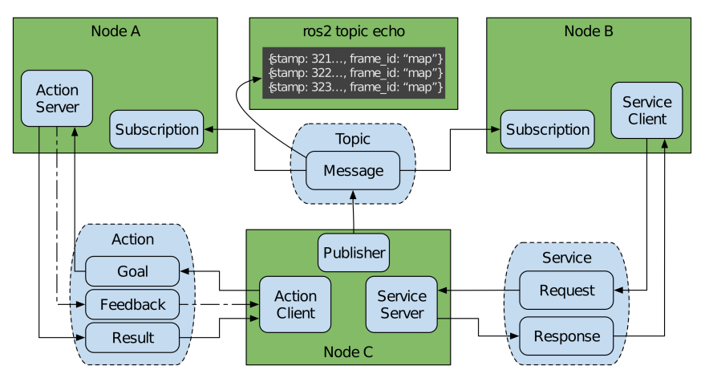
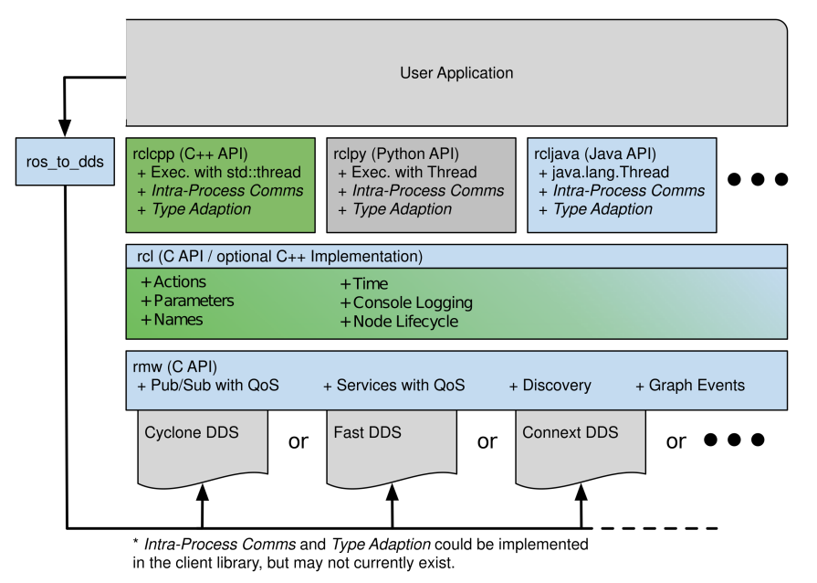
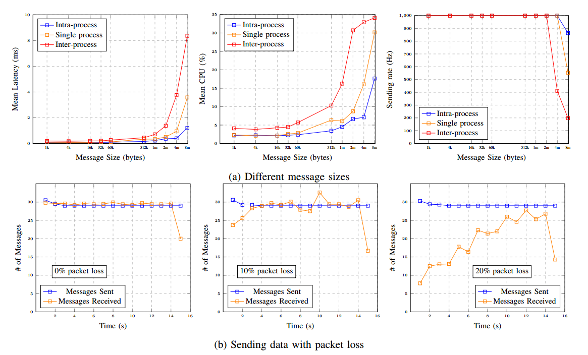
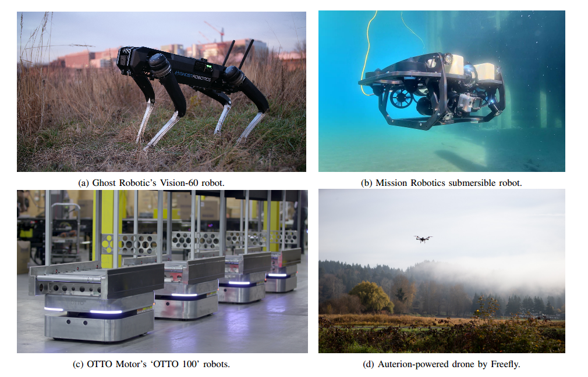
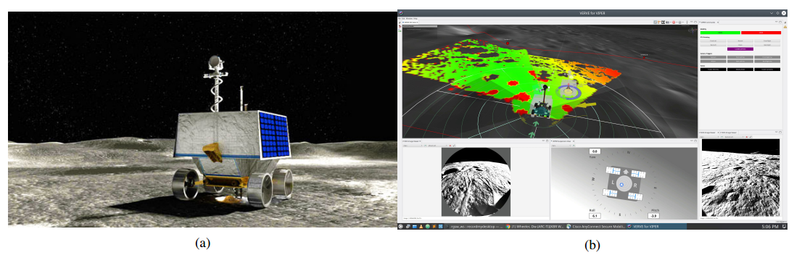

<h1 align="center">Robot Operating System 2: Design, Architecture, and Uses In The Wild  (机器人操作系统 2：设计、架构和实际应用)</h1>

https://arxiv.org/abs/2211.07752

https://www.science.org/doi/10.1126/scirobotics.abm6074

> 摘要：随着机器人在广泛的商业用例中的部署，机器人革命的下一章正在顺利进行。即使在无数的应用程序和环境中，也存在机器人共享的组件的通用词汇——需要模块化、可扩展且可靠的架构；传感；规划;流动性；和自主权。机器人操作系统（ROS）是最后一章的组成部分，通过免费提供的组件和模块化框架明显加快了机器人研究。然而，ROS 1 的设计并未包含许多必要的生产级功能和算法。 ROS 2 及其相关项目已从头开始重新设计，以应对现代机器人系统在各种规模的新探索领域提出的挑战。在这篇评论中，我们重点介绍了 ROS 2 的哲学和架构变化，为机器人革命的新篇章提供了动力。我们还通过案例研究展示了 ROS 2 及其采用对加速真实机器人系统在各种具有挑战性的环境中可靠部署的影响。

## 一、简介

人们已经提出了许多软件平台，有时称为中间件，引入了模块化和适应性强的功能，使构建机器人系统变得更加容易。随着时间的推移，一些中间件已经发展成为包含实用程序、算法和示例应用程序的丰富生态系统。机器人操作系统 (ROS 1) 对日趋成熟的机器人行业的重要性几乎无人能敌。

ROS 1 是由机器人孵化器 Willow Garage 推广的[1]。我们尽了一切努力来创建高质量和高性能的系统，但安全性、网络拓扑和系统正常运行时间并未得到优先考虑。无论如何，ROS 1 已经在几乎所有智能机器领域产生了影响力。其商业崛起是提供自主导航、模拟、可视化、控制等旗舰项目的结果[2]、[3]、[4]。随着商业机会转化为产品，ROS作为研究平台的基础开始显示出其局限性。非传统环境中的安全性、可靠性以及对大规模的支持嵌入式系统对于推动行业发展至关重要。此外，许多公司在 ROS 1 的顶部或内部构建解决方案以创建可靠的应用程序 [5]。

第二代机器人操作系统 ROS 2 经过彻底重新设计，以应对这些挑战，同时以其社区驱动功能的成功为基础 [6]。 ROS 2 基于数据分发服务 (DDS)，这是一种开放式通信标准，用于军事、航天器和金融系统等关键基础设施 [7]。它解决了构建可靠的机器人系统的许多问题。 DDS 使 ROS 2 能够获得一流的安全性、嵌入式和实时支持、多机器人通信以及非理想网络环境中的操作。在考虑了其他通信技术之后选择了 DDS，例如ZeroMQ、RabbitMQ，由于其广泛的功能，包括 UDP 传输、分布式发现、内置安全标准 [8]。

在这篇文章中，我们将确定 ROS 2 对现代机器人系统最先进的适用性，并展示推动其成功的技术和哲学变革。然后，我们将在此基础上进行扩展，展示 ROS 2 如何影响多个独特领域中自主系统的部署。五个案例研究探讨了 ROS 2 如何启用或加速机器人进入陆地、海洋、空中甚至太空的野外环境。

## 二、相关工作

机器人软件的历史悠久而传奇，可以追溯到 50 多年前，像 Shakey 这样的机器人[9]。随着时间的推移，关于如何构造经典规划器、并发行为和三层架构的文章已经很多了[10]、[11]、[12]。一个早期的例子是任务控制架构（TCA），它用于控制各种机器人。例如，CARMEN 是基于 TCA 称为 IPC（进程间通信）的消息传递系统构建的 [13]、[14]。消息传递在分布式系统中有着丰富的历史：来自 IBM 在消息队列方面的工作、Java 的 Jini 以及 MQTT [15]、[16]、[17] 等中间件。

机器人框架提供了将复杂软件分解为更小、更易于管理的部分的架构方法。其中一些组件可以在其他系统中重用，并且可以建立到库中以供用户使用。管理这种复杂性的早期尝试是通过 Player [18] 中的客户端/服务器方法。Player服务器与机器人硬件通信并运行执行其任务所需的算法。客户端可以通过 TCP 连接连接到服务器以提取数据并控制机器人。然而，其架构阻碍了可靠性、代码重用和更换组件的能力。

YARP（Yet Another Robot Platforms） 有助于构建以对等方式组织的控制系统，通过多种协议进行通信 [19]。它通过促进代码重用和模块化来促进研究开发和协作，同时保持高性能。YARP 可用于任何应用程序，但其社区专注于人形和腿式机器人，例如 iCub 和 MIT Cheetah，并且仅支持 C++。

LCM （Lightweight Communications and Marshalling）是一个中间件，它使用具有多种语言绑定的发布/订阅模型。它专注于在高带宽低延迟环境中处理消息传递和数据编组[20]。这限制了 LCM 可以有效使用的机器人应用范围。

OROCOS （Open Robot Control Software）是一组用于机器人控制的库，专注于实时控制系统和相关主题，例如计算运动链和贝叶斯滤波 [21]。该项目已发展成为一个集成 CORBA 中间件和工具的完整框架，用于实时应用程序中的确定性计算。 LCM 和 OROCOS 框架各自专注于整个系统的较小部分，而整个机器人问题的很大一部分留给了最终用户。

ROS 1 包含一组在构建多种机器人时非常有用的库 [1]。有用于监视流程、内省通信、接收时间序列转换等的实用程序。 ROS 1 还拥有一个由社区贡献的传感器、控制和算法包组成的大型生态系统，使小团队能够构建复杂的机器人应用程序。虽然 ROS 1 解决了机器人技术固有的许多复杂性问题，但它很难通过有损链路（如 WiFi 或卫星链路）持续传输数据，存在单点故障，并且没有任何内置安全机制。 ROS 1 和 ROS 2 之间的主要区别见表 I。

| 类别         | ROS1                          | ROS2                                       |
| ------------ | ----------------------------- | ------------------------------------------ |
| 网络传输     | 基于 TCP/UDP 的定制协议       | 现有标准 (DDS)，具有支持添加其他标准的抽象 |
| 网络架构     | 中央名称服务器（roscore）     | 点对点发现                                 |
| 平台支持     | Linux                         | Linux、Windows、macOS                      |
| 客户端库     | 用每种语言独立编写            | 共享通用底层 C 库 (rcl)                    |
| 节点与进程   | 每个进程单个节点              | 每个进程多个节点                           |
| 线程模型     | 回调队列和处理程序            | 可交换执行器                               |
| 节点状态管理 | 无                            | 生命周期节点                               |
| 嵌入式系统   | 最小的实验性支持（rosserial） | 商业性支持（micro-ROS）                    |
| 参数访问     | 基于 XMLRPC 的辅助协议        | 使用服务调用实现                           |
| 参数类型     | 分配时推断类型                | 类型声明和强制执行                         |

    
表I ROS1与ROS2对比总结

ROS 1 社区试图解决其中一些问题，但在几乎所有情况下，由于架构和工程限制，都做出了妥协。例如，为了解决单点故障（“rosmaster”），需要使用定制解决方案单独修补所有现有客户端库。在其他情况下，可以通过 SROS 项目扩展 ROS 1 的安全性。虽然成功，但维护起来很困难，需要进一步开发以满足安全趋势。这些只是修补 ROS 1 的众多尝试中的两个，这些尝试延长了其使用寿命，但没有解决其核心限制。

## 三、ROS 2

ROS 2 是一个用于开发机器人应用程序的软件平台，也称为机器人软件开发套件 (SDK)。重要的是，ROS 2 是开源的。 ROS 2 根据 Apache 2.0 许可证分发，该许可证授予用户修改、应用和重新分发软件的广泛权利，而没有义务回馈 [22]。 ROS 2 依赖于联合生态系统，鼓励贡献者创建和发布自己的软件。大多数附加软件包也使用 Apache 2.0 许可证或类似许可证。使代码免费是推动大规模采用的基础 - 它允许用户利用 ROS 2，而不限制他们使用或分发应用程序的方式。

### A. 范围

ROS 2 支持广泛的机器人应用，从教育和研究到产品开发和部署。它包含大量相互关联的软件组件，通常用于开发机器人应用程序。软件生态系统分为三类：

- **中间件：** ROS 2 中间件被称为管道，涵盖从网络 API 到消息解析器的组件之间的通信。
- **算法：** ROS 2 提供了构建机器人应用程序时常用的许多算法，例如感知、SLAM、规划等等。
- **开发人员工具：** ROS 2 包括一套用于配置、启动、自省、可视化、调试、模拟和日志记录的命令行和图形工具。还有一整套用于源管理、构建过程和分发的工具。

在本节中，我们将探讨第一类，即中间件，它是 ROS 2 的基础。

### B. 设计

1）设计原则：ROS 2 的设计遵循一组原则和一组具体要求。主张以下原则：

- **分布式** 与类似的复杂领域一样，机器人技术中的问题最好通过分布式系统方法来解决[23]。需求被分成功能独立的组件，例如硬件设备驱动程序、感知系统、控制系统、执行程序等。在运行时，这些组件有自己的执行上下文，并通过显式通信共享数据。这种组合应该以分散且安全的方式进行。
- **抽象** 为了管理通信，必须建立接口规范。这些消息定义了所交换数据的语义。有利的抽象可以平衡暴露组件细节的好处与将该组件的应用程序其余部分过度拟合的成本，从而使替代方案变得困难。这种方法导致了一个从特定硬件或软件组件供应商抽象出来的可互操作组件的生态系统[24]。
- **异步** 定义的消息在组件之间异步通信，创建一个基于事件的系统[25]。通过这种方法，应用程序可以跨多个时域工作，这些时域是由物理设备与大量软件组件相结合而产生的。每个都可以有自己的频率来提供数据、接受命令或发信号事件。
- **模块化** UNIX 的设计目标“让每个程序做好一件事”得到了体现 [26]。模块化是在多个层面上实施的，包括库 API、消息定义、命令行工具，甚至软件生态系统本身。该生态系统被组织成大量的联合包，而不是单个代码库。

我们不会假装这些设计原则是通用的且无需权衡。异步还会使实现确定性执行变得更加困难。对于任何单一的、明确定义的问题，都可以构建一个计算效率更高的专用整体解决方案，因为它不涉及抽象或分布式通信。

然而，经过 ROS 1 项目十年的经验，我们声称遵守这些原则通常会带来更好的结果。这种方法有利于代码重用、软件测试、故障隔离、跨学科项目团队内的协作以及全球范围内的合作。

2）设计要求：ROS 2旨在根据设计原则和机器人开发人员的需求满足某些要求。

- **安全性** 任何与网络交互的软件都必须包含确保交互免遭意外和恶意误用的功能。 ROS 2的集成安全系统包括身份验证、加密和访问控制[27]、[28]、[29]。设计者可以通过访问控制策略来配置 ROS 2 来满足他们的需求，这些策略定义了谁可以就什么内容进行通信 [30]。
- **嵌入式系统** 一般来说，机器人包括传感器、执行器和其他外围设备。这些设备可能相对复杂，包含需要与运行 ROS 2 的 CPU 进行通信的微控制器。尽管 ROS 2 应该促进和标准化 CPU 和微控制器的集成，但完整的 ROS 2 堆栈预计不会在小型嵌入式设备上运行。 Micro-ROS 允许 ROS 2 在嵌入式系统上重复使用 [31]。
- **多样化的网络** 机器人用于各种网络环境中，从装配线上机器人手臂的有线 LAN 到行星漫游器的多跳卫星连接。此外，机器人通常会使用内部网络来连接 CPU 内部和跨 CPU 的进程。ROS 2 提供服务质量，配置数据如何流经系统，从而适应网络的限制 [32]。
- **实时计算** 从类人机器人到自动驾驶汽车，机器人应用通常包含实时计算要求。为了满足安全和/或性能目标，系统的某些部分必须在确定的时间内执行。 ROS 2 为实时系统开发人员提供 API 来强制实施特定于应用程序的约束 [33]、[34]。
- **产品准备就绪** 当机器人走出实验室并进入商业用途时，就会引入新的限制。ROS 2 旨在满足设计、开发和项目管理方面的产品要求。这些努力的一个客观结果是 Apex.AI 公司对其基于 ROS 2 的自动驾驶汽车软件进行了功能安全 (ISO 26262) 认证 [35]。这使得 ROS 2 可以在自动驾驶车辆和重型机械等安全关键系统中运行。

### C. 通讯模式

ROS 2 API 提供对通信模式的访问。这些主要是主题、服务和操作，它们是在节点概念下组织的。 ROS 2 还提供参数、计时器、启动和其他可用于设计机器人系统的辅助工具的 API。

- **Topics** 用户交互的最常见模式是主题，它是一个异步消息传递框架。这与其他异步框架类似，例如 ASIO [36]。 ROS 2 提供相同的发布订阅功能，但侧重于使用异步消息传递来组织使用强类型接口的系统。它通过在节点概念下组织计算图中的端点来实现这一点。节点是一个重要的组织单元，它允许用户推理复杂的系统，如图 1 所示。

    匿名发布订阅架构允许多对多通信，这有利于系统内省。开发人员可以通过创建对该主题的订阅而不进行任何更改来观察在该主题上传递的任何消息。

    
     
    
图 1：ROS 2 节点接口：topics, services 和 actions

- **Services** 异步通信并不总是正确的工具。 ROS 2 还提供了请求-响应样式模式，称为服务。请求-响应通信提供了请求和响应对之间的简单数据关联，这在确保完成或接收任务时非常有用，如图 1 所示。独特的是，ROS 2 允许服务客户端的进程在调用期间不会被阻塞。服务也被组织在一个节点下进行组织和自省，允许子系统的接口一起出现在系统诊断中。
- **Actions** ROS 2 独特的通信模式是动作。动作是面向目标的异步通信接口，具有请求、响应、定期反馈和取消的能力，如图 1 所示。这种模式用于自主导航或操作等长时间运行的任务，尽管它有多种用途用途。与服务一样，操作是非阻塞的并且在节点下组织。

### D. 中间件架构

秉承之前的设计理念，ROS 2 的架构由分布在许多解耦包中的几个重要抽象层组成。这些抽象层使得可以为所需的功能提供多种解决方案，例如多个中间件或记录器。此外，跨多个软件包的分发允许用户更换组件或仅使用他们需要的系统部件，这对于认证可能很重要。

**1）抽象层：** 图 2 显示了 ROS 2 中的抽象层。在开发过程中，它们通常隐藏在客户端库后面，开发人员只需在满足异常应用程序特定需求时才需要了解它们。大多数用户只会体验客户端库。

    
     
    
图 2：ROS 2 客户端库 API 堆栈

客户端库提供对核心通信 API 的访问。它们针对每种编程语言进行了定制，使它们更加惯用并利用语言特定的功能。通信与系统如何跨计算资源分布无关 - 无论它们位于同一进程、不同进程，甚至不同计算机中。用户可以将其应用程序分布在多个机器和进程上，甚至可以利用云计算资源，而对源代码进行最小程度的更改。 ROS 2能够通过互联网连接到云资源。有一些产品可以帮助将 ROS 2 集成到云平台中，例如 AWS IoT RoboRunner 和相关的 RoboMaker 产品 [37]。然而，建议使用更专门的专用技术。

客户端库依赖于中间接口 rcl，它为每个客户端库提供通用功能。该库是用 C 编写的，并且由所有客户端库使用（尽管不是必需的）。在 rcl 之下，称为 rmw（ROS MiddleWare）的中间件抽象层提供了必要的通信接口。每个中间件的供应商都实现了 rmw 接口，并且无需更改代码即可互换。

用户可以根据性能、软件许可证或支持的平台等各种限制选择不同的 rmw 实现，从而选择不同的中间件技术。虽然所有支持的 rmw 都基于 DDS，但也存在一些针对其他通信方法的社区支持的 rmw [7]。该抽象层为 ROS 2 提供了灵活性，使其能够随着时间的推移而变化，同时对构建在其之上的系统的影响最小。

网络接口（例如主题、服务、操作）是使用接口描述语言（IDL）通过消息类型定义的。 ROS 2 使用 ros idl 格式（.msg 文件）或 OMG IDL 标准（.idl 文件）定义这些类型。用户提供的接口定义在编译时生成，并创建以任何客户端库语言进行通信所需的代码。

**2）架构节点模式：** 还有其他架构模式可以帮助开发人员构建他们的程序。 ROS 2 提供了一种管理节点生命周期的模式，节点通过状态机进行转换，状态包括未配置、非活动、活动和最终确定。这些状态允许系统集成商控制某些节点何时处于活动状态。这是协调分布式异步系统各部分的重要工具。

正如上一节中所讨论的，通信与机器和进程内端点的位置无关。然而，每个节点放在哪个机器或进程中并不是在编写节点时就应该决定的，而是取决于节点在更大的系统中如何使用。作为组件编写的节点可以作为配置分配给任何进程。对于正在开发的系统来说，这是一个重要的功能，允许开发人员根据各种情况重新安排节点的运行位置。例如，多个节点可以配置为共享一个进程，以节省系统资源或减少延迟。

### E. 软件质量

为了让 ROS 2 在关键应用中得到采用，必须以明显高质量的方式进行设计和实现。监管和认证机构需要了解系统的当前状态以及导致该系统的流程。为此，持续执行由三部分组成的方法来衡量和暴露软件质量：

- **设计文档：** 在进行重大添加之前，必须制定书面的工作原理和设计。本文档表现为设计文章或 ROS 增强提案 (REP) [38]、[39]。截至撰写本文时，已有 44 篇设计文章和 7 个 REP 记录了 ROS 2 的设计。
- **测试：** ROS 2 中的每个功能都需要测试以确保其行为正确。这些测试在持续集成中定期执行。部署了单元测试和集成测试的组合，以及一套静态分析工具（“linter”）。截至撰写本文时，ROS 2 上运行了 32,000-33,000 次测试，其中包括 13 个 linter。
- **质量声明：** 并非每个 ROS 2 包都需要经过严格的记录和测试。因此，定义了多层次的质量政策[40]。该政策定义了每个质量级别在开发实践、测试覆盖率、安全性等方面的要求。截至撰写本文时，45 个 ROS 2 软件包已达到最高级别，即质量级别 1。

### F. 性能和可靠性

网络是机器人框架的一个重要方面。在可靠的网络情况下，标准解决方案是 TCP/IP，因为它在大多数操作系统中进行了优化。不幸的是，TCP/IP 很难在无线通信中传输数据，因为中断可能会导致回退、重传和延迟。 ROS 1 是基于 TCP/IP 构建的，因此在这些情况下受到了影响。

ROS 2 在这些情况下不会遇到困难。 DDS 使用 UDP 传送数据，不会尝试重新传输数据。相反，DDS 决定在不可靠的条件下何时以及如何重新传输。 DDS 引入了服务质量 (QoS) 来公开这些设置，以优化可用带宽和延迟。

可靠性设置决定是否保证消息传递。使用“尽力而为”，发布者将尝试传递一次消息，当新数据使旧数据过时（例如传感器数据）时，这很有用。设置为“可靠”时，发布者将继续发送数据，直到接收者确认收到。

持久性 QoS 设置决定消息的持久性。 “易失性”消息发送后就会被遗忘。同时，“transient-local”将根据需要存储和发送晚加入的订阅数据。

连接的历史记录决定了网络无法跟上数据时的行为。设置为“keepall”，所有数据都会保留，直到应用程序使用它。大多数应用程序使用“keep-last”，它保留固定大小的数据队列，根据需要覆盖最旧的数据。其他设置，包括截止日期、寿命、活跃度和租赁期限，以帮助设计实时系统。

我们进行了实验来对 ROS 2 的网络性能进行基准测试。图 3a 中的图表显示了通过 ROS 2 发送和接收不同大小的消息的结果。该实验在运行频率为 3.4GHz 的 6 核 Intel i7-6800K CPU 上运行， 32GB 内存。截至 2021 年 9 月 23 日，该机器运行的是 Fedora 34，使用 CycloneDDS 和最新的 ROS 2 Rolling 发行包 [41]。使用的性能测试可以在 [https://github.com/ros2/performance_test](https://github.com/ros2/performance_test) 和 [https://github.com/ros2/buildfarm_perf_tests](https://github.com/ros2/buildfarm_perf_tests) 找到。

测试包括一名发布者和一名订阅者。对于每种消息大小，每秒发送 1,000 条消息，系统记录延迟、有效发布率和 CPU 利用率。选择消息大小来测试不同方面，从关键间隔的小消息到较大的消息。在不同进程中、同一进程内以及使用进程内通信的同一进程内重复测试。

数据显示，进程内通信是最有效的，对于所有低于 8 MB 的大小，95% 的延迟低于 1 毫秒。 Intra-process是最可靠的，可以满足8MB以下所有大小的发送速率。这绕过了中间件堆栈，并通过将指针从发布者传递到订阅来传递数据。在处理大约 1 MB 或更大的大消息时，这种改进尤其明显，这些消息通常与图像、点云或其他形式的高分辨率数据相关。使用节点组合时，数据显示了类似的情况 - 第 95 个百分点的延迟低于 1 毫秒，并且大小低于 8 MB 的消息没有丢失。

多进程通信允许发布者和订阅者位于网络上的不同计算机上。不出所料，它还显示出最高的延迟，在 1 MB 之前低于 1 毫秒，然后在 8 MB 之前飙升至 7.85 毫秒。发送速率也呈现出类似的趋势；当大小达到 2 MB 时，第 95 个百分位数的发送速率为 1000 Hz，对于 8 MB，则降低到 213 Hz。

使用多进程和进程间通信是最灵活的场景，但它也显示出最高的延迟和 CPU 利用率。仅仅使用节点组合和/或进程内通信，延迟、CPU 利用率和发送速率都会显着降低。然而，对于小消息，所有机制都能够以超过 1kHz 的频率可靠地发布而不会丢失。

DDS 的默认配置在传输大于 1 MB 的信息时并不是特别有效，这对用户来说是一个真正的挑战。造成这种情况的原因有几个：默认 UDP 缓冲区大小较小、UDP 分段限制以及需要重新传输数据包的 DDS 可靠性保证。其中许多问题可以通过调整网络参数来消除，但会牺牲计算资源。通过使用 ROS 2 中的组合和进程内通信模式也可以提高性能。组合是 ROS 2 中推荐的设计模式，并且变得简单以鼓励其采用。

图 3b 中的图表显示了 ROS 2 对网络中数据包丢失的恢复能力。测试在 Ubuntu 20.04 虚拟机上运行，该虚拟机包含 6 个 2.9GHz 的 Intel Xeon E5-2666 v3 CPU 和 16GB RAM，使用 CycloneDDS rmw。对于每个测试，在不同的进程中运行相同的发布者和订阅节点。网络通过 mininet 运行，mininet 是一个网络模拟器，允许用户指定任意拓扑和链路特征。在此实验中，带宽上限为 54Mbps（与慢速无线网络相比），数据包丢失在 0% 到 20% 之间变化。每条消息由 1000 字节的数组组成，并记录收到的消息数。在中等程度丢失的网络中，ROS 2 仍然可以通过网络有效地传递数据。 20% 是特别糟糕的网络环境，预计性能下降更显着。

    
     
    
图 3：ROS 2 性能结果（因标准差太小，未显示）

### G. 安全

安全性是任何现代商业机器人 SDK 的重要元素。 ROS 2 依赖于 DDS-Security 标准，但还提供了一套附加工具 SROS2，使管理安全基础设施变得容易。 DDS 安全中有 3 个主要概念： 

- **身份验证** 建立网络中消息或参与者的身份。 ROS 2 使用数字签名进行身份验证，称为公钥加密。 SROS2 包括用于生成和存储这些数字签名的命令行实用程序。

- **访问控制** 允许将细粒度策略应用于经过身份验证的网络参与者。它允许参与者仅发现批准的参与者并通过预先批准的网络接口进行通信。 SROS2 具有用于生成这些配置的命令行工具。

- **加密** 这可确保第三方无法窃听或将数据重播到网络中。使用 AES-GCM 对称密钥加密技术执行加密。密钥材料源自作为身份验证的一部分获得的共享秘密。

## 四、案例研究

我们进行了五个案例研究，突出了 ROS 2 提供的物质加速。每项研究都根据访谈、客户体验和研究期间分析的代码库，对 ROS 2 对每个组织的影响进行了主要定性分析。各种用例和规模证明了 ROS 2 在整个机器人领域的重要性。

### A. 陆地：Ghost Robotics

Ghost Robotics 是一家总部位于费城的公司，专门生产用于国防、企业和研究的四足机器人。他们的机器人（如图 4a 所示）是为传统轮式或履带式机器人无法穿越的非结构化自然环境而设计的。 Ghost的Vision-60机器人被部署在洞穴、矿山、森林和沙漠中，可以轻松穿过几英寸深的水或雪。

    
     
    
图 4：分别部署在海陆空的机器人系统案例研究

他们的机器人被宾夕法尼亚大学团队用于 DARPA 地下挑战赛，Ghost 与美国军方在基地安全和其他实验应用方面有着积极的合作关系 [42]。

ROS 2 用于其主要计算平台 Nvidia Jetson Xavier，该平台处理任务执行、高级步态规划、地形测绘和本地化。Ghost 大约 90% 的软件使用 ROS 2 进行通信和架构，其余软件计划在不久的将来效仿。

**1）软件架构：** ROS 2 在构建内部协作和软件设计方面发挥了强大的作用。它们的高级和任务控制软件架构都与 ROS 2 高度集成。它们利用主要子系统之间的发布-订阅接口，使它们能够享受一致的 API，同时每个系统中的技术都在不断改进。项目之间的这种清晰分离使他们能够执行并行开发，而不会中断其他团队的活动。

高级自动化工程师 Hunter Allen 表示：“这太棒了；这是我们自治架构的基础。”他们的任务控制软件使用 ROS 2 操作来请求、取消或获取有关当前任务的反馈。它需要一个任务标识符来与要执行的潜在任务的内部数据库进行交叉引用。接下来，它组装任务中的每个任务，并激活特定任务所需的功能，建模为生命周期节点。最后，它执行任务。

Ghost 的大多数软件都是作为生命周期节点和组件节点来实现的。生命周期节点用于根据当前任务要求动态激活和停用功能，例如在基于 GPS 和基于 VIO 的定位之间切换。它们拥有数十种独特的功能，可随时用于不同的任务，闲置时只占用很少的后台资源。组件节点是由多个团队开发并在运行时组合的独立模块。 Ghost 发现，在有限计算平台上与大型跨学科团队合作时，这些策略非常重要。

所提供的 ROS 2 工具使 Ghost 在短短几个月内就创建了一个高度灵活且高效的自治系统。相比之下，该公司估计，如果从头开始，需要多名工程师花费很多年的时间才能创建类似的功能，从而帮助支持新的自定义用户应用程序。

**2）COVID-19 大流行：** 在最初的 COVID-19 封锁之后，机器人软件团队的有效规模增加了一倍，同时减少了对关键硬件的访问。与此同时，他们正准备在几个月后与美国空军 (USAF) 进行演示。最终，该公司通过调整流程以利用 ROS 2 中提供的功能取得了成功。

在大流行之前，大部分开发都是在办公室使用机器人进行的。当对机器人的访问突然停止时，Ghost 不得不将开发切换到 ROS 2 模拟器 Gazebo。一名工程师就能够创建代表四足动物所需的自定义 Gazebo 插件和模拟文件。该模拟用于开发美国空军演示的整个自主系统。在他们能够返回办公室很久之后，这项新功能仍然在使用 - 它允许更快的内部开发来创建自定义行为并将其部署到客户的机器人上。

**3）ROS 2 作为均衡器：** ROS 2 是 Ghost Robotics 强大的均衡器。它帮助他们与资金充足且地位稳固的竞争对手进行有效竞争。他们没有构建端到端的专有软件组合，而是尽可能利用 ROS 2 的功能。艾伦表示：“我们拥有具有竞争力的产品，因为我们拥有制造具有竞争力的产品所需的工具。我们不必浪费时间做 ROS 2 已经做的事情。”截至 2021 年 8 月，ROS 2 仅有 23 名员工，与数量级大的竞争对手相比，ROS 2 创造了公平的竞争环境。仅经过 30 个工程师年（大约 7.5 名工程师在 4 年内完成），Ghost 就能够向客户发布其 Vision-60 机器人以供部署使用。

ROS 2 提供高质量的通信和 Ghost 使用的无数实用程序，例如 TF2、URDF、rosbag、rviz、roscli、Gazebo，这加速了 Ghost 的机器人进入野外。

### B. 海洋：Mission Robotics

Mission Robotics 是一家旧金山湾区公司，生产海洋机器人，图 4b。他们的设计优先考虑灵活性，支持广泛的客户，每个客户都可以根据自己的应用程序定制平台。 Mission 机器人的用例包括结构检查、环境调查、抢救和安全。这些任务传统上由专业潜水员执行，他们的时间稀缺且宝贵。机器人的加入使得重要的水下工作能够更频繁地进行、持续更长的时间，并且对人类的风险要小得多。

Mission 的车辆携带传感器，收集有关水面和水下环境的数据。机器人的传感器套件会因用户而异，甚至在用户进行的潜水之间也会有所不同。重要的是，用户能够添加和删除给定潜水的组件，同时确保可靠地访问结果数据。 Mission Robotics 使用 ROS 2 作为这些数据流的通用数据总线，使客户能够轻松集成新硬件。

**1）客户架构：** Mission的核心机器人软件不依赖ROS 2。具有使用DDS经验的工程团队直接在Cyclone和Connext DDS上构建了他们的内部系统[41]。该内部软件由 Mission 团队的一小部分人专门维护。

海洋任务的要求通常是特定于客户的，不容易通用，因此需要在购买后进行定制。行业中的常见做法是根据需要连接附加传感器或工具，但通过各种特定于设备的接口独立操作和访问每个附加外围设备。

Mission 使用 ROS 2 作为通用接口。当要集成新传感器（例如特殊的低光摄像头）时，需要开发一个设备驱动程序，用于与传感器通信并通过 ROS 2 发布其数据。该驱动程序部署在 Docker 容器中，将其与传感器隔离。车辆的其余部分。重要的是，Mission 的客户可以使用 ROS 2 作为通用语言来创建自己的扩展，从而使他们能够针对自定义应用程序快速修改机器人并共享通用基础设施。

例如，Mission 与 Aqualink 合作，为自主水面舰艇添加深度传感功能。感兴趣的有效负载是 Zed 立体相机，它具有开箱即用的 ROS 2 驱动程序，包括对所使用的 Jetson Nano 单板计算机的支持。 Mission Robotics 首席技术官 Charles Cross 表示：“立体相机在海洋机器人领域越来越受欢迎，特别是在珊瑚礁测绘和物种识别等清水应用中。”通过在 Jetson 上通过 ROS 2 集成 Zed 相机，Mission 和 Aqualink 能够为任何想要为海洋应用开发新的计算机视觉和自主功能的人创建一个起点。这项工作吸引了其他潜在客户的注意，其中一位客户表示，Mission 的有效载荷集成方法感觉“几乎是超前于时代的”

**2）ROS 2 作为加速器：** 对 ROS 2 的支持是 Mission 的一个卖点，为内部系统提供抽象并提供熟悉的开发人员体验。 Cross 报告称，对于至少三个客户来说，“对 ROS 2 集成的支持在他们的购买决策中明确发挥了作用。” 

Mission 将 ROS 2 视为整个行业的加速器。克罗斯表示，“在海洋领域，几乎没有标准化，也缺乏对现有能力的建设。”因此，“人们不断重新发明轮子”，从数据记录到传感器集成，再到消息格式。这种重复的工作是浪费的，并且会导致不兼容系统的激增。

Mission Robotics 相信 ROS 2 正在改变海洋机器人的这一现状，就像它为其他行业所做的那样。一套通用的消息、API 和工具将极大地加速 Mission 和该行业其他公司的工作。特别是，使用 rosbag 进行数据记录打开了协作之门。这种信息交换可以使机器人工程师、操作员和海洋科学家受益，他们通常是数据的最终用户。正如克罗斯所说，“使用一致的通信系统是这个行业的一大胜利。”

### C. 天空：Auterion Systems

Auterion 是一家来自瑞士苏黎世的无人机初创公司。它成立的目的是培育开源 PX4 Autopilot 开发者社区 [43]。 Auterion 基于 PX4 飞行经验，生产了基于该项目的商用自动驾驶仪，并为客户集成提供商业支持。 Auterion的产品在整个行业得到广泛应用，支持多种类型的机身，包括图4d所示的Freefly。

从历史上看，无人机只能由熟练的飞行员或在开放空间安全操作。 Auterion 的目标是将无人机带入有危险的非结构化空间，同时在更大的自主性下运行。由于强调开放标准，Auterion 选择 ROS 2 将更高级别的功能与 PX4 自动驾驶仪一起集成到其无人机系统中。

**1）日志记录和内省：** ROS 2 的日志记录、内省和调试提高了其完全集成的自动驾驶解决方案 Skynode 上的开发过程的效率。 ROS 2 的日志记录功能用于收集运行时事件，例如错误、调试输出和有关系统的其他元数据。这些被存储以供以后分析和调试。 Auterion 还依赖 rosbag2 在运行时从系统的所有层收集原始数据流，从传感器流到车辆行为。这种全面的记录对于无人机来说特别有价值，因为风等环境因素对飞行条件有重要影响，而这种影响很难重现。因此，ROS 2 的数据集和日志记录功能对于有效的开发、调试和验证过程至关重要。

Auterion 还利用了强大的内省功能。 Auterion 使用 rviz2，这是一种 3 维渲染器，可以在交互式环境中可视化无人机及其所有传感器数据。

ROS 2 中的 3 维可视化、数据记录和记录功能是 Auterion 使用 ROS 2 的驱动原因之一。Auterion 的软件工程师 Nuno Marques 最简洁地阐述了这些工具的价值，“事实上，我们拥有内省和可视化工具会让一切变得不同。”利用这些功能，该公司可以将开发工作重点放在核心飞行控制功能和客户需求上，而不是构建基础工具。

**2）安全、自动化测试：** 飞行的无人机对地面上的人和物以及机身本身具有固有的风险。由于每次实际飞行都有坠毁的风险，因此需要大量的人力和时间来进行安全飞行测试。然而，在模拟中，与试飞相关的成本和风险接近于零。模拟中的故障可以快速修复和迭代，然后重新运行。Auterion 使用 ROS 2 的模拟 Gazebo 能够在硬件测试之前对软件进行端到端测试，以验证安全功能

Gazebo 在其持续集成管道中使用，以防止一系列车辆类型和场景的回归。测试并行运行以获得快速结果，这使得开发人员能够专注于特定问题，同时保持软件安全的信心。

Auterion 还利用模拟测试来验证开发过程中具有挑战性的场景中的功能。例如，他们可以设置对于验证其工作很重要的飞行制度或特定情况。 2021 年，Auterion 在 Gazebo 内飞行了约 22,000 小时，其中包括无法用硬件进行测试的高风险场景。 Auterion 估计这些模拟取代了 12 名全职工程师，才能在现场测试中提供相同的价值。由于其机身成本从 1,000 美元到 100,000 美元不等，因此任何测试都存在相当大的风险 - 特别是在需要测试的危险飞行条件下。开发和验证中的 ROS 2 模拟相结合，可降低成本并加快开发速度。

### D. 太空：NASA VIPER

NASA 的挥发物调查极地探索漫游车 (VIPER) 任务计划于 2023 年 11 月发射到月球南极地区。VIPER 漫游车将在为期 100 天的任务中使用各种仪器寻找水冰和其他资源。地球计算资源将用于绘制地图、注册地形和计算立体解决方案，以通过其与深空网络的 Xband 链路来帮助操作。许多基于地球的操作工具、计算模块和高保真模拟都是基于 ROS 2 和 Gazebo，如图 5 所示。

    
     
    
图 5：(a) 月球表面上的 VIPER（渲染图），(b) 命令和操作软件。

NASA 的核心飞行系统提供硬件接口、基本错误检查和有效负载服务 [44]。卫星链路向流动站传送命令和遥测数据。地球遥测数据被接收并发送给 ROS 2 网络，并由一组节点进行处理。节点将图像数据转换为点云，计算视觉里程计和地形配准，并融合数据以提供姿态校正。这些数据被输入 NASA 的远程虚拟探索视觉环境 (VERVE)，使操作员能够可视化流动站的环境 [45]。操作员使用结果来模拟移动，然后最终在流动站上执行移动。

**1）模拟任务测试：** 由于 VIPER 是一项航天任务，因此该团队专注于生产高度可靠的软件。为了实现这一目标，他们广泛利用 Gazebo 为其所有组件和系统提供高保真测试。 Mark Allen 表示，“拥有模拟器 [Gazebo] 对于以某种方式开发所有 VIPER 软件至关重要。” VIPER 团队求助于 Gazebo 来帮助开发，因为在地球上建立精确运行的月球车模型是不可行的。他们强调“月球环境非常独特，有光照和重力，模拟测试非常重要，因为不可能在地球上有效地进行测试。”该项目能够利用 Gazebo 用户界面的自定义插件创建模拟。它专为高度定制而设计，可支持广泛的机器人需求 - 甚至空间。

NASA 开发了新的插件来模拟特定任务，例如相机镜头眩光、月球照明条件、重力和月球表面地形。 NASA 能够模拟低级串行链路的车辆接口。该仿真对于帮助迭代和改进 VIPER 的系统设计选择非常有价值。通过对漫游车进行硬件级别的模拟，VIPER 团队在发射前使用 Gazebo 测试和验证了漫游车的几乎所有软件。

VIPER 重用了 284,500 行重要代码 (SLOC)，无需 Gazebo 进行修改，修改 < 1% 即可通过验证。 NASA 估计模拟器的开发速度为每个工作月 116 个 SLOC（全面实施需要 2456 个工作月）。这种代码重用加速了开发，使他们能够在短短 266 个工作月内生成专注于 VIPER 特定元素的模拟 [46]。

Gazebo 和 ROS 2 的组合用于培训流动站的操作员。 ROS 2用于向流动站注入故障；使用 VERVE，操作员需要确定如何清除故障以使流动站移动。

**2）创造遗产：** NASA 使用了许多不同的通信机制，但近年来，许多项目都选择了 DDS，因为它能够穿越可能具有高延迟、低带宽和低可靠性的卫星链路。 VIPER 团队评估了这些选项，并选择了 DDS 来进行地面操作。

除了通信机制之外，VIPER 团队还渴望使用 ROS 2，因为它的快速开发能力、内省和可视化工具以及开放源代码。这些特性缩短了新工程师将他们所知道的知识应用到飞行任务中的学习曲线。

然而，在飞行任务中使用新软件需要严格的验证和确认 (V&V) 流程。 NASA 更喜欢使用在之前的任务中经过审查的组件；利用传统软件可以减少开发时间和成本[47]。 VIPER 正在重用 Resource Prospector 的 588,000 行代码中的 84% 以及 Gazebo 和大约 312 个开源 ROS 2 软件包 [46]。 ROS 2 尚未在之前的任务中使用过，但 VIPER 团队认为它提供的功能值得在整个过程中花费额外的管理费用。

在 ROS 2 经过验证并用于 VIPER 任务的地面操作后，ROS 2 在未来的任务中扮演多种角色变得更加容易，并允许在任务程序之间更多地重用机器人软件。

### E. 大规模：OTTO 电机

OTTO Motors 是一家位于安大略省的 Clearpath Robotics 衍生公司，销售陆地和海洋研究平台。 OTTO 使用自主机器人大规模替代手动控制设备，提供仓库和工厂物料搬运服务 - 图 4c。他们在全球部署了数千台机器人，并在一个设施中运营着 100 多台机器人。丰田和通用电气等客户已采用 OTTO。该案例研究提供了对大型机器人应用的独特见解。自从部署在 OTTO 机器人上以来，ROS 2 已经协调了超过 200 万小时的运行和 150 万公里的行程。

**1）扩展多机器人技术：** OTTO Motors 最初在 ROS 1 上开发了他们的技术。使用该技术，他们无法使用自定义多主系统及其车队管理软件在同一共享 ROS 1 网络上测试超过 25 个机器人。这对于小型车队来说已经足够了，但随着 OTTO 发展成为更大的设施，这成为了瓶颈。

OTTO 对可用技术进行了调查，并独立得出了相同的结论：多机器人车队通信的最佳技术是 DDS。更大的网络效应有利于他们继续留在 ROS 生态系统中，因此他们是 ROS 2 的早期采用者之一。这使他们能够利用 ROS 中启用的功能，同时无需独立维护专有的 DDS 框架。

迁移到 ROS 2 后，OTTO 能够在客户设施中扩展至 100 多个机器人。由于ROS 2具有细粒度和可扩展的网络拓扑管理，以及通过共享网络链路上的QoS更好地支持管理带宽，因此可以实现更大的多机器人规模。2017 年的这些部署代表了 ROS 2 在世界各地的首批商业部署。ROS 2 使他们能够快速扩展到前所未有的机器人数量，从而明显加快了他们的上市时间。 OTTO Motors 估计，通过使用 ROS 2，他们在 5 年内节省了 100 万至 500 万美元。此外，由于没有将这些工具重写到专有框架中，他们还节省了数百个工程时间。

OTTO Motor 的 CTO Ryan Gariepy 认为 ROS 生态系统对于业务来说是必要的，“如果 ROS 不存在，整个业务可能就不可行。那就太贵了。”他估计，如果没有它，他们的持续工程成本每年将增加 5-10%。

**2）加速发展：** OTTO Motors 在另外两个领域的开发和部署也得到了加快。首先，它加速了其内部功能开发进程。分布式架构和进程隔离允许大型、物理上分布的团队进行协作。使用明确定义的 ROS 2 接口使 OTTO 能够区分主要的任务类别。 Ryan Gariepy 在接受采访时表示，“考虑到我们正在制造的机器人的规模和现代制造的复杂性，您确实需要灵活地修补功能并在大型团队中共享。”他们的产品软件分布在不同团队拥有的许多存储库中，采用多种语言，并在运行时通过 ROS 2 进行组合。

其次，事实证明，提供 ROS 2 支持对于他们的客户和客户来说很有价值。 OTTO 和 Clearpath 将其平台出售给其他企业，以在其基础上构建定制产品。一家公司最近从 OTTO 购买了平台来制造紫外线消毒机器人，以应对 COVID-19 大流行。由于他们拥有明确定义的标准 API，因此这些外部协作者可以轻松利用机器人平台并将其绑定到他们的自主系统中。 Ryan Gariepy 总结如下：“通过我们提供的 ROS API，我们的外部合作伙伴现在能够在我们的自主能力之上构建应用程序，而不需要我们对他们进行机器人概念或专有库的培训。”这种分离问题和抽象供应商特定硬件（甚至整个机器人平台）的能力使公司能够快速构建新产品以确保公共安全。

### F、讨论

这五个案例研究说明了 ROS 2 使用的广泛应用、环境和原理。选择这些是为了提供部署在每个领域的现代应用机器人系统的独特横截面。无论它们的应用程序有何不同，它们都存在几个共享的公共线程。

ROS 2 使许多人能够更好地在其系统中重用软件组件。 Mission Robotics 利用 ROS 社区的设备驱动程序和集成，以便其客户能够快速适应海洋机器人的特定用例。同样，Auterion 不仅使用较低级别的驱动程序，还使用来自社区的较高级别的算法。 VIPER 团队使用 ROS 2 促进机构内的软件重用。在我们的采访中，他们表示让其他 NASA 团队重复使用代码具有挑战性，而且 ROS 生态系统具有内部知名度，可以更轻松地鼓励此类合作。

另一个共同点是实现内部和外部的协作。 Ghost Robotics 和 OTTO Motors 使用接口和组合节点来分隔复杂系统的各个部分，因此团队可以进行协作，而无需关心系统其他部分的细节。 Mission 和 Auterion 都能够利用 ROS 2 与客户协作构建定制解决方案。

最后，ROS 2 允许企业通过销售可信平台来加速其他企业的发展。所有接受调查的公司都将其平台出售给其他企业，以在其基础上构建产品。 ROS 专业知识在行业中的不断普及，加上其免费许可，使其成为主要的机器人 SDK。通过使用 ROS 2 及其约定，他们能够销售可快速在定制应用程序中投入使用的平台。

需要注意的是，这些主题、软件的复用性、合作、可信平台，与前文中规定的设计原则高度相关。特别是，它们符合分布式、抽象和模块化的设计原则。对这些设计原则的坚持直接导致了我们研究中的新兴主题，这些主题代表了当今机器人行业的一些最大的加速因素。

# 五、结论

ROS 2 经过彻底重新设计，以应对现代机器人技术的挑战。它的设计基于一套深思熟虑的原则、现代机器人技术要求以及对广泛定制的支持。 ROS 2 主要基于 DDS，是一个可靠且高质量的机器人框架，可以支持广泛的应用。该框架继续帮助加速机器人走出实验室、进入野外的部署，并正在推动下一波机器人革命。

我们通过一系列案例研究展示了它如何明显加速公司和机构在各种规模的多种类型环境中进行有效部署。他们表明 ROS 2 是一个推动者、一个均衡器和一个加速器。各行业围绕 ROS 2 的标准化正在为新的合作、更快的开发创造机会，并推动新开发的技术向前发展。随着 ROS 2 继续达到其巅峰成熟度，这种趋势可能会在未来几年继续显现。

# 六．致谢

我们要感谢案例研究中接受采访的公司代表。其中包括：来自 Ghost Robotics 的 Hunter Allen 和 James Laney、来自 Mission Robotics 的 Charles Cross、来自 Auterion 的 Nuno Marques 和 Markus Achtelik、来自 NASA Ames 的 Mark Allen 和 Terry Fong，以及来自 OTTO Motors 的 Ryan Gariepy。我们还要感谢 Open Robotics 团队、ROS 2 技术指导委员会成员以及社区的热情支持。

<h1>
参考文献
</h1>

[1] Morgan Quigley, Brian Gerkey, Ken Conley, Josh Faust, Tully Foote, Jeremy Leibs, Eric Berger, Rob Wheeler, and Andrew Ng. ROS: an open-source Robot Operating System. In IEEE International Conference on Robotics and Automation Workshop on Open Source Software, 2009.

[2] Sachin Chitta, Eitan Marder-Eppstein, Wim Meeussen, Vijay Pradeep, Adolfo Rodr´ıguez Tsouroukdissian, Jonathan Bohren, David Coleman, Bence Magyar, Gennaro Raiola, Mathias Ludtke, and Enrique Fernan- ¨ dez Perdomo. ros control: A generic and simple control framework for ROS. Journal of Open Source Software, 2(20):456, 2017.

[3] Eitan Marder-Eppstein, Eric Berger, Tully Foote, Brian Gerkey, and Kurt Konolige. The Office Marathon: Robust navigation in an indoor office environment. In IEEE International Conference on Robotics and Automation, pages 300–307, 2010.

[4] David Coleman, Ioan Sucan, Sachin Chitta, and Nikolaus Correll. Reducing the Barrier to Entry of Complex Robotic Software: a MoveIt! Case Study. Journal of Software Engineering for Robotics, 5(1):3–16, 2014.

[5] Brian Cairl (Fetch Robotics Inc.). Deterministic, asynchronous message driven task execution with ros. In ROSCon Madrid 2018. Open Robotics, September 2018.

[6] Steve Macenski, Francisco Mart´ın, Ruffin White, and Jonatan Gines Clavero. The Marathon 2: A Navigation System. In ´ IEEE/RSJ International Conference on Intelligent Robots and Systems, 2020.

[7] G. Pardo-Castellote. OMG Data-Distribution Service: architectural overview. In International Conference on Distributed Computing Systems Workshops, pages 200–206, 2003.

[8] William Woodall. ROS on DDS. https://design.ros2.org/articles/ros_on_dds.html, accessed February 11, 2022.

[9] Benjamin Kuipers, Edward A. Feigenbaum, Peter E. Hart, and Nils J. Nilsson. Shakey: From Conception to History. AI Magazine, pages 88–103, 2017.

[10] Richard E Fikes and Nils J Nilsson. Strips: A new approach to the application of theorem proving to problem solving. Artificial intelligence, 2(3-4):189–208, 1971.

[11] Rodney Brooks. A robust layered control system for a mobile robot. IEEE journal on robotics and automation, 2(1):14–23, 1986.

[12] Erann Gat, R Peter Bonnasso, Robin Murphy, et al. On three-layer architectures. Artificial intelligence and mobile robots, 195:210, 1998.

[13] Reid G Simmons. Structured control for autonomous robots. IEEE transactions on robotics and automation, 10(1):34–43, 1994.

[14] Michael Montemerlo, Nicholas Roy, and Sebastian Thrun. Perspectives on standardization in mobile robot programming: The carnegie mellon navigation (carmen) toolkit. In Proceedings 2003 IEEE/RSJ International Conference on Intelligent Robots and Systems (IROS 2003)(Cat. No. 03CH37453), volume 3, pages 2436–2441. IEEE, 2003.

[15] C Mohan and R Dievendorff. Recent work on distributed commit protocols, and recoverable messaging and queuing. Data Engineering, 17(1):1, 1994.

[16] Jim Waldo. The jini architecture for network-centric computing. Communications of the ACM, 42(7):76–82, 1999.

[17] OASIS. MQTT Version 5.0: OASIS Standard, 2019.

[18] Brian P. Gerkey, Richard T. Vaughan, Kasper Støy, Andrew Howard, Gaurav S. Sukhatme, and Maja J Mataric. Most Valuable Player: A ´Robot Device Server for Distributed Control. In IEEE/RSJ International Conference on Intelligent Robots and Systems, 2001.

[19] Giorgio Metta, Paul Fitzpatrick, and Lorenzo Natale. YARP: Yet Another Robot Platform. International Journal of Advanced Robotic Systems, 3(1):43–48, 2006.

[20] Albert S. Huang, Edwin Olson, and David C. Moore. LCM: Lightweight Communications and Marshalling. In IEEE/RSJ International Conference on Intelligent Robots and Systems, pages 4057–4062, 2010.

[21] H. Bruyninckx, P. Soetens, and B. Koninckx. The real-time motion control core of the Orocos project. In IEEE International Conference on Robotics and Automation, 2003.

[22] Apache Software Foundation. Apache License, Version 2.0. https: //www.apache.org/licenses/LICENSE-2.0.html, accessed September 3, 2021.

[23] K. Birman and T. A. Joseph. Exploiting virtual synchrony in distributed systems. In ACM Symposium on Operating Systems Principles, pages 123–138, 1987.

[24] Jonathan Corbet, Alessandro Rubini, and Greg Kroah-Hartman. Linux device drivers. ”O’Reilly Media, Inc.”, 2005.

[25] Gero Muhl, Ludger Fiege, and Peter Pietzuch. ¨ Distributed event-based systems. Springer Science & Business Media, 2006.

[26] M. D. McIlroy, E. N. Pinson, and B. A. Tague. Unix Time-Sharing System: Foreword. The Bell System Technical Journal, 57(6):1899– 1904, 1978.

[27] Aravind Sundaresan and Leonard Gerard. Secure ros: Imposing secure communication in a ros system. In ROSCon Vancouver 2017. Open Robotics, September 2017.

[28] Kyle Fazzari. ROS 2 DDS-Security integration. https://design.ros2.org/articles/ros2_dds_security.html, accessed September 6, 2021.

[29] OMG. DDS Security. https://www.omg.org/spec/ DDS-SECURITY/1.0/PDF, accessed February 9, 2022.

[30] Ruffin White, Gianluca Caiazza, Henrik Christensen, and Agostino Cortesi. Procedurally provisioned access control for robotic systems. In IEEE/RSJ International Conference on Intelligent Robots and Systems, 2018.

[31] Ingo Lutkebohle, Borja Outerelo Gamarra, I ¨ nigo Muguruza Goenaga, ˜ Jaime Martin Losa, and V´ıctor Mayoral Vilches. micro-ROS: ROS 2 on microcontrollers. In ROSCon. Open Robotics, October 2019.

[32] Object Management Group. Data Distribution Service for Real-time Systems Specification, December, 2004.

[33] Lennart Puck, P Keller, Tristan Schnell, Carsten Plasberg, Atanas Tanev, Georg Heppner, Arne Ronnau, and R ¨ udiger Dillmann. Dis- ¨ tributed and Synchronized Setup towards Real-Time Robotic Control using ROS2 on Linux. In 2020 IEEE 16th International Conference on Automation Science and Engineering (CASE), pages 1287–1293.IEEE, 2020.

[34] Jan Staschulat, Ingo Lutkebohle, and Ralph Lange. The rclc Execu- ¨ tor: Domain-specific deterministic scheduling mechanisms for ROS applications on microcontrollers: work-in-progress. In International Conference on Embedded Software, pages 18–19. IEEE, 2020.

[35] Mehul Sagar. ISO Certification of ROS 2. In Embedded World Conference, March 2021.

[36] John Torjo. Asio C++ Network Programming: Enhance Your Skills with Practical Examples for C++ Network Programming, 2013.

[37] Channy Yun. AWS IoT RoboRunner for Building Robot Fleet Management Applications, accessed February 11, 2022.

[38] ROS 2 Design. http://design.ros2.org/, accessed August 5, 2021.

[39] ROS Enhancement Proposals. https://ros.org/reps/ rep-0000.html, accessed August 5, 2021.

[40] William Woodall. REP 2004: Package Quality Categories. https: //ros.org/reps/rep-2004.html, accessed August 5, 2021.

[41] Eclipse Foundation. Cyclone DDS. https://cyclonedds.io/, accessed September 3, 2021.

[42] Ian D. Miller, Fernando Cladera, Anthony Cowley, Shreyas S. Shivakumar, Elijah S. Lee, Laura Jarin-Lipschitz, Akhilesh Bhat, Neil Rodrigues, Alex Zhou, Avraham Cohen, Adarsh Kulkarni, James Laney, Camillo Jose Taylor, and Vijay Kumar. Mine tunnel exploration using multiple quadrupedal robots, 2020.

[43] Lorenz Meier, Dominik Honegger, and Marc Pollefeys. Px4: A node-based multithreaded open source robotics framework for deeply embedded platforms. In 2015 IEEE International Conference on Robotics and Automation (ICRA), pages 6235–6240, 2015.

[44] David McComas. NASA/GSFC’s Flight Software Core Flight System. In Flight Software Workshop, 2012.

[45] Susan Y Lee, David Lees, Tamar Cohen, Mark Allan, Matthew Deans, Theodore Morse, Eric Park, and Trey Smith. Reusable science tools for analog exploration missions: xgds web tools, verve, and gigapan voyage. Acta Astronautica, 90(2):268–288, 2013.

[46] Sherry Stukes, Mark Allan, Matthew Deans Georgia Bajjalieh, Terrence Fong, Jairus Hihn, and Hans Utz. An innovative approach to modeling viper rover software life cycle cost. In 2021 IEEE Aerospace Conference (50100). IEEE, 2021.

[47] Charley Price. Heritage Software Save up to 97% on future V&V for real projects. https://www.nasa.gov/sites/default/ files/03-09_ivv_guidance_for_ivv_for_product_ line_software.pdf, accessed September 7, 2021.

